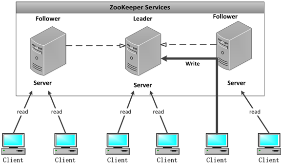

# Zookeeper分布式协调服务

### 1、简介

​		zookeeper是一个分布式协调服务的框架，主要用来解决分布式集群中应用系统的一致性问题，例如如何避免同时操作导致数据脏读的问题等，Zookeeper本质上是一个分布式的小型文件存储系统，提供基于类似文件系统树方式的数据存储，并且可以对书中的节点进行有效管理，从而用来维护和监控存储的数据状态变化，通过监控这些数据状态的变化，从而达到基于数据的集群管理，比如统一命名服务、分布式配置服务、分布式消息队列、分布式 锁、分布式协调等功能。

​		ZooKeeper很简单。ZooKeeper允许分布式进程通过共享的分层名称空间相互协调，该命名空间的组织方式类似于标准文件系统。名称空间由数据寄存器（在ZooKeeper中称为znodes）组成，它们类似于文件和目录。与设计用于存储的典型文件系统不同，ZooKeeper数据保留在内存中，这意味着ZooKeeper可以实现高吞吐量和低延迟数。

​		ZooKeeper实施对高性能，高可用性，严格有序访问加以重视。ZooKeeper的性能方面意味着它可以在大型的分布式系统中使用。可靠性方面使它不会成为单点故障。严格排序意味着可以在客户端上实现复杂的同步原语。

​		ZooKeeper已复制。像它协调的分布式进程一样，ZooKeeper本身也可以在称为集合的一组主机上进行复制。

​		组成ZooKeeper服务的服务器都必须彼此了解。它们维护内存中的状态图像，以及持久存储中的事务日志和快照。只要大多数服务器可用，ZooKeeper服务将可用。

​		客户端连接到单个ZooKeeper服务器。客户端维护一个TCP连接，通过它发送请求，获取响应，获取监视事件并发送心跳。如果与服务器的TCP连接断开，则客户端将连接到其他服务器。

​		ZooKeeper is ordered. 【有序的】

​		ZooKeeper stamps each update with a number that reflects the order of all ZooKeeper transactions. Subsequent operations can use the order to implement higher-level abstractions, such as synchronization primitives.【 ZooKeeper用一个反映所有ZooKeeper事务顺序的数字标记每个更新。后续操作可以使用该命令来实现更高级别的抽象，例如同步原语。 】

### 2、特性

​		Zookeeper具有全局一致性、可靠性、顺序性、原子性以及实时性等。

#### 2.1、全局一致性

​		每一个服务器都保存一份相同的数据副本，看到的目录树是一致的，也就是数据的统一，这也是Zookeeper的重要特性，

#### 2.2、可靠性

​		如果消息可靠，对目录结构的增删改查，被选中一台服务器接收，那么将所有的服务接收。

#### 2.3、顺序性

​		Zookeeper顺序性重要分为全局顺序和偏序两种，其中全局有序是指如果在同一台服务器上消息A在消息B前发布，则在所有服务器上消息A都在消息B前被发布，偏序是指如果一个消息b在消息a后被同一个发布者发布，a必将排在b前面，无论是全局有序还是偏序，其目的都是为了保证Zookeeper的全局数据一致性。

#### 2.4、数据更新原子性

​		一次数据更新操作要么成功（半数以上节点成功），要么失败。不存在中间状态。

#### 2.5、实时性

​		Zookeeper保证客户将在一个时间间隔内获得的服务器更新的信息、服务器失效信息。

### 3、Zookeeper的角色

​		Zookeeper集群是一个主从集群，它一般是由一个Leader[领导者]和多个Follower[跟随者]组成，针对访问量较大的Zookeeper集群，还可以增加Observer[观察者]，

