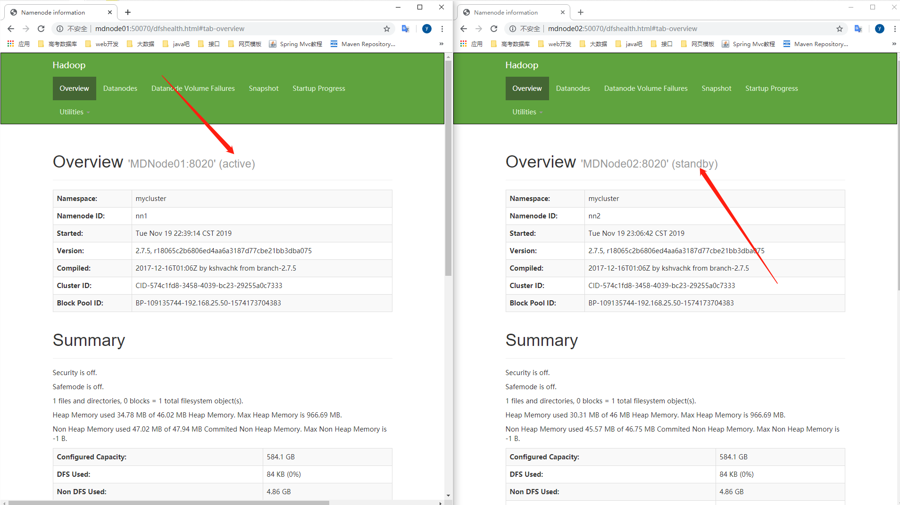

# Hadoop的HA高可用实验

### 1、免秘钥登录

集群之间做免秘钥登录

### 2、简介

#### 目的

本指南概述了HDFS高可用性（HA）功能以及如何使用Quorum Journal Manager（QJM）功能配置和管理HA HDFS群集。

本文档假定读者对HDFS群集中的常规组件和节点类型有一般的了解。有关详细信息，请参阅HDFS体系结构指南。

#### 注意：使用Quorum Journal Manager或常规共享存储

本指南讨论如何使用Quorum Journal Manager（QJM）配置和使用HDFS HA，以在活动和备用NameNode之间共享编辑日志。有关如何使用NFS而非QJM将NFS用于共享存储来配置HDFS HA的信息，请参阅[此替代指南。](https://hadoop.apache.org/docs/r2.6.5/hadoop-project-dist/hadoop-hdfs/HDFSHighAvailabilityWithNFS.html)

#### 背景

在Hadoop 2.0.0之前，NameNode是HDFS集群中的单点故障（SPOF）。每个群集只有一个NameNode，如果该计算机或进程不可用，则整个群集将不可用，直到NameNode重新启动或在单独的计算机上启动。

这从两个方面影响了HDFS群集的总可用性：

- 如果发生意外事件（例如机器崩溃），则在操作员重新启动NameNode之前，群集将不可用。
- 计划内的维护事件，例如NameNode计算机上的软件或硬件升级，将导致群集停机时间的延长。

HDFS高可用性功能通过提供在带有热备用的主动/被动配置中在同一群集中运行两个冗余NameNode的选项来解决上述问题。这可以在计算机崩溃的情况下快速故障转移到新的NameNode，或出于计划维护的目的由管理员发起的正常故障转移。

#### 建筑

在典型的HA群集中，将两个单独的计算机配置为NameNode。在任何时间点，一个NameNode都恰好处于*Active*状态，而另一个Node 处于*Standby*状态。Active NameNode负责集群中的所有客户端操作，而Standby只是充当从属，并保持足够的状态以在必要时提供快速故障转移。

为了使备用节点保持其状态与活动节点同步，两个节点都与一组称为“ JournalNodes”（JN）的单独守护程序进行通信。当活动节点执行任何名称空间修改时，它会持久地将修改记录记录到大多数这些JN中。Standby节点能够从JN读取编辑，并一直在监视它们以查看编辑日志的更改。当“备用节点”看到编辑内容时，会将其应用于自己的名称空间。发生故障转移时，备用数据库将确保在将自身升级为活动状态之前，已从JounalNodes读取所有编辑内容。这样可确保在发生故障转移之前，名称空间状态已完全同步。

为了提供快速的故障转移，备用节点还必须具有有关集群中块位置的最新信息。为了实现这一点，DataNodes被配置了两个NameNodes的位置，并向两者发送块位置信息和心跳信号。

对于HA群集的正确操作至关重要，一次只能有一个NameNode处于活动状态。否则，名称空间状态将在两者之间迅速分散，从而有数据丢失或其他不正确结果的风险。为了确保此属性并防止所谓的“裂脑情况”，JournalNode将仅一次允许单个NameNode成为作者。在故障转移期间，将变为活动状态的NameNode将仅承担写入JournalNodes的角色，这将有效地防止另一个NameNode继续处于活动状态，从而使新的Active可以安全地进行故障转移。

#### 硬件资源

为了部署高可用性群集，您应该准备以下内容：

- **NameNode计算机** -运行活动NameNode和Standby NameNode的计算机应具有彼此等效的硬件，以及与非HA群集中将使用的硬件相同的硬件。
- **JournalNode计算机** -运行JournalNode的计算机。JournalNode守护程序相对较轻，因此可以合理地将这些守护程序与其他Hadoop守护程序（例如NameNodes，JobTracker或YARN ResourceManager）并置在计算机上。**注意：**必须至少有3个JournalNode守护程序，因为必须将编辑日志修改写入大多数JN。这将允许系统容忍单个计算机的故障。您可能还会运行3个以上的JournalNode，但是为了实际增加系统可以容忍的故障数量，您应该运行奇数个JN（即3、5、7等）。请注意，当与N个JournalNode一起运行时，系统最多可以容忍（N-1）/ 2个故障，并继续正常运行。

请注意，在HA群集中，备用NameNode也执行名称空间状态的检查点，因此不必在HA群集中运行Secondary NameNode，CheckpointNode或BackupNode。实际上，这样做将是一个错误。这还允许重新配置未启用HA的HDFS群集的用户启用HA，以重用他们先前专用于次要NameNode的硬件。

#### 部署方式

与联合身份验证配置类似，高可用性配置向后兼容，并允许现有的单个NameNode配置无需更改即可工作。设计新的配置，以便群集中的所有节点都可以具有相同的配置，而无需根据节点的类型将不同的配置文件部署到不同的计算机。

像HDFS联合`身份验证`一样，HA群集重用`名称服务ID`来标识实际上可能由多个HA NameNode组成的单个HDFS实例。此外，HA还添加了一个名为`NameNode ID`的新抽象。群集中的每个不同的NameNode都有一个不同的NameNode ID来区分它。为了支持所有NameNode的单个配置文件，相关的配置参数后缀有**nameservice ID**和**NameNode ID**。

配置细节

要配置HA NameNode，必须将多个配置选项添加到**hdfs-site.xml**配置文件中。

设置这些配置的顺序并不重要，但是为**dfs.nameservices**和**dfs.ha.namenodes。[nameservice ID]**选择的值将确定**后面**的密钥。因此，您应该在设置其余配置选项之前决定这些值。

### 3、规划

-------

|       | NN-1 | NN-2 |  DN  |  ZK  | ZKFC | JNN  |
| :---: | :--: | :--: | :--: | :--: | :--: | :--: |
| Node1 |  *   |      |      |      |  *   |  *   |
| Node2 |      |  *   |  *   |  *   |  *   |  *   |
| Node3 |      |      |  *   |  *   |      |  *   |
| Node4 |      |      |  *   |  *   |      |      |

ZK:  zookeeper 

ZKFC:   failover controller【故障转移进程】

#### hdfs-site.xml配置

```xml
<configuration>
    <property>
        <name>dfs.replication</name>
        <value>2</value>
    </property>
    <!--配置一个集群服务ID-->
    <property>
      <name>dfs.nameservices</name>
      <value>mycluster</value>
    </property>
    <!--使用逗号分隔的NameNode ID列表进行配置。DataNode将使用它来确定集群中的所有NameNode。例如，如果您以前使用“ mycluster”作为名称服务ID，并且想要使用“ nn1”和“ nn2”作为NameNode的各个ID-->
    <property>
      <name>dfs.ha.namenodes.mycluster</name>
      <value>nn1,nn2</value>
    </property>
    <!-- 对于两个先前配置的NameNode ID，请设置NameNode进程的完整地址和IPC端口。请注意，这将导致两个单独的配置选项。 -->
    <property>
  		<name>dfs.namenode.rpc-address.mycluster.nn1</name>
  		<value>MDNode01:8020</value>
    </property>
    <property>
      <name>dfs.namenode.rpc-address.mycluster.nn2</name>
      <value>MDNode02:8020</value>
    </property>
    <!-- 为两个NameNode的HTTP服务器设置地址以进行侦听 -->
    <property>
      <name>dfs.namenode.http-address.mycluster.nn1</name>
      <value>MDNode01:50070</value>
    </property>
    <property>
      <name>dfs.namenode.http-address.mycluster.nn2</name>
      <value>MDNode02:50070</value>
    </property>
    <!-- 标识NameNode将在其中写入/读取编辑内容的JN组的UR 
	在这里，可以配置提供共享编辑存储的JournalNode的地址，该地址由Active nameNode写入并由Standby NameNode读取，以与Active NameNode所做的所有文件系统更改保持最新。尽管您必须指定几个JournalNode地址，但是您仅应配置这些URI之一。URI的格式应为：“ qjournal：// host1：port1 ; host2：port2 ; host3：port3 / journalId ”。日记ID是此名称服务的唯一标识符，它允许单个JournalNode集为多个联合名称系统提供存储。尽管不是必需的，但最好将名称服务ID用作日记标识符。
	-->
    <property>
      <name>dfs.namenode.shared.edits.dir</name>
      <value>qjournal://MDNode01:8485;MDNode02:8485;MDNode03:8485/mycluster</value>
    </property>
    <!-- 配置Java类的名称，DFS客户端将使用该Java类来确定哪个NameNode是当前的Active，从而确定哪个NameNode当前正在服务于客户端请求。Hadoop当前随附的唯一实现是ConfiguredFailoverProxyProvider，因此请使用此实现，除非您使用的是自定义实现。 -->
    <property>
      <name>dfs.client.failover.proxy.provider.mycluster</name>
  <value>org.apache.hadoop.hdfs.server.namenode.ha.ConfiguredFailoverProxyProvider</value>
        <!--
	为了保证系统的正确性，在任何给定时间只有一个NameNode处于Active状态。重要的是，使用Quorum Journal Manager时，将只允许一个NameNode写入JournalNodes，因此不会因裂脑情况而损坏文件系统元数据。但是，当发生故障转移时，以前的Active NameNode仍然有可能向客户端提供读取请求，这可能已过期，直到该NameNode在尝试写入JournalNodes时关闭为止。因此，即使使用Quorum Journal Manager，仍然需要配置一些防护方法。但是，为了在防护机制失败的情况下提高系统的可用性，建议配置一种防护方法，以确保成功返回列表中的最后一种防护方法
-->
    </property>
    <property>
      <name>dfs.ha.fencing.methods</name>
      <value>sshfence</value>
    </property>
<!--远程登录所需的ssh秘钥-->
    <property>
      <name>dfs.ha.fencing.ssh.private-key-files</name>
      <value>/root/.ssh/id_dsa</value>
    </property>
	<!--这是JournalNode机器上将存储JN使用的编辑和其他本地状态的绝对路径。您只能为此配置使用单个路径。通过运行多个单独的JournalNode或在本地连接的RAID阵列上配置此目录，可以提供此数据的冗余-->
    <property>
      <name>dfs.journalnode.edits.dir</name>
      <value>/var/mgs/hadoop/ha/journode</value>
    </property>

</configuration>

```


#### core-site.xml

  ```xml
<!--
您现在可以配置Hadoop客户端的默认路径，以使用新的启用HA的逻辑URI。如果您之前使用“ mycluster”作为名称服务ID，则它将是所有HDFS路径的授权部分的值。
-->
<configuration>
    <property>
        <name>fs.defaultFS</name>
        <value>hdfs://mycluster</value>
    </property>
    <!--数保持的文件目录-->
    <property>
        <name>hadoop.tmp.dir</name>
        <value>/var/mgs/hadoop/ha</value>
    </property>
</configuration>

  ```


### Zookeeper配置

自动故障转移

介绍

以上各节描述了如何配置手动故障转移。在这种模式下，即使活动节点发生故障，系统也不会自动触发从活动NameNode到备用NameNode的故障转移。本节介绍如何配置和部署自动故障转移。

组件

自动故障转移为HDFS部署添加了两个新组件：ZooKeeper集群和ZKFailoverController进程（缩写为ZKFC）。

Apache ZooKeeper是一项高可用性服务，用于维护少量的协调数据，将数据中的更改通知客户端并监视客户端的故障。HDFS自动故障转移的实现依赖ZooKeeper进行以下操作：

- **故障检测** -群集中的每个NameNode计算机都在ZooKeeper中维护一个持久性会话。如果计算机崩溃，则ZooKeeper会话将终止，通知另一个NameNode应触发故障转移。
- **活动的NameNode选举** -ZooKeeper提供了一种简单的机制来专门选举一个节点为活动的节点。如果当前活动的NameNode崩溃，则另一个节点可能会在ZooKeeper中采取特殊的排他锁，指示它应成为下一个活动的NameNode。

ZKFailoverController（ZKFC）是一个新组件，它是一个ZooKeeper客户端，它还监视和管理NameNode的状态。运行NameNode的每台机器还运行ZKFC，该ZKFC负责：

- **运行状况监视** -ZKFC使用运行状况检查命令定期ping其本地NameNode。只要NameNode以健康状态及时响应，ZKFC就会认为该节点是健康的。如果节点崩溃，冻结或以其他方式进入不正常状态，则运行状况监视器将其标记为不正常。
- **ZooKeeper会话管理** -当本地NameNode运行状况良好时，ZKFC会在ZooKeeper中保持打开的会话。如果本地NameNode处于活动状态，则它还将持有一个特殊的“锁定” znode。该锁使用ZooKeeper对“临时”节点的支持。如果会话到期，则锁定节点将被自动删除。
- **基于ZooKeeper的选举** -如果本地NameNode运行状况良好，并且ZKFC看到当前没有其他节点持有锁znode，则它本身将尝试获取该锁。如果成功，则它“赢得选举”，并负责运行故障转移以使其本地NameNode处于活动状态。故障转移过程类似于上述的手动故障转移：首先，如有必要，将先前的活动节点隔离，然后将本地NameNode转换为活动状态。

有关自动故障转移设计的更多详细信息，请参阅Apache HDFS JIRA上HDFS-2185附带的设计文档。

部署ZooKeeper

在典型的部署中，ZooKeeper守护程序被配置为在三个或五个节点上运行。由于ZooKeeper本身对光资源有要求，因此可以将ZooKeeper节点并置在与HDFS NameNode和Standby Node相同的硬件上。许多操作员选择将第三个ZooKeeper进程与YARN ResourceManager部署在同一节点上。建议将ZooKeeper节点配置为将其数据与HDFS元数据存储在单独的磁盘驱动器上，以实现最佳性能和隔离。

ZooKeeper的设置超出了本文档的范围。我们将假定您已经设置了在三个或更多节点上运行的ZooKeeper集群，并已通过使用ZK CLI进行连接来验证其正确的操作。

在你开始之前

在开始配置自动故障转移之前，应关闭集群。在群集运行时，当前无法从手动故障转移设置过渡到自动故障转移设置。


配置：

hdfs-site.xml添加

```xml
<property>
   <name>dfs.ha.automatic-failover.enabled</name>
   <value>true</value>
 </property>
```

 core-site.xml 中

```xml
<property>
   <name>ha.zookeeper.quorum</name>
   <value>MDNode02:2181,MDNode03:2181,MDNode04:2181</value>
 </property>
```


分发这两个配置文件:

```shell
[root@MDNode01 hadoop]# scp core-site.xml hdfs-site.xml MDNode02:`pwd`
core-site.xml                                                                                                                                                                                                  100% 1111     1.1KB/s   00:00    
hdfs-site.xml                                                                                                                                                                                                  100% 2239     2.2KB/s   00:00    
[root@MDNode01 hadoop]# scp core-site.xml hdfs-site.xml MDNode03:`pwd`
core-site.xml                                                                                                                                                                                                  100% 1111     1.1KB/s   00:00    
hdfs-site.xml                                                                                                                                                                                                  100% 2239     2.2KB/s   00:00    
[root@MDNode01 hadoop]# scp core-site.xml hdfs-site.xml MDNode04:`pwd`
core-site.xml                                                                                                                                                                                                  100% 1111     1.1KB/s   00:00    
hdfs-site.xml                                                                                                                                                                                                  100% 2239     2.2KB/s   00:00    
[root@MDNode01 hadoop]# 

```


Zookeeper的配置：

下载解压Zookeeper到/opt/mgs/目录下面【我用的是3.4.14版本】

配置zoo.cfg

```properties
# The number of milliseconds of each tick
tickTime=2000
# The number of ticks that the initial 
# synchronization phase can take
initLimit=10
# The number of ticks that can pass between 
# sending a request and getting an acknowledgement
syncLimit=5
# the directory where the snapshot is stored.
# do not use /tmp for storage, /tmp here is just 
# example sakes.
#目录必须存在
dataDir=/var/mgs/zookeeper
# the port at which the clients will connect
clientPort=2181
# the maximum number of client connections.
# increase this if you need to handle more clients
#maxClientCnxns=60
#
# Be sure to read the maintenance section of the 
# administrator guide before turning on autopurge.
#
# http://zookeeper.apache.org/doc/current/zookeeperAdmin.html#sc_maintenance
#
# The number of snapshots to retain in dataDir
#autopurge.snapRetainCount=3
# Purge task interval in hours
# Set to "0" to disable auto purge feature
#autopurge.purgeInterval=1

server.1=MDNode02:2888:3888
server.2=MDNode03:2888:3888
server.3=MDNode04:2888:3888

```


配置/etc/proflie文件的ZOOKEEPER_HOME变量

```shell
export JAVA_HOME=/usr/java/jdk1.8.0_221
export JRE_HOME=/usr/java/jdk1.8.0_221/jre
export HADOOP_HOME=/opt/mgs/hadoop-2.7.5
export ZOOKEEPER_HOME=/opt/mgs/zookeeper-3.4.14
export CLASSPATH=.:$JAVA_HOME/lib:$JRE_HOME/lib:$CLASSPATH
export PATH=$JAVA_HOME/bin:$JRE_HOME/bin:$PATH:$HADOOP_HOME/bin:$HADOOP_HOME/sbin:$ZOOKEEPER_HOME/bin
```

常用的参数命令：

zkServer.sh

start|start-foreground|stop|restart|status|upgrade|print-cmd

-----------------------


After all of the necessary configuration options have been set, you must start the JournalNode daemons on the set of machines where they will run. This can be done by running the command "*hadoop-daemon.sh start journalnode*" and waiting for the daemon to start on each of the relevant machines.

Once the JournalNodes have been started, one must initially synchronize the two HA NameNodes' on-disk metadata.

- If you are setting up a fresh HDFS cluster, you should first run the format command (*hdfs namenode -format*) on one of NameNodes.
- If you have already formatted the NameNode, or are converting a non-HA-enabled cluster to be HA-enabled, you should now copy over the contents of your NameNode metadata directories to the other, unformatted NameNode by running the command "*hdfs namenode -bootstrapStandby*" on the unformatted NameNode. Running this command will also ensure that the JournalNodes (as configured by **dfs.namenode.shared.edits.dir**) contain sufficient edits transactions to be able to start both NameNodes.
- If you are converting a non-HA NameNode to be HA, you should run the command "*hdfs -initializeSharedEdits*", which will initialize the JournalNodes with the edits data from the local NameNode edits directories.

At this point you may start both of your HA NameNodes as you normally would start a NameNode.

You can visit each of the NameNodes' web pages separately by browsing to their configured HTTP addresses. You should notice that next to the configured address will be the HA state of the NameNode (either "standby" or "active".) Whenever an HA NameNode starts, it is initially in the Standby state.

--------------


启动journalnode

在1、2、3节点启动journalnode

```shell
[root@MDNode01 ~]# hadoop-daemon.sh start journalnode
starting journalnode, logging to /opt/mgs/hadoop-2.7.5/logs/hadoop-root-journalnode-MDNode01.out
[root@MDNode01 ~]# jps
1382 JournalNode
1417 Jps
```


在1节点上面的一个节点

```shell
[root@MDNode01 ~]# hdfs namenode -format
19/11/19 22:28:17 INFO namenode.NameNode: STARTUP_MSG: 
/************************************************************
STARTUP_MSG: Starting NameNode
STARTUP_MSG:   host = MDNode01/192.168.25.50
STARTUP_MSG:   args = [-format]
STARTUP_MSG:   version = 2.7.5
STARTUP_MSG:   classpath = /opt/mgs/hadoop-2.7.5/etc/hadoop:/opt/mgs/hadoop-2.7.5/share/hadoop/common/lib/protobuf-java-2.5.0.jar:/opt/mgs/hadoop-
......
2.7.5.jar:/opt/mgs/hadoop-2.7.5/share/hadoop/mapreduce/hadoop-mapreduce-client-jobclient-2.7.5-tests.jar:/opt/mgs/hadoop-2.7.5/share/hadoop/mapreduce/hadoop-mapreduce-examples-2.7.5.jar:/opt/mgs/hadoop-2.7.5/contrib/capacity-scheduler/*.jar
STARTUP_MSG:   build = https://shv@git-wip-us.apache.org/repos/asf/hadoop.git -r 18065c2b6806ed4aa6a3187d77cbe21bb3dba075; compiled by 'kshvachk' on 2017-12-16T01:06Z
STARTUP_MSG:   java = 1.8.0_221
************************************************************/
19/11/19 22:28:17 INFO namenode.NameNode: registered UNIX signal handlers for [TERM, HUP, INT]
19/11/19 22:28:17 INFO namenode.NameNode: createNameNode [-format]
Formatting using clusterid: CID-574c1fd8-3458-4039-bc23-29255a0c7333
19/11/19 22:28:19 INFO namenode.FSNamesystem: No KeyProvider found.
19/11/19 22:28:19 INFO namenode.FSNamesystem: fsLock is fair: true
19/11/19 22:28:19 INFO namenode.FSNamesystem: Detailed lock hold time metrics enabled: false
19/11/19 22:28:19 INFO blockmanagement.DatanodeManager: dfs.block.invalidate.limit=1000
19/11/19 22:28:19 INFO blockmanagement.DatanodeManager: dfs.namenode.datanode.registration.ip-hostname-check=true
19/11/19 22:28:19 INFO blockmanagement.BlockManager: dfs.namenode.startup.delay.block.deletion.sec is set to 000:00:00:00.000
19/11/19 22:28:19 INFO blockmanagement.BlockManager: The block deletion will start around 2019 Nov 19 22:28:19
19/11/19 22:28:19 INFO util.GSet: Computing capacity for map BlocksMap
19/11/19 22:28:19 INFO util.GSet: VM type       = 64-bit
19/11/19 22:28:19 INFO util.GSet: 2.0% max memory 966.7 MB = 19.3 MB
19/11/19 22:28:19 INFO util.GSet: capacity      = 2^21 = 2097152 entries
19/11/19 22:28:20 INFO blockmanagement.BlockManager: dfs.block.access.token.enable=false
19/11/19 22:28:20 INFO blockmanagement.BlockManager: defaultReplication         = 2
19/11/19 22:28:20 INFO blockmanagement.BlockManager: maxReplication             = 512
19/11/19 22:28:20 INFO blockmanagement.BlockManager: minReplication             = 1
19/11/19 22:28:20 INFO blockmanagement.BlockManager: maxReplicationStreams      = 2
19/11/19 22:28:20 INFO blockmanagement.BlockManager: replicationRecheckInterval = 3000
19/11/19 22:28:20 INFO blockmanagement.BlockManager: encryptDataTransfer        = false
19/11/19 22:28:20 INFO blockmanagement.BlockManager: maxNumBlocksToLog          = 1000
19/11/19 22:28:20 INFO namenode.FSNamesystem: fsOwner             = root (auth:SIMPLE)
19/11/19 22:28:20 INFO namenode.FSNamesystem: supergroup          = supergroup
19/11/19 22:28:20 INFO namenode.FSNamesystem: isPermissionEnabled = true
19/11/19 22:28:20 INFO namenode.FSNamesystem: Determined nameservice ID: mycluster
19/11/19 22:28:20 INFO namenode.FSNamesystem: HA Enabled: true
19/11/19 22:28:20 INFO namenode.FSNamesystem: Append Enabled: true
19/11/19 22:28:21 INFO util.GSet: Computing capacity for map INodeMap
19/11/19 22:28:21 INFO util.GSet: VM type       = 64-bit
19/11/19 22:28:21 INFO util.GSet: 1.0% max memory 966.7 MB = 9.7 MB
19/11/19 22:28:21 INFO util.GSet: capacity      = 2^20 = 1048576 entries
19/11/19 22:28:21 INFO namenode.FSDirectory: ACLs enabled? false
19/11/19 22:28:21 INFO namenode.FSDirectory: XAttrs enabled? true
19/11/19 22:28:21 INFO namenode.FSDirectory: Maximum size of an xattr: 16384
19/11/19 22:28:21 INFO namenode.NameNode: Caching file names occuring more than 10 times
19/11/19 22:28:21 INFO util.GSet: Computing capacity for map cachedBlocks
19/11/19 22:28:21 INFO util.GSet: VM type       = 64-bit
19/11/19 22:28:21 INFO util.GSet: 0.25% max memory 966.7 MB = 2.4 MB
19/11/19 22:28:21 INFO util.GSet: capacity      = 2^18 = 262144 entries
19/11/19 22:28:21 INFO namenode.FSNamesystem: dfs.namenode.safemode.threshold-pct = 0.9990000128746033
19/11/19 22:28:21 INFO namenode.FSNamesystem: dfs.namenode.safemode.min.datanodes = 0
19/11/19 22:28:21 INFO namenode.FSNamesystem: dfs.namenode.safemode.extension     = 30000
19/11/19 22:28:21 INFO metrics.TopMetrics: NNTop conf: dfs.namenode.top.window.num.buckets = 10
19/11/19 22:28:21 INFO metrics.TopMetrics: NNTop conf: dfs.namenode.top.num.users = 10
19/11/19 22:28:21 INFO metrics.TopMetrics: NNTop conf: dfs.namenode.top.windows.minutes = 1,5,25
19/11/19 22:28:21 INFO namenode.FSNamesystem: Retry cache on namenode is enabled
19/11/19 22:28:21 INFO namenode.FSNamesystem: Retry cache will use 0.03 of total heap and retry cache entry expiry time is 600000 millis
19/11/19 22:28:21 INFO util.GSet: Computing capacity for map NameNodeRetryCache
19/11/19 22:28:21 INFO util.GSet: VM type       = 64-bit
19/11/19 22:28:21 INFO util.GSet: 0.029999999329447746% max memory 966.7 MB = 297.0 KB
19/11/19 22:28:21 INFO util.GSet: capacity      = 2^15 = 32768 entries
19/11/19 22:28:24 INFO namenode.FSImage: Allocated new BlockPoolId: BP-109135744-192.168.25.50-1574173704383
19/11/19 22:28:24 INFO common.Storage: Storage directory /var/mgs/hadoop/ha/dfs/name has been successfully formatted.
19/11/19 22:28:25 INFO namenode.FSImageFormatProtobuf: Saving image file /var/mgs/hadoop/ha/dfs/name/current/fsimage.ckpt_0000000000000000000 using no compression
19/11/19 22:28:25 INFO namenode.FSImageFormatProtobuf: Image file /var/mgs/hadoop/ha/dfs/name/current/fsimage.ckpt_0000000000000000000 of size 321 bytes saved in 0 seconds.
19/11/19 22:28:25 INFO namenode.NNStorageRetentionManager: Going to retain 1 images with txid >= 0
19/11/19 22:28:25 INFO util.ExitUtil: Exiting with status 0
19/11/19 22:28:25 INFO namenode.NameNode: SHUTDOWN_MSG: 
/************************************************************
SHUTDOWN_MSG: Shutting down NameNode at MDNode01/192.168.25.50
************************************************************/

```

启动NameNode进程

```shell
[root@MDNode01 ~]# jps
1489 Jps
1382 JournalNode
[root@MDNode01 ~]# hadoop-daemon.sh start namenode
starting namenode, logging to /opt/mgs/hadoop-2.7.5/logs/hadoop-root-namenode-MDNode01.out
[root@MDNode01 ~]# jps
1382 JournalNode
1594 Jps
1519 NameNode
```

在2节点的NameNode从节点上面复制主节点上面的格式化信息


```shell
[root@MDNode02 ~]# hdfs namenode -bootstrapStandby
19/11/19 22:47:21 INFO namenode.NameNode: STARTUP_MSG: 
/************************************************************
STARTUP_MSG: Starting NameNode
STARTUP_MSG:   host = MDNode02/192.168.25.51
STARTUP_MSG:   args = [-bootstrapStandby]
STARTUP_MSG:   version = 2.7.5
STARTUP_MSG:   classpath = /opt/mgs/hadoop-2.7.5/etc/hadoop:/opt/mgs/hadoop-2.7.5/share/hadoop/common/lib/protobuf-java-2.5.0.jar:/opt/mgs/hadoop-2.7.5/share/hadoop/common/lib/junit-4.11.jar:/opt/mgs/hadoop-2.7.5/share/hadoop/common/lib/jackson-jaxrs-1.9.13.jar:/opt/mgs/hadoop-2.7.5/share/hadoop/common/lib/apacheds-kerberos-codec-2.0.0-M15.jar:/opt/mgs/hadoop-
......
2.7.5.jar:/opt/mgs/hadoop-2.7.5/share/hadoop/mapreduce/hadoop-mapreduce-client-jobclient-2.7.5-tests.jar:/opt/mgs/hadoop-2.7.5/share/hadoop/mapreduce/hadoop-mapreduce-examples-2.7.5.jar:/opt/mgs/hadoop-2.7.5/contrib/capacity-scheduler/*.jar
STARTUP_MSG:   build = https://shv@git-wip-us.apache.org/repos/asf/hadoop.git -r 18065c2b6806ed4aa6a3187d77cbe21bb3dba075; compiled by 'kshvachk' on 2017-12-16T01:06Z
STARTUP_MSG:   java = 1.8.0_221
************************************************************/
19/11/19 22:47:21 INFO namenode.NameNode: registered UNIX signal handlers for [TERM, HUP, INT]
19/11/19 22:47:21 INFO namenode.NameNode: createNameNode [-bootstrapStandby]
=====================================================
About to bootstrap Standby ID nn2 from:
           Nameservice ID: mycluster
        Other Namenode ID: nn1
  Other NN's HTTP address: http://MDNode01:50070
  Other NN's IPC  address: MDNode01/192.168.25.50:8020
             Namespace ID: 749034685
            Block pool ID: BP-109135744-192.168.25.50-1574173704383
               Cluster ID: CID-574c1fd8-3458-4039-bc23-29255a0c7333
           Layout version: -63
       isUpgradeFinalized: true
=====================================================
19/11/19 22:47:24 INFO common.Storage: Storage directory /var/mgs/hadoop/ha/dfs/name has been successfully formatted.
19/11/19 22:47:26 INFO namenode.TransferFsImage: Opening connection to http://MDNode01:50070/imagetransfer?getimage=1&txid=0&storageInfo=-63:749034685:0:CID-574c1fd8-3458-4039-bc23-29255a0c7333
19/11/19 22:47:26 INFO namenode.TransferFsImage: Image Transfer timeout configured to 60000 milliseconds
19/11/19 22:47:27 INFO namenode.TransferFsImage: Transfer took 0.01s at 0.00 KB/s
19/11/19 22:47:27 INFO namenode.TransferFsImage: Downloaded file fsimage.ckpt_0000000000000000000 size 321 bytes.
19/11/19 22:47:27 INFO util.ExitUtil: Exiting with status 0
19/11/19 22:47:27 INFO namenode.NameNode: SHUTDOWN_MSG: 
/************************************************************
SHUTDOWN_MSG: Shutting down NameNode at MDNode02/192.168.25.51
************************************************************/
[root@MDNode02 ~]# jps
1827 JournalNode
1758 QuorumPeerMain
1950 Jps
[root@MDNode02 ~]# 

```

注册Zookeeper服务

查看Zookeeper的服务

```shell
[root@MDNode04 ~]# zkCli.sh 
Connecting to localhost:2181
2019-11-19 22:56:44,562 [myid:] - INFO  [main:Environment@100] - Client environment:zookeeper.version=3.4.14-4c25d480e66aadd371de8bd2fd8da255ac140bcf, built on 03/06/2019 16:18 GMT
2019-11-19 22:56:44,566 [myid:] - INFO  [main:Environment@100] - Client environment:host.name=MDNode04
2019-11-19 22:56:44,566 [myid:] - INFO  [main:Environment@100] - Client environment:java.version=1.8.0_221
2019-11-19 22:56:44,569 [myid:] - INFO  [main:Environment@100] - Client environment:java.vendor=Oracle Corporation
2019-11-19 22:56:44,569 [myid:] - INFO  [main:Environment@100] - Client environment:java.home=/usr/java/jdk1.8.0_221/jre
2019-11-19 22:56:44,569 [myid:] - INFO  [main:Environment@100] - Client environment:java.class.path=/opt/mgs/zookeeper-3.4.14/bin/../zookeeper-server/target/classes:/opt/mgs/zookeeper-3.4.14/bin/../build/classes:/opt/mgs/zookeeper-3.4.14/bin/../zookeeper-server/target/lib/*.jar:/opt/mgs/zookeeper-3.4.14/bin/../build/lib/*.jar:/opt/mgs/zookeeper-3.4.14/bin/../lib/slf4j-log4j12-1.7.25.jar:/opt/mgs/zookeeper-3.4.14/bin/../lib/slf4j-api-1.7.25.jar:/opt/mgs/zookeeper-3.4.14/bin/../lib/netty-3.10.6.Final.jar:/opt/mgs/zookeeper-3.4.14/bin/../lib/log4j-1.2.17.jar:/opt/mgs/zookeeper-3.4.14/bin/../lib/jline-0.9.94.jar:/opt/mgs/zookeeper-3.4.14/bin/../lib/audience-annotations-0.5.0.jar:/opt/mgs/zookeeper-3.4.14/bin/../zookeeper-3.4.14.jar:/opt/mgs/zookeeper-3.4.14/bin/../zookeeper-server/src/main/resources/lib/*.jar:/opt/mgs/zookeeper-3.4.14/bin/../conf:.:/usr/java/jdk1.8.0_221/lib:/usr/java/jdk1.8.0_221/jre/lib:
2019-11-19 22:56:44,569 [myid:] - INFO  [main:Environment@100] - Client environment:java.library.path=/usr/java/packages/lib/amd64:/usr/lib64:/lib64:/lib:/usr/lib
2019-11-19 22:56:44,569 [myid:] - INFO  [main:Environment@100] - Client environment:java.io.tmpdir=/tmp
2019-11-19 22:56:44,569 [myid:] - INFO  [main:Environment@100] - Client environment:java.compiler=<NA>
2019-11-19 22:56:44,569 [myid:] - INFO  [main:Environment@100] - Client environment:os.name=Linux
2019-11-19 22:56:44,570 [myid:] - INFO  [main:Environment@100] - Client environment:os.arch=amd64
2019-11-19 22:56:44,570 [myid:] - INFO  [main:Environment@100] - Client environment:os.version=2.6.32-431.el6.x86_64
2019-11-19 22:56:44,570 [myid:] - INFO  [main:Environment@100] - Client environment:user.name=root
2019-11-19 22:56:44,570 [myid:] - INFO  [main:Environment@100] - Client environment:user.home=/root
2019-11-19 22:56:44,570 [myid:] - INFO  [main:Environment@100] - Client environment:user.dir=/root
2019-11-19 22:56:44,571 [myid:] - INFO  [main:ZooKeeper@442] - Initiating client connection, connectString=localhost:2181 sessionTimeout=30000 watcher=org.apache.zookeeper.ZooKeeperMain$MyWatcher@5ce65a89
Welcome to ZooKeeper!
2019-11-19 22:56:44,671 [myid:] - INFO  [main-SendThread(localhost:2181):ClientCnxn$SendThread@1025] - Opening socket connection to server localhost/127.0.0.1:2181. Will not attempt to authenticate using SASL (unknown error)
JLine support is enabled
2019-11-19 22:56:44,809 [myid:] - INFO  [main-SendThread(localhost:2181):ClientCnxn$SendThread@879] - Socket connection established to localhost/127.0.0.1:2181, initiating session
2019-11-19 22:56:44,956 [myid:] - INFO  [main-SendThread(localhost:2181):ClientCnxn$SendThread@1299] - Session establishment complete on server localhost/127.0.0.1:2181, sessionid = 0x30000d4fb1c0000, negotiated timeout = 30000

WATCHER::

WatchedEvent state:SyncConnected type:None path:null
##可以查看Zookeeper提供的服务
[zk: localhost:2181(CONNECTED) 0] ls /
[zookeeper]
[zk: localhost:2181(CONNECTED) 1] 

```


在ZooKeeper中初始化HA状态

添加配置密钥后，下一步是在ZooKeeper中初始化所需的状态。您可以通过从其中一个NameNode主机运行以下命令来执行此操作。

```
$ hdfs zkfc -formatZK
```

这将在ZooKeeper中创建一个znode，自动故障转移系统将在其中存储其数据。

使用`start-dfs.sh`启动集群

由于已在配置中启用了自动故障转移，因此`start-dfs.sh`脚本现在将在任何运行NameNode的计算机上自动启动ZKFC守护程序。ZKFC启动时，它们将自动选择一个NameNode激活。

手动启动集群

如果您手动管理集群上的服务，则需要在运行NameNode的每台计算机上手动启动`zkfc`守护程序。您可以通过运行以下命令启动守护程序：

```
$ hadoop-daemon.sh start zkfc
```


注册NameNode注册Zookeeper服务

```shell
[root@MDNode01 ~]# hdfs zkfc -formatZK
19/11/19 23:00:15 INFO tools.DFSZKFailoverController: Failover controller configured for NameNode NameNode at MDNode01/192.168.25.50:8020
19/11/19 23:00:16 INFO zookeeper.ZooKeeper: Client environment:zookeeper.version=3.4.6-1569965, built on 02/20/2014 09:09 GMT
19/11/19 23:00:16 INFO zookeeper.ZooKeeper: Client environment:host.name=MDNode01
19/11/19 23:00:16 INFO zookeeper.ZooKeeper: Client environment:java.version=1.8.0_221
19/11/19 23:00:16 INFO zookeeper.ZooKeeper: Client environment:java.vendor=Oracle Corporation
19/11/19 23:00:16 INFO zookeeper.ZooKeeper: Client environment:java.home=/usr/java/jdk1.8.0_221/jre
19/11/19 23:00:16 INFO zookeeper.ZooKeeper: Client environment:java.class.path=/opt/mgs/hadoop-2.7.5/etc/hadoop:/opt/mgs/hadoop-
......
2.7.5.jar:/opt/mgs/hadoop-2.7.5/share/hadoop/mapreduce/hadoop-mapreduce-client-shuffle-2.7.5.jar:/opt/mgs/hadoop-2.7.5/share/hadoop/mapreduce/hadoop-mapreduce-client-jobclient-2.7.5.jar:/opt/mgs/hadoop-2.7.5/share/hadoop/mapreduce/hadoop-mapreduce-client-jobclient-2.7.5-tests.jar:/opt/mgs/hadoop-2.7.5/share/hadoop/mapreduce/hadoop-mapreduce-examples-2.7.5.jar:/opt/mgs/hadoop-2.7.5/contrib/capacity-scheduler/*.jar
19/11/19 23:00:16 INFO zookeeper.ZooKeeper: Client environment:java.library.path=/opt/mgs/hadoop-2.7.5/lib/native
19/11/19 23:00:16 INFO zookeeper.ZooKeeper: Client environment:java.io.tmpdir=/tmp
19/11/19 23:00:16 INFO zookeeper.ZooKeeper: Client environment:java.compiler=<NA>
19/11/19 23:00:16 INFO zookeeper.ZooKeeper: Client environment:os.name=Linux
19/11/19 23:00:16 INFO zookeeper.ZooKeeper: Client environment:os.arch=amd64
19/11/19 23:00:16 INFO zookeeper.ZooKeeper: Client environment:os.version=2.6.32-431.el6.x86_64
19/11/19 23:00:16 INFO zookeeper.ZooKeeper: Client environment:user.name=root
19/11/19 23:00:16 INFO zookeeper.ZooKeeper: Client environment:user.home=/root
19/11/19 23:00:16 INFO zookeeper.ZooKeeper: Client environment:user.dir=/root
19/11/19 23:00:16 INFO zookeeper.ZooKeeper: Initiating client connection, connectString=MDNode02:2181,MDNode03:2181,MDNode04:2181 sessionTimeout=5000 watcher=org.apache.hadoop.ha.ActiveStandbyElector$WatcherWithClientRef@52bf72b5
19/11/19 23:00:16 INFO zookeeper.ClientCnxn: Opening socket connection to server MDNode03/192.168.25.52:2181. Will not attempt to authenticate using SASL (unknown error)
19/11/19 23:00:16 INFO zookeeper.ClientCnxn: Socket connection established to MDNode03/192.168.25.52:2181, initiating session
19/11/19 23:00:16 INFO zookeeper.ClientCnxn: Session establishment complete on server MDNode03/192.168.25.52:2181, sessionid = 0x20000d50ad80000, negotiated timeout = 5000
19/11/19 23:00:16 INFO ha.ActiveStandbyElector: Session connected.
19/11/19 23:00:16 INFO ha.ActiveStandbyElector: Successfully created /hadoop-ha/mycluster in ZK.
19/11/19 23:00:16 INFO zookeeper.ClientCnxn: EventThread shut down
19/11/19 23:00:16 INFO zookeeper.ZooKeeper: Session: 0x20000d50ad80000 closed

```


查看Zookeeper中的服务

```shell
[zk: localhost:2181(CONNECTED) 1] ls /
[zookeeper, hadoop-ha]
[zk: localhost:2181(CONNECTED) 2] ls /hadoop-ha
[mycluster]
[zk: localhost:2181(CONNECTED) 3] ls /hadoop-ha/mycluster
[]
[zk: localhost:2181(CONNECTED) 4] 
```

可以看到Hadoop-ha的服务


启动集群

```shell
[root@MDNode01 ~]# start-dfs.sh 
Starting namenodes on [MDNode01 MDNode02]
MDNode02: starting namenode, logging to /opt/mgs/hadoop-2.7.5/logs/hadoop-root-namenode-MDNode02.out
MDNode01: namenode running as process 1519. Stop it first.
MDNode03: starting datanode, logging to /opt/mgs/hadoop-2.7.5/logs/hadoop-root-datanode-MDNode03.out
Mdnode04: starting datanode, logging to /opt/mgs/hadoop-2.7.5/logs/hadoop-root-datanode-MDNode04.out
MDNode02: starting datanode, logging to /opt/mgs/hadoop-2.7.5/logs/hadoop-root-datanode-MDNode02.out
Starting journal nodes [MDNode01 MDNode02 MDNode03]
MDNode01: journalnode running as process 1382. Stop it first.
MDNode03: journalnode running as process 1745. Stop it first.
MDNode02: journalnode running as process 1827. Stop it first.
Starting ZK Failover Controllers on NN hosts [MDNode01 MDNode02]
MDNode01: starting zkfc, logging to /opt/mgs/hadoop-2.7.5/logs/hadoop-root-zkfc-MDNode01.out
MDNode02: starting zkfc, logging to /opt/mgs/hadoop-2.7.5/logs/hadoop-root-zkfc-MDNode02.out
```


```shell
[root@MDNode01 ~]# jps
2227 DFSZKFailoverController
2324 Jps
1382 JournalNode
1519 NameNode
```


```shell
[root@MDNode02 current]# jps
2050 DataNode
1827 JournalNode
1989 NameNode
2119 DFSZKFailoverController
2266 Jps
1758 QuorumPeerMain
```


```shell
[root@MDNode03 ~]# jps
1745 JournalNode
1944 Jps
1676 QuorumPeerMain
1852 DataNode
```


```shell
[root@MDNode04 ~]# jps
1745 ZooKeeperMain
1665 QuorumPeerMain
1796 DataNode
1886 Jps
```


```shell
[zk: localhost:2181(CONNECTED) 7] ls /hadoop-ha/mycluster 
[ActiveBreadCrumb, ActiveStandbyElectorLock]
```


查看配置

```shell
ZooKeeper -server host:port cmd args
	stat path [watch]
	set path data [version]
	ls path [watch]
	delquota [-n|-b] path
	ls2 path [watch]
	setAcl path acl
	setquota -n|-b val path
	history 
	redo cmdno
	printwatches on|off
	delete path [version]
	sync path
	listquota path
	rmr path
	get path [watch]
	create [-s] [-e] path data acl
	addauth scheme auth
	quit 
	getAcl path
	close 
	connect host:port
[zk: localhost:2181(CONNECTED) 5] ls /
[zookeeper, hadoop-ha]
[zk: localhost:2181(CONNECTED) 7] ls /hadoop-ha/mycluster 
[ActiveBreadCrumb, ActiveStandbyElectorLock]
[zk: localhost:2181(CONNECTED) 8] get /hadoop-ha/mycluster/ActiveBreadCrumb

	myclusternnMDNode01 �>(�>
cZxid = 0x300000008
ctime = Tue Nov 19 23:06:56 CST 2019
mZxid = 0x300000008
mtime = Tue Nov 19 23:06:56 CST 2019
pZxid = 0x300000008
cversion = 0
dataVersion = 0
aclVersion = 0
ephemeralOwner = 0x0
dataLength = 32
numChildren = 0
[zk: localhost:2181(CONNECTED) 9] get /hadoop-ha/mycluster/ActiveStandbyElectorLock

	myclusternnMDNode01 �>(�>
cZxid = 0x300000007
ctime = Tue Nov 19 23:06:56 CST 2019
mZxid = 0x300000007
mtime = Tue Nov 19 23:06:56 CST 2019
pZxid = 0x300000007
cversion = 0
dataVersion = 0
aclVersion = 0
ephemeralOwner = 0x30000d4fb1c0001
dataLength = 32
numChildren = 0
[zk: localhost:2181(CONNECTED) 10] 

```


浏览器访问两个节点的




-----

服务宕机测试

主节点：

hadoop-daemon.sh stop namenode 关闭主节点的服务


节点2会自动切换成active状态


可以通过Zookeeper的服务查看此时的服务是第二个节点


当hadoop的主节点重新启动，这时候不会切换节点2的Ativan状态

而1只会成为standby状态


//被Zookeeper认为宕机的原因很多，切换的机制就是这样

---

关闭顺序：

从主节点上关闭

```shell
[root@hadoopNode01 hadoop]# stop-dfs.sh 
Stopping namenodes on [hadoopNode01 hadoopNode02]
hadoopNode02: stopping namenode
hadoopNode01: stopping namenode
hadoopNode02: stopping datanode
hadoopNode03: stopping datanode
hadoopNode04: stopping datanode
Stopping journal nodes [hadoopNode01 hadoopNode02 hadoopNode03]
hadoopNode02: stopping journalnode
hadoopNode03: stopping journalnode
hadoopNode01: stopping journalnode
Stopping ZK Failover Controllers on NN hosts [hadoopNode01 hadoopNode02]
hadoopNode01: stopping zkfc
hadoopNode02: stopping zkfc
[root@hadoopNode01 hadoop]# 
```

关闭

Zookeeper服务

zkServer.shstop

--------------------

下一次重新启动的一次顺序

1、启动Zookeeper集群

zkServer.sh start

2、直接启动hdfs

start-dfs.sh