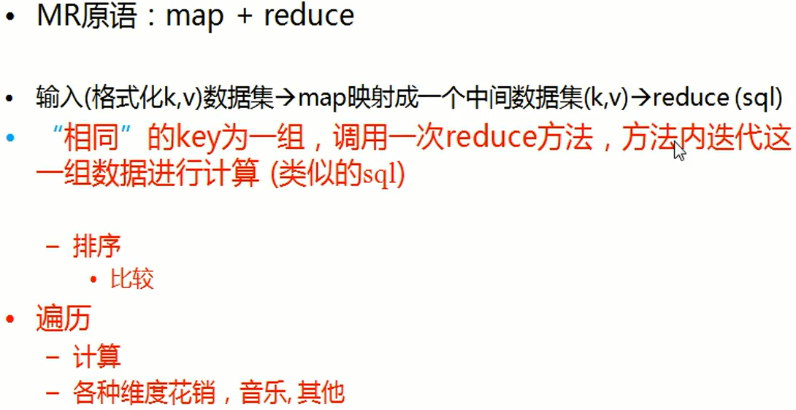

# MapReduce 案例与概述

## 官方简介

### Overview

Hadoop MapReduce is a software framework for easily writing applications which process vast amounts of data (multi-terabyte data-sets) in-parallel on large clusters (thousands of nodes) of commodity hardware in a reliable, fault-tolerant manner.

A MapReduce *job* usually splits the input data-set into independent chunks which are processed by the *map tasks* in a completely parallel manner. The framework sorts the outputs of the maps, which are then input to the *reduce tasks*. Typically both the input and the output of the job are stored in a file-system. The framework takes care of scheduling tasks, monitoring them and re-executes the failed tasks.

Typically the compute nodes and the storage nodes are the same, that is, the MapReduce framework and the Hadoop Distributed File System (see [HDFS Architecture Guide](https://hadoop.apache.org/docs/r2.7.5/hadoop-project-dist/hadoop-hdfs/HdfsDesign.html)) are running on the same set of nodes. This configuration allows the framework to effectively schedule tasks on the nodes where data is already present, resulting in very high aggregate bandwidth across the cluster.

The MapReduce framework consists of a single master `ResourceManager`, one slave `NodeManager` per cluster-node, and `MRAppMaster` per application (see [YARN Architecture Guide](https://hadoop.apache.org/docs/r2.7.5/hadoop-yarn/hadoop-yarn-site/YARN.html)).

Minimally, applications specify the input/output locations and supply *map* and *reduce* functions via implementations of appropriate interfaces and/or abstract-classes. These, and other job parameters, comprise the *job configuration*.

The Hadoop *job client* then submits the job (jar/executable etc.) and configuration to the `ResourceManager` which then assumes the responsibility of distributing the software/configuration to the slaves, scheduling tasks and monitoring them, providing status and diagnostic information to the job-client.

Although the Hadoop framework is implemented in Java™, MapReduce applications need not be written in Java.

- [Hadoop Streaming](https://hadoop.apache.org/docs/r2.7.5/api/org/apache/hadoop/streaming/package-summary.html) is a utility which allows users to create and run jobs with any executables (e.g. shell utilities) as the mapper and/or the reducer.
- [Hadoop Pipes](https://hadoop.apache.org/docs/r2.7.5/api/org/apache/hadoop/mapred/pipes/package-summary.html) is a [SWIG](http://www.swig.org/)-compatible C++ API to implement MapReduce applications (non JNI™ based).

### Inputs and Outputs

The MapReduce framework operates exclusively on `` pairs, that is, the framework views the input to the job as a set of `` pairs and produces a set of `` pairs as the output of the job, conceivably of different types.

The `key` and `value` classes have to be serializable by the framework and hence need to implement the [Writable](https://hadoop.apache.org/docs/r2.7.5/api/org/apache/hadoop/io/Writable.html) interface. Additionally, the key classes have to implement the [WritableComparable](https://hadoop.apache.org/docs/r2.7.5/api/org/apache/hadoop/io/WritableComparable.html) interface to facilitate sorting by the framework.

Input and Output types of a MapReduce job:

(input) ` ->` **map** `->  ->` **combine** `->  ->` **reduce** `-> ` (output)

### MapReduce

分为两个阶段：

1. Map阶段，对数据进行分析映射成Key Value形式，Key是个组的概念
2. Reduce阶段 对映射的后的Value进行处理的阶段

## MapReduce作业

### 1、Input Split

转载地址：https://www.dummies.com/programming/big-data/hadoop/input-splits-in-hadoops-mapreduce/

HDFS的设置方式将大文件分解为大块（例如，测量为128MB），并将这些块的三个副本存储在集群中的不同节点上。HDFS不了解这些文件的内容。

在YARN中，当启动MapReduce作业时，资源管理器（群集资源管理和作业调度工具）创建一个Application Master守护程序来照顾该作业的生命周期。（在Hadoop 1中，JobTracker监视单个作业以及处理作业调度和集群资源管理。）

Application Master要做的第一件事就是确定需要处理哪些文件块。Application Master向NameNode请求有关所需数据块副本存储位置的详细信息。使用文件块的位置数据，Application Master向资源管理器发出请求，以使映射任务在存储它们的从属节点上处理特定的块。

> 有效进行MapReduce处理的关键在于，只要有可能，就*在本地*存储数据的从属节点上对数据进行*本地*处理。

在研究如何处理数据块之前，您需要更仔细地研究Hadoop如何存储数据。在Hadoop中，文件由单独的记录组成，最终由映射器任务一一处理。

每年有一个大文件，并且在每个文件中，每一行代表一个flight。换句话说，一行代表一条记录。现在，请记住，Hadoop集群的块大小为64MB，这意味着轻量数据文件被分成了恰好64MB的块。

看到问题了吗？如果每个映射任务都处理特定数据块中的所有记录，那么跨越块边界的那些记录将如何处理？文件块恰好为64MB（或您设置的块大小为任意大小），并且由于HDFS没有文件块内部内容的概念，因此它无法衡量记录何时可能溢出到另一个块中。

为了解决此问题，Hadoop使用存储在文件块中的数据的逻辑表示形式，称为输入拆分。当MapReduce作业客户端计算输入拆分时，它将找出块中第一个完整记录的起始位置以及块中最后一条记录的终止位置。

如果一个块中的最后一条记录不完整，则输入拆分将包含下一个块的位置信息以及完成记录所需的数据的字节偏移量。

该图显示了数据块和输入拆分之间的这种关系

第二篇文章说的很详细

https://blog.csdn.net/Dr_Guo/article/details/51150278

### 2、Map 

讲不同数Key分离出来，

### 3、shufflie

### 4、Reduce

一组key只能调用一次Reduce方法

### 5、output

#### 单词统计流程

#### 总结

- Map :
  ●读懂数据
  ●映射为KV模型
  ●并行分布式
  ●计算向数据移动
- Reduce :
  数据全量/分量加工( partition/group )
  Reduce中可以包含不同的key
  ●相同的Key汇聚到- -个Reduce中
  ●相同的Key调用一 次reduce方法
  ●排序实现key的汇聚
- K,V使用自定义数据类型
  作为参数传递,节省开发成本,提高程序自由度
  Writable序列化:使能分布式程序数据交互
  Comparable比较器:实现具体排序(字典序,数值序等)

