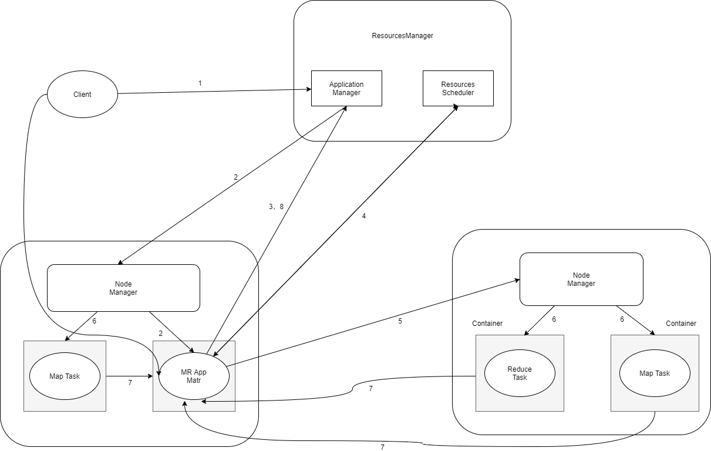

# Yarn 

### MapReduce的不足

参考文章：https://www.ibm.com/developerworks/cn/opensource/os-cn-hadoop-yarn/

### yarn体系结构

yarn(yet Another Resources Negotiation，另一种资源协调者)是一个通用的资源管理系统和调度的平台，讲MapReduce V1的的JobTracker拆分为两个独立的任务，这两个任务分别是全局的资源管理器ResourcesManager和每个应用程序特有的ApplicationMaster。

ResourcesManager负责整个系统中的资源管理和分配

ApplicationMaster负责单个应用程序的管理

#### ResourcesManager

1. 负责处理客服端的请求
2. 接收和监控NodeManager（NM）的资源情况
3. 启动和监控ApplicationMaster（AM）
4. 资源调度和分配

#### NodeManager

每个节点上面的资源和任务管理器

负责和ResourcesManager心跳联系

接收ApplicationMaster的启动停止容器的请求

#### ApplicationMaster

用户提交每个应用程序都包含一个ApplicationMaster，它负责协调来自ResourcesManager的资源，把获得的资源分配给内部的各个任务，从而实现“二次分配”，初次之外，ApplicationMaster还会通过NodeManager监控容器的执行和资源的使用情况，并在此之外任务运行失败时候，重新为任务申请资源来重启任务。

### YARN工作流程

1. 用户端通过Client向Yarn提交应用程序Application，提交的内容包含Application的必备信息，如ApplicationMaster程序、启动ApplicationMaster的命令、用户程序等。
2. yarn中的ResourcesManager接受到客服端应用程序的请求后，ResourcesManager中的调度器Scheduler会为应用程序分配配一个容器，用来运行本次程序对于的ApplicationMaster，图中的MR App Mastr表示的是MapReduce程序的ApplicationMaster
3. ApplicationMaster被创建后，首先想ResourcesManager注册信息，这样用户可以通过ResourcesManager查看应用程序的运行状态，接下来4-7步表示应用程序具备执行步骤，
4. ApplicationMaster采用轮询的方式通过RPC协议向ResourcesManager申请资源
5. ResourcesManager向申请ApplicationMaster分配资源，一旦ApplicationMaster申请得到资源后，便开始与对于的NodeManager通信，要求启动任务。
6. NodeManager为任务设置好运行的环境（包含环境变量、jar包、二进制程序等）后，将任务启动命令写到一个脚本中，并通过运行该脚本启动任务。
7. 各个任务通过某个RPC协议向ApplicationMaster汇报自己的状态和进度，让ApplicationMaster随时掌握各个任务的运行状态。从而可以在任务失败的时候重启任务。
8. 应用程序运行结束后，ApplicationMaster向ResourcesManager注销自己，并关闭自己。如果ApplicationMaster因为故障而导致任务失败，那么ResourcesManager中的应用程序管理器会从新启动，直到所有任务执行完毕。