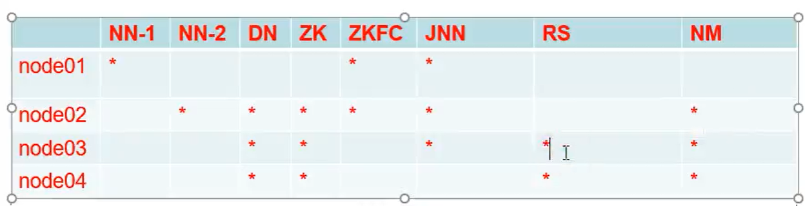

# 配置YARN高可用

官方文档：https://hadoop.apache.org/docs/r2.7.5/




1、Configure parameters as follows:etc/hadoop/mapred-site.xml:

```xml
<configuration>
    <property>
        <name>mapreduce.framework.name</name>
        <value>yarn</value>
    </property>
</configuration>
```

etc/hadoop/yarn-site.xml:

```xml
<configuration>
    <property>
        <name>yarn.nodemanager.aux-services</name>
        <value>mapreduce_shuffle</value>
    </property>
    <property>
      <name>yarn.resourcemanager.ha.enabled</name>
      <value>true</value>
    </property>
    <property>
      <name>yarn.resourcemanager.cluster-id</name>
      <value>cluster1</value>
    </property>
    <property>
      <name>yarn.resourcemanager.ha.rm-ids</name>
      <value>rm1,rm2</value>
    </property>
    <property>
      <name>yarn.resourcemanager.hostname.rm1</name>
      <value>hadoopNode03</value>
    </property>
    <property>
      <name>yarn.resourcemanager.hostname.rm2</name>
      <value>hadoopNode04</value>
    </property>
    <property>
      <name>yarn.resourcemanager.webapp.address.rm1</name>
      <value>hadoopNode03:8088</value>
    </property>
    <property>
      <name>yarn.resourcemanager.webapp.address.rm2</name>
      <value>hadoopNode04:8088</value>
    </property>
    <property>
      <name>yarn.resourcemanager.zk-address</name>
      <value>hadoopNode02:2181,hadoopNode03:2181,hadoopNode04:2181</value>
    </property>
</configuration>
```

 按照我们的需求分发配置文件到其他节点

在节点1上启动我们看看：

```
[root@hadoopNode01 hadoop]# start-yarn.sh 
starting yarn daemons
starting resourcemanager, logging to /opt/mgs/hadoop-2.7.5/logs/yarn-root-resourcemanager-hadoopNode01.out
hadoopNode04: starting nodemanager, logging to /opt/mgs/hadoop-2.7.5/logs/yarn-root-nodemanager-hadoopNode04.out
hadoopNode03: starting nodemanager, logging to /opt/mgs/hadoop-2.7.5/logs/yarn-root-nodemanager-hadoopNode03.out
hadoopNode02: starting nodemanager, logging to /opt/mgs/hadoop-2.7.5/logs/yarn-root-nodemanager-hadoopNode02.out
```

可以看到 nodemanager会根据我们配置的slaves里面找到相对于的Datanode

接下来我们还要在节点三和节点四上面手动的启动yarn

```
[root@hadoopNode03 hadoop]# yarn-daemon.sh start resourcemanager
starting resourcemanager, logging to /opt/mgs/hadoop-2.7.5/logs/yarn-root-resourcemanager-hadoopNode03.out
[root@hadoopNode03 hadoop]# jps
2757 Jps
2712 ResourceManager
1626 JournalNode
1515 QuorumPeerMain
2558 NodeManager
1567 DataNode
[root@hadoopNode03 hadoop]# 
```

### 统计单词案例

```shell
[root@hadoopNode01 mapreduce]# hadoop jar hadoop-mapreduce-examples-2.7.5.jar wordcount /mgs/apiCreate/jk5172user.txt /mgs/output/jike
20/04/10 20:25:28 INFO client.ConfiguredRMFailoverProxyProvider: Failing over to rm2
20/04/10 20:25:30 INFO input.FileInputFormat: Total input paths to process : 1
20/04/10 20:25:31 INFO mapreduce.JobSubmitter: number of splits:1
20/04/10 20:25:31 INFO mapreduce.JobSubmitter: Submitting tokens for job: job_1586521055500_0001
20/04/10 20:25:32 INFO impl.YarnClientImpl: Submitted application application_1586521055500_0001
20/04/10 20:25:32 INFO mapreduce.Job: The url to track the job: http://hadoopNode04:8088/proxy/application_1586521055500_0001/
20/04/10 20:25:32 INFO mapreduce.Job: Running job: job_1586521055500_0001
20/04/10 20:25:50 INFO mapreduce.Job: Job job_1586521055500_0001 running in uber mode : false
20/04/10 20:25:50 INFO mapreduce.Job:  map 0% reduce 0%
20/04/10 20:26:03 INFO mapreduce.Job:  map 100% reduce 0%
20/04/10 20:26:17 INFO mapreduce.Job:  map 100% reduce 100%
20/04/10 20:26:17 INFO mapreduce.Job: Job job_1586521055500_0001 completed successfully
20/04/10 20:26:17 INFO mapreduce.Job: Counters: 49
	File System Counters
		FILE: Number of bytes read=2671
		FILE: Number of bytes written=254429
		FILE: Number of read operations=0
		FILE: Number of large read operations=0
		FILE: Number of write operations=0
		HDFS: Number of bytes read=8268243
		HDFS: Number of bytes written=2521
		HDFS: Number of read operations=6
		HDFS: Number of large read operations=0
		HDFS: Number of write operations=2
	Job Counters 
		Launched map tasks=1
		Launched reduce tasks=1
		Data-local map tasks=1
		Total time spent by all maps in occupied slots (ms)=11303
		Total time spent by all reduces in occupied slots (ms)=10603
		Total time spent by all map tasks (ms)=11303
		Total time spent by all reduce tasks (ms)=10603
		Total vcore-milliseconds taken by all map tasks=11303
		Total vcore-milliseconds taken by all reduce tasks=10603
		Total megabyte-milliseconds taken by all map tasks=11574272
		Total megabyte-milliseconds taken by all reduce tasks=10857472
	Map-Reduce Framework
		Map input records=99737
		Map output records=997366
		Map output bytes=16742458
		Map output materialized bytes=2671
		Input split bytes=110
		Combine input records=997366
		Combine output records=153
		Reduce input groups=153
		Reduce shuffle bytes=2671
		Reduce input records=153
		Reduce output records=153
		Spilled Records=306
		Shuffled Maps =1
		Failed Shuffles=0
		Merged Map outputs=1
		GC time elapsed (ms)=948
		CPU time spent (ms)=6460
		Physical memory (bytes) snapshot=316002304
		Virtual memory (bytes) snapshot=4160417792
		Total committed heap usage (bytes)=165810176
	Shuffle Errors
		BAD_ID=0
		CONNECTION=0
		IO_ERROR=0
		WRONG_LENGTH=0
		WRONG_MAP=0
		WRONG_REDUCE=0
	File Input Format Counters 
		Bytes Read=8268133
	File Output Format Counters 
		Bytes Written=2521
```

到此结束


