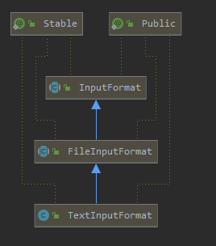
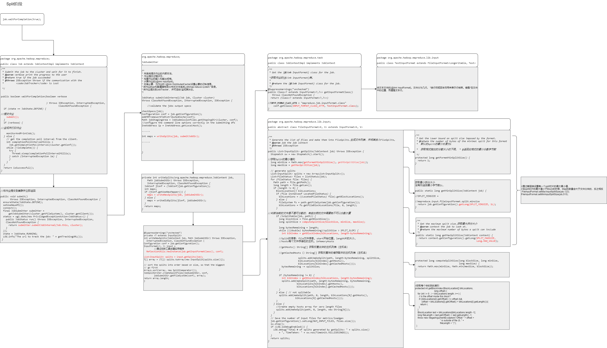
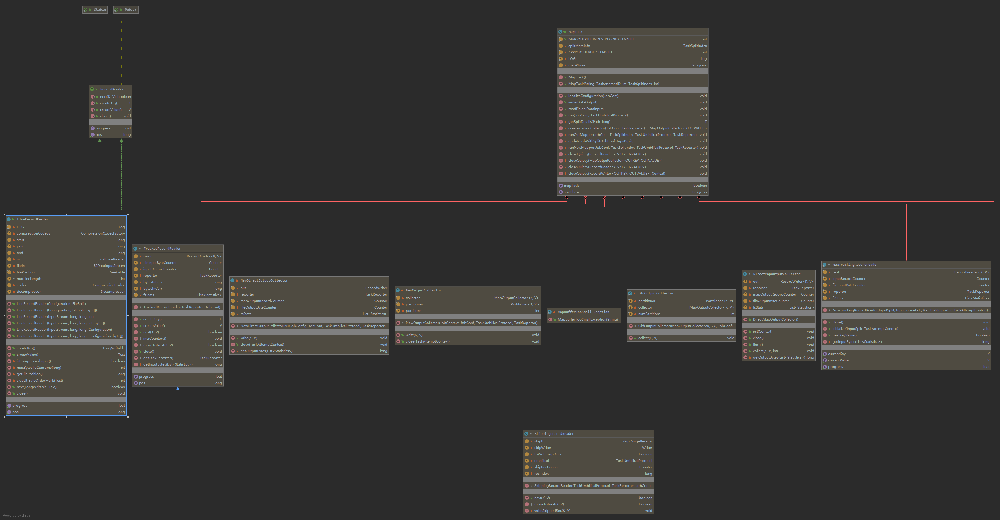
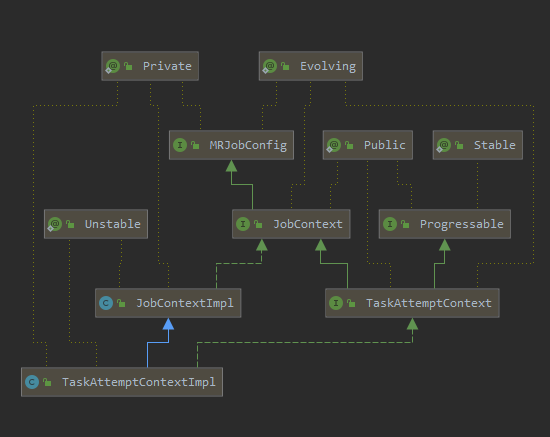

# MapReduce源码分析

## Job

### waitForCompletion方法

```java
public boolean waitForCompletion(boolean verbose
                                   ) throws IOException, InterruptedException,
                                            ClassNotFoundException {
    if (state == JobState.DEFINE) {
        //提交作业
      submit();
    }
    //是否监控
    if (verbose) {
      //监视并打印作业
      monitorAndPrintJob();
    } else {
      // get the completion poll interval from the client.
      int completionPollIntervalMillis = 
        Job.getCompletionPollInterval(cluster.getConf());
      while (!isComplete()) {
        try {
          Thread.sleep(completionPollIntervalMillis);
        } catch (InterruptedException ie) {
        }
      }
    }
    return isSuccessful();
  }
```


```java
  /**
   * Submit the job to the cluster and return immediately.
   * @throws IOException
   */
  public void submit() 
         throws IOException, InterruptedException, ClassNotFoundException {
    ensureState(JobState.DEFINE);
    setUseNewAPI();
    connect();
    final JobSubmitter submitter = 
        getJobSubmitter(cluster.getFileSystem(), cluster.getClient());
    status = ugi.doAs(new PrivilegedExceptionAction<JobStatus>() {
      public JobStatus run() throws IOException, InterruptedException, 
      ClassNotFoundException {
          //提交者 提交内部作业
        return submitter.submitJobInternal(Job.this, cluster);
      }
    });
    state = JobState.RUNNING;
    LOG.info("The url to track the job: " + getTrackingURL());
   }
```


## JobSubmitter 作业提交者

### submitJobInternal方法

```java
/**
   * Internal method for submitting jobs to the system.
   * 
   * <p>The job submission process involves:
   * <ol>
   *   <li>
   *   Checking the input and output specifications of the job.
   *   </li>
   *   <li>
   *   Computing the {@link InputSplit}s for the job.
   *   </li>
   *   <li>
   *   Setup the requisite accounting information for the 
   *   {@link DistributedCache} of the job, if necessary.
   *   </li>
   *   <li>
   *   Copying the job's jar and configuration to the map-reduce system
   *   directory on the distributed file-system. 
   *   </li>
   *   <li>
   *   Submitting the job to the <code>JobTracker</code> and optionally
   *   monitoring it's status.
   *   </li>
   * </ol></p>
   * @param job the configuration to submit
   * @param cluster the handle to the Cluster
   * @throws ClassNotFoundException
   * @throws InterruptedException
   * @throws IOException
   */
  JobStatus submitJobInternal(Job job, Cluster cluster) 
  throws ClassNotFoundException, InterruptedException, IOException {

    //验证作业输出规格
    checkSpecs(job);
	//获取配置
    Configuration conf = job.getConfiguration();
    //将MR框架添加到分布式缓存
    addMRFrameworkToDistributedCache(conf);
	//作业提交文件 获取暂存目录
    Path jobStagingArea = JobSubmissionFiles.getStagingDir(cluster, conf);
      ......
   try {
      //获取要写入的Splits的切片数量
      int maps = writeSplits(job, submitJobDir);
      conf.setInt(MRJobConfig.NUM_MAPS, maps);
      LOG.info("number of splits:" + maps);

      // write "queue admins of the queue to which job is being submitted"
      // to job file.
      String queue = conf.get(MRJobConfig.QUEUE_NAME,
          JobConf.DEFAULT_QUEUE_NAME);
      AccessControlList acl = submitClient.getQueueAdmins(queue);
      conf.set(toFullPropertyName(queue,
          QueueACL.ADMINISTER_JOBS.getAclName()), acl.getAclString());

      // removing jobtoken referrals before copying the jobconf to HDFS
      // as the tasks don't need this setting, actually they may break
      // because of it if present as the referral will point to a
      // different job.
      TokenCache.cleanUpTokenReferral(conf);

      if (conf.getBoolean(
          MRJobConfig.JOB_TOKEN_TRACKING_IDS_ENABLED,
          MRJobConfig.DEFAULT_JOB_TOKEN_TRACKING_IDS_ENABLED)) {
        // Add HDFS tracking ids
        ArrayList<String> trackingIds = new ArrayList<String>();
        for (Token<? extends TokenIdentifier> t :
            job.getCredentials().getAllTokens()) {
          trackingIds.add(t.decodeIdentifier().getTrackingId());
        }
        conf.setStrings(MRJobConfig.JOB_TOKEN_TRACKING_IDS,
            trackingIds.toArray(new String[trackingIds.size()]));
      }

      // Set reservation info if it exists
      ReservationId reservationId = job.getReservationId();
      if (reservationId != null) {
        conf.set(MRJobConfig.RESERVATION_ID, reservationId.toString());
      }

      // Write job file to submit dir
      writeConf(conf, submitJobFile);
      
      //
      // Now, actually submit the job (using the submit name)
      //
      printTokens(jobId, job.getCredentials());
      status = submitClient.submitJob(
          jobId, submitJobDir.toString(), job.getCredentials());
      if (status != null) {
        return status;
      } else {
        throw new IOException("Could not launch job");
      }
    } finally {
      if (status == null) {
        LOG.info("Cleaning up the staging area " + submitJobDir);
        if (jtFs != null && submitJobDir != null)
          jtFs.delete(submitJobDir, true);

      }
    }
  }
  
```

1. 检查作业的输入和输出规格。
2. 计算作业的输入切片InputSplit
3. 如有必要，为作业的*{@link DistributedCache}设置必要的记帐信息。
4. 将作业的jar和配置复制到分布式文件系统上的map-reduce system 目录。
5. 将作业提交到  JobTracker  ，并可选地*监视其状态。

#### writeSplits 计算Split的数量

```java
  private int writeSplits(org.apache.hadoop.mapreduce.JobContext job,
      Path jobSubmitDir) throws IOException,
      InterruptedException, ClassNotFoundException {
    JobConf jConf = (JobConf)job.getConfiguration();
    int maps;
    if (jConf.getUseNewMapper()) {
    //我是使用的是新的计算方式，老的计算方式应该是给上个1.X版本的把
      maps = writeNewSplits(job, jobSubmitDir);
    } else {
      maps = writeOldSplits(jConf, jobSubmitDir);
    }
    return maps;
  }
```

##### writeNewSplits 写入新的Split

```java
@SuppressWarnings("unchecked")
  private <T extends InputSplit>
  int writeNewSplits(JobContext job, Path jobSubmitDir) throws IOException,
      InterruptedException, ClassNotFoundException {
    Configuration conf = job.getConfiguration();
    InputFormat<?, ?> input =
        //通过反射工具创建实用程序
      ReflectionUtils.newInstance(job.getInputFormatClass(), conf);

    List<InputSplit> splits = input.getSplits(job);
    T[] array = (T[]) splits.toArray(new InputSplit[splits.size()]);

    // sort the splits into order based on size, so that the biggest
    // go first
    Arrays.sort(array, new SplitComparator());
    JobSplitWriter.createSplitFiles(jobSubmitDir, conf, 
        jobSubmitDir.getFileSystem(conf), array);
    return array.length;
  }
```

job.getInputFormatClass()方法我们看的是JobContextImpl实现类的方法获取作业的{@link InputFormat}类

```java
  /**
   * Get the {@link InputFormat} class for the job.
   * 
   * @return the {@link InputFormat} class for the job.
   */
  @SuppressWarnings("unchecked")
  public Class<? extends InputFormat<?,?>> getInputFormatClass() 
     throws ClassNotFoundException {
    return (Class<? extends InputFormat<?,?>>) 
        //获取用户的mapreduce.job.inputformat.class类，存在就获取用户输入的，如果没有就用默认的TextInputFormat
      conf.getClass(INPUT_FORMAT_CLASS_ATTR, TextInputFormat.class);
  }
```

**默认的TextInputFormat**文字输入格式

用于纯文本文件的{@link InputFormat}。文件分为几行。 *换行符或回车符用来表示行结束。键是*在文件中的位置，而值是文本行。



#### 通过输入格式化类InputFormat得到Split的个数

```java
 /** 
   * Logically split the set of input files for the job.  
   * 
   * <p>Each {@link InputSplit} is then assigned to an individual {@link Mapper}
   * for processing.</p>
   *
   * <p><i>Note</i>: The split is a <i>logical</i> split of the inputs and the
   * input files are not physically split into chunks. For e.g. a split could
   * be <i>&lt;input-file-path, start, offset&gt;</i> tuple. The InputFormat
   * also creates the {@link RecordReader} to read the {@link InputSplit}.
   * 
   * @param context job configuration.
   * @return an array of {@link InputSplit}s for the job.
   */
```

逻辑上拆分作业的输入文件集。  然后将每个{@link InputSplit}分配给一个单独的{@link Mapper} 进行处理。 注意 ：拆分为 逻辑 分割输入和 输入文件实际上并不分割成块。例如分割可以 为   输入文件路径，开始，偏移 元组。 InputFormat *还创建{@link RecordReader}来读取{@link InputSplit}。

分析 .getSplits(job)的实现类FileInputFormat的实现

```java
  /** 
   * Generate the list of files and make them into FileSplits.
   * 生成文件列表，并将其放入FileSplits。
   * @param job the job context
   * @throws IOException
   */
  public List<InputSplit> getSplits(JobContext job) throws IOException {
    StopWatch sw = new StopWatch().start();
      //getFormatMinSplitSize返回的是1，获取格式施加的分割大小的下限 返回此格式的最小分割字节数1
      //getMinSplitSize(job)
      //单曲可以分析为，用户输入的split的配置和默认的split的切片
    long minSize = Math.max(getFormatMinSplitSize(), getMinSplitSize(job));
      //如果设置了，就会取出用户的，否则使用默认的
    long maxSize = getMaxSplitSize(job);

    // generate splits
    List<InputSplit> splits = new ArrayList<InputSplit>();
      //获取输入的输入文件，也就是Map输入的path获取，因为Map支持多个输入源
    List<FileStatus> files = listStatus(job);
      //循环的处理每个文件处理成Map的输入切片输入Map中
    for (FileStatus file: files) {
      Path path = file.getPath();
      long length = file.getLen();
      if (length != 0) {
        BlockLocation[] blkLocations;
        if (file instanceof LocatedFileStatus) {
          blkLocations = ((LocatedFileStatus) file).getBlockLocations();
        } else {
          FileSystem fs = path.getFileSystem(job.getConfiguration());
          blkLocations = fs.getFileBlockLocations(file, 0, length);
        }
          //判断文件是不是支持切片的，有些通过压缩算法的文件是不支持切块的
        if (isSplitable(job, path)) {
          long blockSize = file.getBlockSize();
            //获取块文件的大小
          long splitSize = computeSplitSize(blockSize, minSize, maxSize);

          long bytesRemaining = length;
          while (((double) bytesRemaining)/splitSize > SPLIT_SLOP) {
            int blkIndex = getBlockIndex(blkLocations, length-bytesRemaining);
              //Split的信息：file文件信息, start开始位置, length片的大小, hosts每个文件存储在的主机, inMemoryHosts
              //getHosts() String[] 获取托管此块的主机列表（主机名）
              //getCachedHosts（）String[] 获取托管块的缓存副本的主机列表（主机名）
            splits.add(makeSplit(path, length-bytesRemaining, splitSize,
                        blkLocations[blkIndex].getHosts(),
                        blkLocations[blkIndex].getCachedHosts()));
            bytesRemaining -= splitSize;
          }

          if (bytesRemaining != 0) {
            int blkIndex = getBlockIndex(blkLocations, length-bytesRemaining);
            splits.add(makeSplit(path, length-bytesRemaining, bytesRemaining,
                       blkLocations[blkIndex].getHosts(),
                       blkLocations[blkIndex].getCachedHosts()));
          }
        } else { // not splitable
          splits.add(makeSplit(path, 0, length, blkLocations[0].getHosts(),
                      blkLocations[0].getCachedHosts()));
        }
      } else { 
        //Create empty hosts array for zero length files
        splits.add(makeSplit(path, 0, length, new String[0]));
      }
    }
    // Save the number of input files for metrics/loadgen
    job.getConfiguration().setLong(NUM_INPUT_FILES, files.size());
    sw.stop();
    if (LOG.isDebugEnabled()) {
      LOG.debug("Total # of splits generated by getSplits: " + splits.size()
          + ", TimeTaken: " + sw.now(TimeUnit.MILLISECONDS));
    }
    return splits;
  }

```

```java
  /**
   * Get the minimum split size
   * 返回系统配置的split的配置
   * @param job the job
   * @return the minimum number of bytes that can be in a split
   */
  public static long getMinSplitSize(JobContext job) {
      // SPLIT_MINSIZE mapreduce.input.fileinputformat.split.minsize的配置文件参数
    return job.getConfiguration().getLong(SPLIT_MINSIZE, 1L);
  }
```

```java
/**
   * Get the maximum split size.
   * @param context the job to look at.
   * @return the maximum number of bytes a split can include
   */
  public static long getMaxSplitSize(JobContext context) {
    return context.getConfiguration().getLong(SPLIT_MAXSIZE, 
                                              Long.MAX_VALUE);
  }
```

```java
  protected long computeSplitSize(long blockSize, long minSize,
                                  long maxSize) {
    return Math.max(minSize, Math.min(maxSize, blockSize));
  }
```

```jav
//通过客服端设置每一个split切片的最大最小值，
//当split切片的最大值小于Block的时候，Map的数量会大于文件分块的，反之相反
        FileInputFormat.setMaxInputSplitSize(job,123);
        FileInputFormat.setMinInputSplitSize(job,515);
```

```java
//获取每个块的到的索引 
protected int getBlockIndex(BlockLocation[] blkLocations, 
                              long offset) {
    for (int i = 0 ; i < blkLocations.length; i++) {
      // is the offset inside this block?
      if ((blkLocations[i].getOffset() <= offset) &&
          (offset < blkLocations[i].getOffset() + blkLocations[i].getLength())){
        return i;
      }
    }
    BlockLocation last = blkLocations[blkLocations.length -1];
    long fileLength = last.getOffset() + last.getLength() -1;
    throw new IllegalArgumentException("Offset " + offset + 
                                       " is outside of file (0.." +
                                       fileLength + ")");
  }
```



直接现在看看

## Map Task



### MapTask类的run方法

```java

/** A Map task. */
@InterfaceAudience.LimitedPrivate({"MapReduce"})
@InterfaceStability.Unstable
public class MapTask extends Task {
  
  @Override
  public void run(final JobConf job, final TaskUmbilicalProtocol umbilical)
    throws IOException, ClassNotFoundException, InterruptedException {
    this.umbilical = umbilical;

    if (isMapTask()) {
      // 判断Reduce的数量是不是等于0，
      if (conf.getNumReduceTasks() == 0) {
        mapPhase = getProgress().addPhase("map", 1.0f);
      } else {
        // 如果存在Reduce存在一个或者多个，执行Map，还要执行排序
        mapPhase = getProgress().addPhase("map", 0.667f);
        sortPhase  = getProgress().addPhase("sort", 0.333f);
      }
    }
    //开始计算调度算法
    TaskReporter reporter = startReporter(umbilical);
 
    boolean useNewApi = job.getUseNewMapper();
    initialize(job, getJobID(), reporter, useNewApi);

    // check if it is a cleanupJobTask
    if (jobCleanup) {
      runJobCleanupTask(umbilical, reporter);
      return;
    }
    if (jobSetup) {
      runJobSetupTask(umbilical, reporter);
      return;
    }
    if (taskCleanup) {
      runTaskCleanupTask(umbilical, reporter);
      return;
    }
	//是不是使用新的API
    if (useNewApi) {
      //我们使用的是新的API
      runNewMapper(job, splitMetaInfo, umbilical, reporter);
    } else {
      runOldMapper(job, splitMetaInfo, umbilical, reporter);
    }
    done(umbilical, reporter);
  }

  public Progress getSortPhase() {
    return sortPhase;
  }


}

```

```java
job.setNumReduceTasks(1111);
```

可以在客服端设置Reduce的数量

切片是计算出来的，我们可以通过设置Split的大小来控制Map，Reduce是设置的。默认的Reduce的数量为1个。

```
public int getNumReduceTasks() { return getInt(JobContext.NUM_REDUCES, 1); }
```

```java
@SuppressWarnings("unchecked")
  private <INKEY,INVALUE,OUTKEY,OUTVALUE>
  void runNewMapper(final JobConf job,
                    final TaskSplitIndex splitIndex,
                    final TaskUmbilicalProtocol umbilical,
                    TaskReporter reporter
                    ) throws IOException, ClassNotFoundException,
                             InterruptedException {
    // 创建任务上下文，以便我们获取课程
    org.apache.hadoop.mapreduce.TaskAttemptContext taskContext =
      new org.apache.hadoop.mapreduce.task.TaskAttemptContextImpl(job, 
                                                                  getTaskID(),
                                                                  reporter);
    // 创建map
    org.apache.hadoop.mapreduce.Mapper<INKEY,INVALUE,OUTKEY,OUTVALUE> mapper =
      (org.apache.hadoop.mapreduce.Mapper<INKEY,INVALUE,OUTKEY,OUTVALUE>)
        ReflectionUtils.newInstance(taskContext.getMapperClass(), job);
    // 创建输入格式化
    org.apache.hadoop.mapreduce.InputFormat<INKEY,INVALUE> inputFormat =
      (org.apache.hadoop.mapreduce.InputFormat<INKEY,INVALUE>)
        ReflectionUtils.newInstance(taskContext.getInputFormatClass(), job);
    // 重新创建切片对象，也就是在客户端得到的Splits是个序列化的对象
    org.apache.hadoop.mapreduce.InputSplit split = null;
    split = getSplitDetails(new Path(splitIndex.getSplitLocation()),
        splitIndex.getStartOffset());
    LOG.info("Processing split: " + split);
	//新的跟踪记录阅读器对象
    org.apache.hadoop.mapreduce.RecordReader<INKEY,INVALUE> input =
      new NewTrackingRecordReader<INKEY,INVALUE>
        (split, inputFormat, reporter, taskContext);
    
    job.setBoolean(JobContext.SKIP_RECORDS, isSkipping());
    org.apache.hadoop.mapreduce.RecordWriter output = null;
    
    // get an output object
    if (job.getNumReduceTasks() == 0) {
      output = 
        new NewDirectOutputCollector(taskContext, job, umbilical, reporter);
    } else {
      output = new NewOutputCollector(taskContext, job, umbilical, reporter);
    }
	//map自己的上下文的创建
    org.apache.hadoop.mapreduce.MapContext<INKEY, INVALUE, OUTKEY, OUTVALUE> 
    mapContext = 
      new MapContextImpl<INKEY, INVALUE, OUTKEY, OUTVALUE>(job, getTaskID(), 
          input, output, 
          committer, 
          reporter, split);

    org.apache.hadoop.mapreduce.Mapper<INKEY,INVALUE,OUTKEY,OUTVALUE>.Context 
        mapperContext = 
          new WrappedMapper<INKEY, INVALUE, OUTKEY, OUTVALUE>().getMapContext(
              mapContext);

    try {
        //输入初始化
      input.initialize(split, mapperContext);
        //调用Map中run方法
      mapper.run(mapperContext);
        //map阶段执行完毕
      mapPhase.complete();
      setPhase(TaskStatus.Phase.SORT);
      statusUpdate(umbilical);
        //关闭map的输入流
      input.close();
      input = null;
        //关闭map阶段的输出流，关闭之前会把最后的数据刷新输出完毕
      output.close(mapperContext);
      output = null;
    } finally {
      closeQuietly(input);
      closeQuietly(output, mapperContext);
    }
  }
```


#### 创建map的时候初始化的过程



我们来看

```java
package org.apache.hadoop.mapreduce.task;
public class JobContextImpl implements JobContext {
  /**
   * Get the {@link Mapper} class for the job.
   * 
   * @return the {@link Mapper} class for the job.
   */
  @SuppressWarnings("unchecked")
  public Class<? extends Mapper<?,?,?,?>> getMapperClass() 
     throws ClassNotFoundException {
    return (Class<? extends Mapper<?,?,?,?>>) 
        // MAP_CLASS_ATTR = "mapreduce.job.map.class";
      conf.getClass(MAP_CLASS_ATTR, Mapper.class);
  }
}
```

#### 输入格式化

```java
  /**
   * Get the {@link InputFormat} class for the job.
   * 
   * @return the {@link InputFormat} class for the job.
   */
  @SuppressWarnings("unchecked")
  public Class<? extends InputFormat<?,?>> getInputFormatClass() 
     throws ClassNotFoundException {
    return (Class<? extends InputFormat<?,?>>) 
        //INPUT_FORMAT_CLASS_ATTR = "mapreduce.job.inputformat.class";
      conf.getClass(INPUT_FORMAT_CLASS_ATTR, TextInputFormat.class);
  }
```

#### 新的跟踪记录阅读器对象创建的过程

```java
    NewTrackingRecordReader(org.apache.hadoop.mapreduce.InputSplit split,
        org.apache.hadoop.mapreduce.InputFormat<K, V> inputFormat,
        TaskReporter reporter,
        org.apache.hadoop.mapreduce.TaskAttemptContext taskContext)
        throws InterruptedException, IOException {
      this.reporter = reporter;
      this.inputRecordCounter = reporter
          .getCounter(TaskCounter.MAP_INPUT_RECORDS);
      this.fileInputByteCounter = reporter
          .getCounter(FileInputFormatCounter.BYTES_READ);

      List <Statistics> matchedStats = null;
      if (split instanceof org.apache.hadoop.mapreduce.lib.input.FileSplit) {
        matchedStats = getFsStatistics(((org.apache.hadoop.mapreduce.lib.input.FileSplit) split)
            .getPath(), taskContext.getConfiguration());
      }
      fsStats = matchedStats;

      long bytesInPrev = getInputBytes(fsStats);
        //创建一个创建记录读取器
      this.real = inputFormat.createRecordReader(split, taskContext);
      long bytesInCurr = getInputBytes(fsStats);
      fileInputByteCounter.increment(bytesInCurr - bytesInPrev);
    }
```

inputFormat.createRecordReader(split, taskContext);

调用的是NewTrackingRecordReader的initialize()的方阿飞

```java
package org.apache.hadoop.mapreduce.lib.input;
public class TextInputFormat extends FileInputFormat<LongWritable, Text> {

  @Override
  public RecordReader<LongWritable, Text> 
    createRecordReader(InputSplit split,
                       TaskAttemptContext context) {
    String delimiter = context.getConfiguration().get(
        "textinputformat.record.delimiter");
    byte[] recordDelimiterBytes = null;
    if (null != delimiter)
      recordDelimiterBytes = delimiter.getBytes(Charsets.UTF_8);
      //返回一个以行为单位的记录读取器
    return new LineRecordReader(recordDelimiterBytes);
  }

  @Override
  protected boolean isSplitable(JobContext context, Path file) {
    final CompressionCodec codec =
      new CompressionCodecFactory(context.getConfiguration()).getCodec(file);
    if (null == codec) {
      return true;
    }
    return codec instanceof SplittableCompressionCodec;
  }

}
```

LineRecordReader(recordDelimiterBytes)得到的是对于的

=========

未完待续：