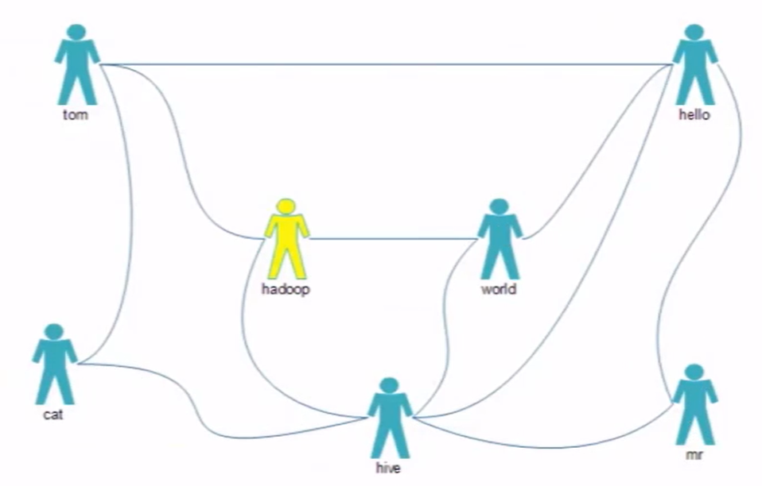

# MapReduce好友推荐案例

好友序列

```properties
tom hello hadoop cat
world hadoop hello hive
cat tom hive
mr hive hello
hive cat hadoop world hello mr
hadoop tom hive world
hello tom world hive mr
```

第一个表示用户，第二个开始就是联系人

tom的联系人有hello、hadoop、cat三个兰溪人，我们需要为用户提供联系人。



分析可知：

我们需要在map阶段根据用户的直接联系和间接关系列举出来，map输出的为tom：hadoop 1，hello：hadoop 0，0代表间接关系，1代表直接关系。在Reduce阶段把直接关系的人删除掉，再输出。

### RecomFriendApp

```java
package icu.shaoyayu.hadoop.mr.buddy;

import icu.shaoyayu.hadoop.mr.buddy.mapper.RecomFriendMapper;
import icu.shaoyayu.hadoop.mr.buddy.reduce.RecomFriendReduce;
import org.apache.hadoop.conf.Configuration;
import org.apache.hadoop.fs.Path;
import org.apache.hadoop.io.IntWritable;
import org.apache.hadoop.io.Text;
import org.apache.hadoop.mapreduce.Job;
import org.apache.hadoop.mapreduce.lib.input.FileInputFormat;
import org.apache.hadoop.mapreduce.lib.output.FileOutputFormat;

import java.io.IOException;

/**
 * @author 邵涯语
 * @date 2020/4/18 23:33
 * @Version :
 */
public class RecomFriendApp {

    public static void main(String[] args) throws IOException, ClassNotFoundException, InterruptedException {

        //获取配置
        Configuration configuration = new Configuration(true);

        //获取作业
        Job job = Job.getInstance(configuration);
        job.setJarByClass(RecomFriendApp.class);
        //配置
        //map环节
        job.setMapperClass(RecomFriendMapper.class);
        job.setMapOutputKeyClass(Text.class);
        job.setMapOutputValueClass(IntWritable.class);
        //Reduce环节
        job.setReducerClass(RecomFriendReduce.class);
        //设置作业输入输出的路径

        Path inputPath = new Path("/data/friend/input/");
        FileInputFormat.setInputPaths(job,inputPath);

        Path outputPath = new Path("/data/friend/output/");
        if (outputPath.getFileSystem(configuration).exists(outputPath)){
            outputPath.getFileSystem(configuration).delete(outputPath,true);
        }
        FileOutputFormat.setOutputPath(job,outputPath);
        //提交作业
        job.waitForCompletion(true);
        
    }
}
```


### RecomFriendMapper

```java
package icu.shaoyayu.hadoop.mr.buddy.mapper;

import org.apache.hadoop.io.IntWritable;
import org.apache.hadoop.io.LongWritable;
import org.apache.hadoop.io.Text;
import org.apache.hadoop.mapreduce.Mapper;
import org.apache.hadoop.util.StringUtils;

import java.io.IOException;

/**
 * @author 邵涯语
 * @date 2020/4/18 23:43
 * @Version :
 */
public class RecomFriendMapper extends Mapper<LongWritable, Text,Text, IntWritable> {

    private Text mKey = new Text();
    private IntWritable mValue = new IntWritable();

    /**
     * 重写map方法
     * @param key
     * @param value
     * @param context
     * @throws IOException
     * @throws InterruptedException
     */
    @Override
    protected void map(LongWritable key, Text value, Context context) throws IOException, InterruptedException {

        //tom hello hadoop cat
        String[] sts = StringUtils.split(value.toString(),' ');

        for (int i = 1; i < sts.length; i++) {
            mKey.set(compareTwoStrings(sts[0],sts[i]));
            mValue.set(0);
            context.write(mKey,mValue);
            for (int j = i+1; j < sts.length; j++) {
                mKey.set(compareTwoStrings(sts[i],sts[j]));
                mValue.set(1);
                context.write(mKey,mValue);
            }
        }

    }

    private static String compareTwoStrings(String val1,String val2){
        if (val1.compareTo(val2) < 0){
            return val1+":"+val2;
        }
        return val2+":"+val1;
    }


}
```


### RecomFriendReduce

```java
package icu.shaoyayu.hadoop.mr.buddy.reduce;

import org.apache.hadoop.io.IntWritable;
import org.apache.hadoop.io.Text;
import org.apache.hadoop.mapreduce.Reducer;

import java.io.IOException;

/**
 * @author 邵涯语
 * @date 2020/4/18 23:46
 * @Version :
 */
public class RecomFriendReduce extends Reducer<Text, IntWritable,Text,IntWritable> {

    private IntWritable mVale = new IntWritable();

    /**
     * reduce阶段
     * @param key
     * @param values
     * @param context
     * @throws IOException
     * @throws InterruptedException
     */
    @Override
    protected void reduce(Text key, Iterable<IntWritable> values, Context context) throws IOException, InterruptedException {
        //tom:hello 0
        //tom:hello 1
        //tom:hello 0
        int flg = 0;
        int sum = 0;
        for (IntWritable value : values) {
            if (value.get() == 0){
                flg = 1;
            }
            sum+= value.get();
        }
        if (flg==0){
            mVale.set(sum);
            context.write(key,mVale);
        }
    }

}
```

