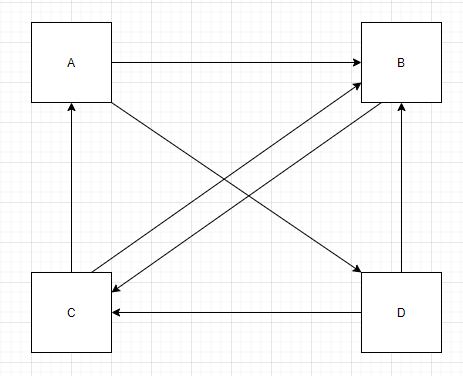
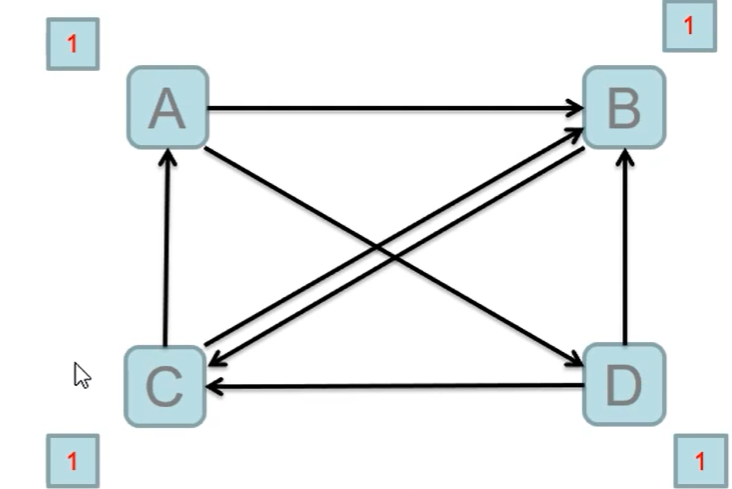
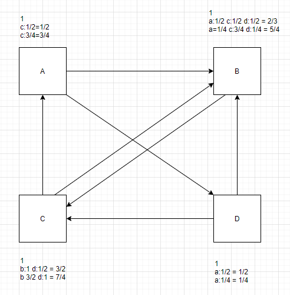
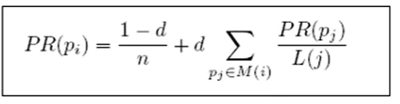

# PageRank案列

### 什么是pagerank

- PageRank是Google提出的算法，用于衡量特定网页相对于搜索引擎索弓中的其他网页而言的重要程度。
- 是Google创始人拉里佩奇和谢尔盖布林于1997年创造的
- PageRank实现了将链接价值概念作为排名因素。

计算环境

- Hadoop-2.5.2
- 四台主机
- 两台NN的HA
- 两台RM的HA
- 离线计算框架MapReduce

### 算法原理(1)

思考超链接在互联网中的作用?

- 入链====投票
  PageRank让链接来"投票",到一个页面的超链接相当于对该页投一票
- 入链数量
  如果一个页面节点接收到的其他网页指向的入链数量越多，那么这个页面越重要。
- 入链质量
  指向页面A的入链质量不同，质量高的页面会通过链接向其他页面传递更多的权重。所以越是质量高的页面指向页面A，则页面A越重要。



站在A的角度:
需要将自己的PR值分给B,D
站在B的角度:
收到来自A,C,D的PR值



PR需要迭代计算
其PR值会趋于稳定



### 算法原理(2)

初始值
    Google的每个页面设置相同的PR值
    pagerank算法给每个页面的PR初始值为1。

迭代计算(收敛)
    Google不断的重复计算每个页面的PageRank。那么经过不断的重复计算
    这些页面的PR值会趋向于稳定，也就是收敛的状态。
    在具体企业应用中怎么样确定收敛标准?
        1、每个页面的PR值和上一 次计算的PR相等τ
        2、设定一个差值指标(0.0001) 。当所有页面和上一 -次计算的PR差值平均小于该标准时，则收敛。
        3、设定一个百分比(99%) ，当99%的页面和上一次计算的PR相等

### 算法原理(3)

站在互联网的角度:

- 只出，不入: PR会为0
- 只入，不出: PR会很高
- 直接访问网页

一修正PageRank计算公式:增加阻尼系数

- 在简单公式的基础上增加了阻尼系数(damping factor) d
- 一般取值d=0.85。

完整PageRank计算公式

- d:阻尼系数
- M():指向的页面集合
- L(j): 页面的出链数
- PR(pj): j页面的PR值
- n:所有页面数



数据如下

```properties
A B D
B C
C A B
D B C
```


### 案例

```java
package icu.shaoyayu.hadoop.mr.pagerank;

import org.apache.hadoop.conf.Configuration;
import org.apache.hadoop.fs.FileSystem;
import org.apache.hadoop.fs.Path;
import org.apache.hadoop.io.Text;
import org.apache.hadoop.mapreduce.Job;
import org.apache.hadoop.mapreduce.Mapper;
import org.apache.hadoop.mapreduce.Reducer;
import org.apache.hadoop.mapreduce.lib.input.FileInputFormat;
import org.apache.hadoop.mapreduce.lib.input.KeyValueTextInputFormat;
import org.apache.hadoop.mapreduce.lib.output.FileOutputFormat;

import java.io.IOException;

/**
 * @author 邵涯语
 * @date 2020/4/19 21:17
 * @Version :
 */
public class RunJob {

    public static enum MyCounter{
        my;
    }

    public static void main(String[] args) {

        Configuration configuration = new Configuration(true);
        //If enabled, user can submit an application cross-platform i.e. submit an application from a Windows client to a Linux/Unix server or vice versa.
        //如果启用，则用户可以跨平台提交应用程序，即从Windows客户端向Linux / Unix服务器提交应用程序，反之亦然。
        configuration.set("mapreduce.app-submission.cross-platform","true");
        //The runtime framework for executing MapReduce jobs. Can be one of local, classic or yarn.
        //用于执行MapReduce作业的运行时框架。可以是本地，经典或毛线之一。
        configuration.set("mapreduce.framework.name","local");

        double d = 0.001;
        int i = 0;
        while (true){
            i++;
            try {
                //运行计数器 将name属性的值设置为int。 参数： 名称-属性名称。 value-属性的int值。
                configuration.setInt("runCount",1);
                FileSystem fs = FileSystem.get(configuration);
                Job job = Job.getInstance(configuration);
                job.setJarByClass(RunJob.class);

                //设置用户指定的作业名称。 参数： 名称-工作的新名称。
                job.setJobName("pr"+i);
                job.setMapperClass(PageRankMapper.class);
                job.setReducerClass(PageRankReducer.class);
                job.setMapOutputKeyClass(Text.class);
                job.setMapOutputValueClass(Text.class);

                //设置jar指向的路径
//                job.setJar("");

                /**
                 * 设置输入格式类 键值文字输入格式
                 * 纯文本文件的{@link InputFormat}。文件分为几行。换行或回车都可用来表示行结束。
                 * 每行由分隔符字节分为键和值部分。如果不存在这样的字节，则密钥将是整行，并且值将为空。
                 * 分隔符字节可以在配置文件中以属性名mapreduce.input.keyvaluelinerecordreader.key.value.separator指定。
                 * 默认值为制表符（'\ t'）。
                 */
                job.setInputFormatClass(KeyValueTextInputFormat.class);

                Path inputPath = new Path("data/pagerank/input/");
                if (i > 1){
                    inputPath = new Path("data/pagerank/output/pr"+i);
                }
                FileInputFormat.setInputPaths(job,inputPath);

                Path outputPath = new Path("data/pagerank/output/pr"+i);

                if (fs.exists(outputPath)){
                    fs.delete(outputPath,true);
                }
                FileOutputFormat.setOutputPath(job,outputPath);

                boolean f = job.waitForCompletion(true);

                if (f){
                    System.out.println("success fully executed:"+i);
                    long sun = job.getCounters().findCounter(MyCounter.my).getValue();
                    System.out.println(sun);
                    double avgd = sun/4000.0;
                    if (avgd < d){
                        break;
                    }
                }

            }catch (Exception e){
                e.printStackTrace();
            }
        }

    }

    static class PageRankMapper extends Mapper<Text, Text,Text,Text>{

        @Override
        protected void map(Text key, Text value, Context context) throws IOException, InterruptedException {
            int runCount = context.getConfiguration().getInt("runCount",1);
            /**
             * 可能收到的数据情况
             * A  B D
             * A  B D 0.3
             *
             * K:A
             * V:B D
             * K:A
             * V:0.3 B D
             */

            String page = key.toString();
            Node node = null;
            if (runCount==1){
                node = Node.fromMR("1.0\t" + value.toString());
            } else {
                node = Node.fromMR(value.toString());
            }
            // 有出链
            if (node.containsAdjacentNodes()) {
                Double outValue = node.getPageRank() / node.getAdjacentNodeNames().length;

                // 输出 A: 1.0    B    D, 输出原始值
                context.write(new Text(page), new Text(node.toString()));
                for (int i = 0; i < node.getAdjacentNodeNames().length; i++) {
                    String outKey = node.getAdjacentNodeNames()[i];
                    // 输出 B: 0.5; D: 0.5;
                    context.write(new Text(outKey), new Text(outValue + ""));
                }
            }


        }
    }

    static class PageRankReducer extends Reducer<Text,Text,Text,Text>{
        @Override
        protected void reduce(Text key, Iterable<Text> values, Context context) throws IOException, InterruptedException {
            Double sum = 0d;

            // 原始值
            Node sourceNode = null;
            for (Text text : values) {
                Node node = Node.fromMR(text.toString());
                if (node.containsAdjacentNodes()) {
                    sourceNode = node;
                }else {
                    sum += node.getPageRank();
                }
            }
            // 0.85 为公式阻尼系数
            Double newPR = (1 - 0.85) / 4.0 + (0.85 * sum);

            // 原始值比较, 扩大倍数, 根据收敛值确定(0.001, 就是1000)
            Double d = Math.abs((newPR - sourceNode.getPageRank()) * 1000.0);
            System.err.println(d);
            // 计数器, 确定最后停止标准
            context.getCounter(MyCounter.my).increment(d.intValue());

            sourceNode.setPageRank(newPR);
            context.write(key, new Text(sourceNode.toString()));

        }
    }

}
```


```java
package icu.shaoyayu.hadoop.mr.pagerank;

import org.apache.commons.lang.StringUtils;

import java.io.IOException;
import java.util.Arrays;

/**
 * @author 邵涯语
 * @date 2020/4/19 22:18
 * @Version :
 */
public class Node {
    /** 初始值 */
    private Double pageRank = 1d;
    /** 出链 */
    private String[] adjacentNodeNames;
    public static final char fieldSeparator = '\t';

    public Double getPageRank() {
        return pageRank;
    }

    public Node setPageRank(Double pageRank) {
        this.pageRank = pageRank;
        return this;
    }

    public String[] getAdjacentNodeNames() {
        return adjacentNodeNames;
    }

    public Node setAdjacentNodeNames(String[] adjacentNodeNames) {
        this.adjacentNodeNames = adjacentNodeNames;
        return this;
    }

    public boolean containsAdjacentNodes() {
        return adjacentNodeNames != null && adjacentNodeNames.length > 0;
    }

    @Override
    public String toString() {
        StringBuilder sb = new StringBuilder();
        sb.append(pageRank);

        if (getAdjacentNodeNames() != null) {
            sb.append(fieldSeparator).append(StringUtils.join(getAdjacentNodeNames(), fieldSeparator));
        }
        return sb.toString();
    }

    // value =1.0 B D
    public static Node fromMR(String value) throws IOException {
        String[] parts = StringUtils.splitPreserveAllTokens(value, fieldSeparator);
        if (parts.length < 1) {
            throw new IOException("Expected 1 or more parts but received " + parts.length);
        }
        Node node = new Node().setPageRank(Double.valueOf(parts[0]));
        if (parts.length > 1) {
            node.setAdjacentNodeNames(Arrays.copyOfRange(parts, 1, parts.length));
        }
        return node;
    }

}
```

