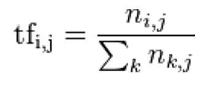
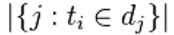
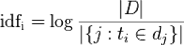
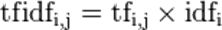

# TFIDF 案列

### 概念

TF-IDF（term frequency–inverse document frequency）是一种用于资讯检索与资讯探勘的常用加权技术。

TF-IDF是一种统计方法，用以评估一字词对于一个文件集或一个语料库中的其中一份文件的重要程度。

- 字词的重要性随着它在文件中出现的次数成正比增加
- 但同时会随着它在语料库中出现的频率成反比下降

TF-IDF加权的各种形式常被搜寻引擎应用

- 作为文件与用户查询之间相关程度的度量或评级。
- 除了TF-IDF以外，因特网上的搜寻引擎还会使用基于链接分析的评级方法，以确定文件在搜寻结果中出现的顺序：PR。

词频 (term frequency, TF) 指的是某一个给定的词语在一份给定的文件中出现的次数。这个数字通常会被归一化（分子一般小于分母 区别于IDF），以防止它偏向长的文件。（同一个词语在长文件里可能会比短文件有更高的词频，而不管该词语重要与否。）
公式中：

ni,j是该词在文件dj中的出现次数，而分母则是在文件dj中所有字词的出现次数之和。

逆向文件频率 (inverse document frequency, IDF) 是一个词语普遍重要性的度量。某一特定词语的IDF，可以由总文件数目除以包含该词语之文件的数目，再将得到的商取对数得到。

|D|：语料库中的文件总数

包含ti文件的数目

TF-IDF：

某一特定文件内的高词语频率，以及该词语在整个文件集合中的低文件频率，可以产生出高权重的TF-IDF。因此，TF-IDF倾向于过滤掉常见的词语，保留重要的词语。
TFIDF的主要思想是：如果某个词或短语在一篇文章中出现的频率TF高，并且在其他文章中很少出现，则认为此词或者短语具有很好的类别区分能力，适合用来分类。