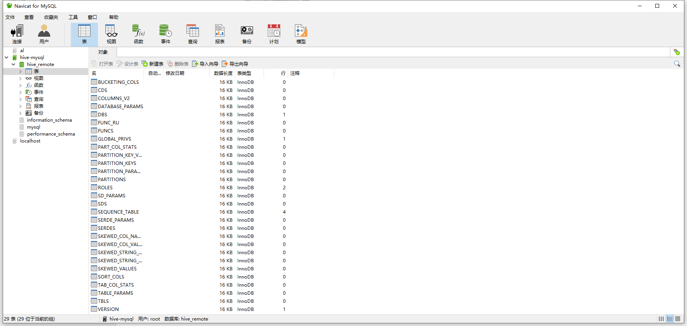
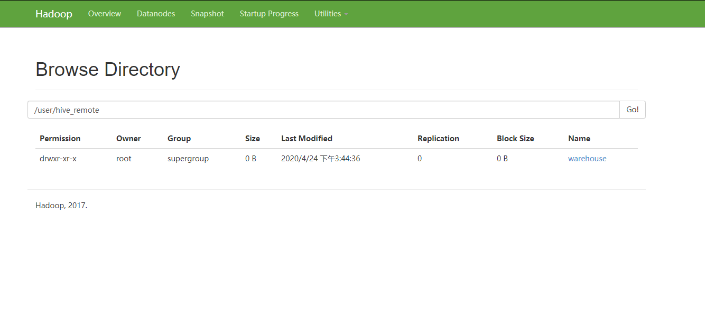
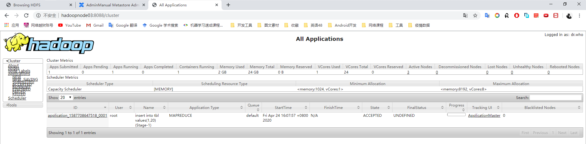
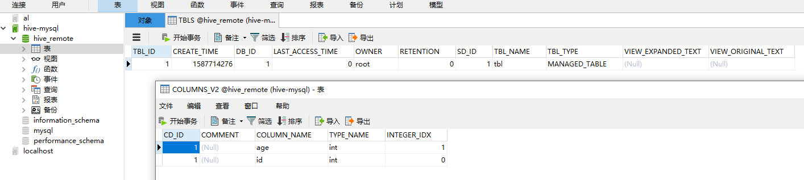
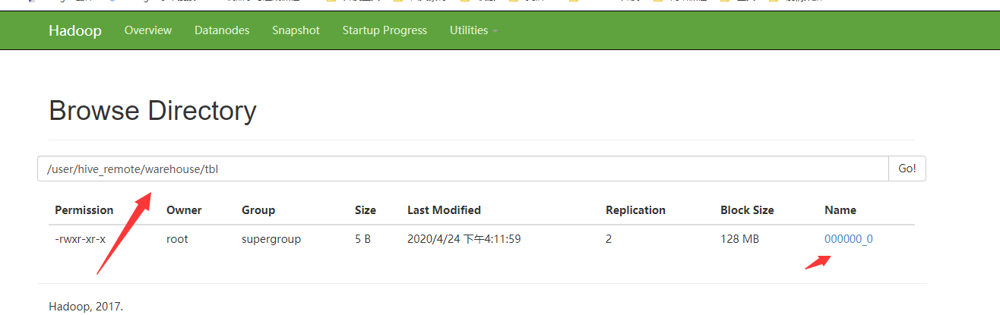

# Hive的搭建环境

> 自己必须搭建好hdfs集群和mysql环境

 ## MYSQL的安装配置

### yum安装Mysql

如果你的yum数据源里面没有找到mysql-server

请下载安装MYSQL的数据源

```shell
$ wget http://repo.mysql.com/mysql-community-release-el7-5.noarch.rpm
$ rpm -ivh mysql-community-release-el7-5.noarch.rpm
$ yum -y install mysql-server
```

等待安装完成就可以了

```
service mysqld start
mysq
>
```

修改用户权限

```
use mysql;
UPDATE mysql.user SET password=PASSWORD("123") WHERE user="root" AND Host="localhost";
grant all privileges on *.* to root@"%" identified by "123" with grant option; 
flush privileges;
quit;
```

## Hive的安装配置

启动好你的zkSerive服务和hdfs和yum服务

配置文档：

https://cwiki.apache.org/confluence/display/Hive/AdminManual+Metastore+Administration

https://cwiki.apache.org/confluence/display/Hive/AdminManual+Configuration

### 单用户模式

 上传自己的Hive到自己的安装目录，同样把mysql的驱动包上传；

解药Hive到自己放的位置

配置Hive的环境变量：path中添加$HIVE_HOME/bin

在cof的文件中配置hive-site.xml，删除里面的所有配置，写上自己的配置即可

```
<property>  
  <name>hive.metastore.warehouse.dir</name>  
  <value>/user/hive_remote/warehouse</value>  
</property>  
<property>  
  <name>javax.jdo.option.ConnectionURL</name>  
  <value>jdbc:mysql://hadoopNode01:3306/hive_remote?createDatabaseIfNotExist=true</value>  
</property>  
<property>  
  <name>javax.jdo.option.ConnectionDriverName</name>  
  <value>com.mysql.jdbc.Driver</value>  
</property>  
<property>  
  <name>javax.jdo.option.ConnectionUserName</name>  
  <value>root</value>  
</property>  
<property>  
  <name>javax.jdo.option.ConnectionPassword</name>  
  <value>123</value>  
</property> 
```

把mysql的驱动包移动到hive的lib文件夹下面

这样直接hive启动就行了


下面是展示的效果：





#### 插入数据测试

```shell
hive> show table
table         tables        tablesample   
hive> show tables;
OK
Time taken: 1.265 seconds
hive> create
create          create_union(   
hive> create table tbl(id int,age int);
OK
Time taken: 0.702 seconds
hive> show tables;
OK
tbl
Time taken: 0.079 seconds, Fetched: 1 row(s)
hive> insert into tbl values(1,20);
Query ID = root_20200424160730_26d5e32c-897c-4a4d-8bf6-8ea7b268afef
Total jobs = 3
Launching Job 1 out of 3
Number of reduce tasks is set to 0 since there's no reduce operator
Starting Job = job_1587708647518_0001, Tracking URL = http://hadoopNode03:8088/proxy/application_1587708647518_0001/
Kill Command = /opt/mgs/hadoop-2.7.5/bin/hadoop job  -kill job_1587708647518_0001
Hadoop job information for Stage-1: number of mappers: 1; number of reducers: 0
2020-04-24 16:11:00,936 Stage-1 map = 0%,  reduce = 0%
2020-04-24 16:12:00,370 Stage-1 map = 100%,  reduce = 0%, Cumulative CPU 4.82 sec
MapReduce Total cumulative CPU time: 4 seconds 820 msec
Ended Job = job_1587708647518_0001
Stage-4 is selected by condition resolver.
Stage-3 is filtered out by condition resolver.
Stage-5 is filtered out by condition resolver.
Moving data to: hdfs://mycluster/user/hive_remote/warehouse/tbl/.hive-staging_hive_2020-04-24_16-07-30_635_2047200650536358183-1/-ext-10000
Loading data to table default.tbl
Table default.tbl stats: [numFiles=1, numRows=1, totalSize=5, rawDataSize=4]
MapReduce Jobs Launched: 
Stage-Stage-1: Map: 1   Cumulative CPU: 4.82 sec   HDFS Read: 3533 HDFS Write: 72 SUCCESS
Total MapReduce CPU Time Spent: 4 seconds 820 msec
OK
Time taken: 276.979 seconds
```





插入成功后：






### 多用户模式

准备在两台计算机上面布置好hive和环境变量

#### 配置服务端：

/apache-hive-1.2.2/conf/hive-site.xml

```xml
<?xml version="1.0" encoding="UTF-8" standalone="no"?>
<?xml-stylesheet type="text/xsl" href="configuration.xsl"?>
<configuration>
    <property>  
      <name>hive.metastore.warehouse.dir</name>  
      <value>/user/hive/warehouse</value>  
    </property>  
    <property>  
      <name>javax.jdo.option.ConnectionURL</name>  
      <value>jdbc:mysql://hadoopNode01:3306/hive?createDatabaseIfNotExist=true</value>  
    </property>  
    <property>  
      <name>javax.jdo.option.ConnectionDriverName</name>  
      <value>com.mysql.jdbc.Driver</value>  
    </property>  
    <property>  
      <name>javax.jdo.option.ConnectionUserName</name>  
      <value>root</value>  
    </property>  
    <property>  
      <name>javax.jdo.option.ConnectionPassword</name>  
      <value>123</value>  
    </property> 
</configuration>
```

#### 客服端的配置

/apache-hive-1.2.2/conf/hive-site.xml

```xml
<?xml version="1.0" encoding="UTF-8" standalone="no"?>
<?xml-stylesheet type="text/xsl" href="configuration.xsl"?>
<configuration>
    <property>  
      <name>hive.metastore.warehouse.dir</name>  
      <value>/user/hive/warehouse</value>  
    </property> 
    <property>  
      <name>hive.metastore.uris</name>  
      <value>thrift://hadoopNode03:9083</value>  
    </property>   
</configuration>
```

启动服务端：

```shell
[root@hadoopNode03 apache-hive-1.2.2]# hive --service metastore
Starting Hive Metastore Server 

```

这是阻塞是启动的服务

启动服务端：

```shell
[root@hadoopNode04 apache-hive-1.2.2]# clear 
[root@hadoopNode04 apache-hive-1.2.2]# hive

Logging initialized using configuration in jar:file:/opt/mgs/apache-hive-1.2.2/lib/hive-common-1.2.2.jar!/hive-log4j.properties
hive> 
```

配置完成