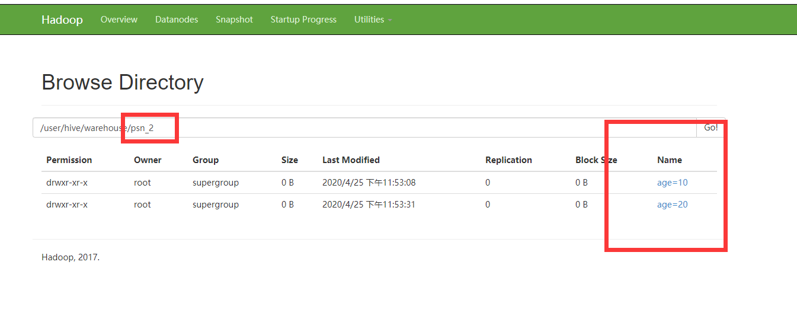

# HIVE分区

## 简单分区

```sehll
hive> CREATE TABLE psn_2(
    > id int,
    > name string,
    > likes array<string>,
    > address map<string,string>
    > )
    > PARTITIONED BY (age int)
    > ROW FORMAT DELIMITED
    > FIELDS TERMINATED BY ','
    > COLLECTION ITEMS TERMINATED BY '-'
    > MAP KEYS TERMINATED BY ':';
OK
Time taken: 20.107 seconds
hive> desc formtted psn_2;
FAILED: SemanticException [Error 10001]: Table not found formtted
hive> desc formatted psn_2;
OK
# col_name            	data_type           	comment             
	 	 
id                  	int                 	                    
name                	string              	                    
likes               	array<string>       	                    
address             	map<string,string>  	                    
	 	 
# Partition Information	 	 
# col_name            	data_type           	comment             
	 	 
age                 	int                 	                    
	 	 
# Detailed Table Information	 	 
Database:           	default             	 
Owner:              	root                	 
CreateTime:         	Sat Apr 25 23:45:22 CST 2020	 
LastAccessTime:     	UNKNOWN             	 
Protect Mode:       	None                	 
Retention:          	0                   	 
Location:           	hdfs://mycluster/user/hive/warehouse/psn_2	 
Table Type:         	MANAGED_TABLE       	 
Table Parameters:	 	 
	transient_lastDdlTime	1587829522          
	 	 
# Storage Information	 	 
SerDe Library:      	org.apache.hadoop.hive.serde2.lazy.LazySimpleSerDe	 
InputFormat:        	org.apache.hadoop.mapred.TextInputFormat	 
OutputFormat:       	org.apache.hadoop.hive.ql.io.HiveIgnoreKeyTextOutputFormat	 
Compressed:         	No                  	 
Num Buckets:        	-1                  	 
Bucket Columns:     	[]                  	 
Sort Columns:       	[]                  	 
Storage Desc Params:	 	 
	colelction.delim    	-                   
	field.delim         	,                   
	mapkey.delim        	:                   
	serialization.format	,                   
Time taken: 0.682 seconds, Fetched: 37 row(s)
hive> LOAD DATA LOCAL INPATH '/root/data/data' INTO TABLE psn_2 PARTITION(age=10);
Loading data to table default.psn_2 partition (age=10)
Partition default.psn_2{age=10} stats: [numFiles=1, numRows=0, totalSize=419, rawDataSize=0]
OK
Time taken: 16.219 seconds
hive> LOAD DATA LOCAL INPATH '/root/data/data' INTO TABLE psn_2 PARTITION(age=20);
Loading data to table default.psn_2 partition (age=20)
Partition default.psn_2{age=20} stats: [numFiles=1, numRows=0, totalSize=419, rawDataSize=0]
OK
Time taken: 1.096 seconds
hive> select * from psn_2;
OK
1	小明1	["lol","book","movie"]	{"beijing":"shangxuetang","shanghai":"pudong"}	10
2	小明2	["lol","book","movie"]	{"beijing":"shangxuetang","shanghai":"pudong"}	10
3	小明3	["lol","book","movie"]	{"beijing":"shangxuetang","shanghai":"pudong"}	10
4	小明4	["lol","book","movie"]	{"beijing":"shangxuetang","shanghai":"pudong"}	10
5	小明5	["lol","movie"]	{"beijing":"shangxuetang","shanghai":"pudong"}	10
6	小明6	["lol","movie"]	{"beijing":"shangxuetang","shanghai":"pudong"}	10
7	小明7	["lol","movie"]	{"beijing":"shangxuetang","shanghai":"pudong"}	10
1	小明1	["lol","book","movie"]	{"beijing":"shangxuetang","shanghai":"pudong"}	20
2	小明2	["lol","book","movie"]	{"beijing":"shangxuetang","shanghai":"pudong"}	20
3	小明3	["lol","book","movie"]	{"beijing":"shangxuetang","shanghai":"pudong"}	20
4	小明4	["lol","book","movie"]	{"beijing":"shangxuetang","shanghai":"pudong"}	20
5	小明5	["lol","movie"]	{"beijing":"shangxuetang","shanghai":"pudong"}	20
6	小明6	["lol","movie"]	{"beijing":"shangxuetang","shanghai":"pudong"}	20
7	小明7	["lol","movie"]	{"beijing":"shangxuetang","shanghai":"pudong"}	20
Time taken: 0.656 seconds, Fetched: 14 row(s)
```

注意分区的字段不需要在table中定义出来，



这样的分区是在表的文件下面创建分区文件夹，文件夹的名称为分区键的值，文件夹下面则是数据内容。

## 多分区

```shell
hive> CREATE TABLE psn_3(
    > id int,
    > name string,
    > likes array<string>,
    > address map<string,string>
    > )
    > PARTITIONED BY (age int,sex string)
    > ROW FORMAT DELIMITED
    > FIELDS TERMINATED BY ','
    > COLLECTION ITEMS TERMINATED BY '-'
    > MAP KEYS TERMINATED BY ':';
OK
Time taken: 20.107 seconds
hive> LOAD DATA LOCAL INPATH '/root/data/data' INTO TABLE psn_2 PARTITION(age=10,sex='man');
```

相同在hdfs的文件夹 psn_3/age=?/sex='?'/这样的组合文件夹。


查看data的数据时候：

```shell
[root@hadoopNode02 mgs]# hdfs dfs -cat /user/hive/warehouse/psn_2/age=10/data
1,小明1,lol-book-movie,beijing:shangxuetang-shanghai:pudong
2,小明2,lol-book-movie,beijing:shangxuetang-shanghai:pudong
3,小明3,lol-book-movie,beijing:shangxuetang-shanghai:pudong
4,小明4,lol-book-movie,beijing:shangxuetang-shanghai:pudong
5,小明5,lol-movie,beijing:shangxuetang-shanghai:pudong
6,小明6,lol-movie,beijing:shangxuetang-shanghai:pudong
7,小明7,lol-movie,beijing:shangxuetang-shanghai:pudong
```

age =10 的字段是文件夹带人给读入的


### 添加分区

添加分区是不按照顺序的

```shell
ALTER TABLE table_name ADD [IF NOT EXISTS] PARTITION partition_spec [LOCATION 'location'][, PARTITION partition_spec [LOCATION 'location'], ...];
 
partition_spec:
  : (partition_column = partition_col_value, partition_column = partition_col_value, ...)
```

例如：

```
ALTEL TABLE table_name add PARTITION([这里添加进去的分区名称，定义好的分区所有字段])
```


```shell
ALTER TABLE page_view ADD PARTITION (dt='2008-08-08', country='us') location '/path/to/us/part080808'
                          PARTITION (dt='2008-08-09', country='us') location '/path/to/us/part080809';
```

### 删除分区

·添加的时候必须一次添加必须是指定分区的所有字段，但是删除可以分开删除字段，

```shell
ALTER TABLE table_name drop [IF NOT EXISTS] PARTITION partition_spec [LOCATION 'location'][, PARTITION partition_spec [LOCATION 'location'], ...];
```

