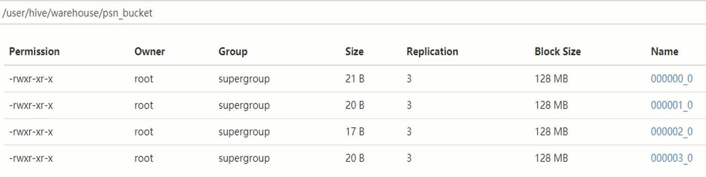

# Hive 分桶

## 1、hive分桶

- 分桶表是对列值取哈希值的方式，将不同数据放到不同文件中存储。
- 对于hive中每一 个表分区都可以进一 步进行分桶。
- 由列的哈希值除以桶的个数来决定每条数据划分在哪个桶中。
  

适用场景:

- 数据抽样(sampling )

## 2、开启支持分桶

开启分桶

```shell
set hive.enforce .bucketing=true;
```

- 默认: false; 设置为tue之后，mr运行时会根据bucket的个数自动分配reduce task个数。 (用户也可以通过
  mapred.reduce.tasks自己设置reduce任务个数，但分桶时不推荐使用)

- 注意: - -次作业产生的桶(文件数量)和reduce task个数- 致。

往分桶表中加载数据

```sql
 insert into table bucket_table select columns from tbl;
 //或者
 insert overwrite table bucket_table select columns from tbl;
```

桶表的抽样：

```sql
select * from buck_table tablesample(bucket 1 out of 4 on columns)
```

TABLESAMPLE语法:
- TABLESAMPLE(BUCKET x OUT OF y)
一x:表示从哪个bucket开始抽取数据
- y:必须为该表总bucket数的倍数或因子


案例

创建一个源数据表

```sql
CREATE TABLE psn( id INT, name STRING, age INT)
ROW FORMAT DELIMITED FIELDS TERMINATED BY ','
```

数据：

```sql
CREATE TABLE psn_1( id INT, name STRING, age INT)
CLUSTERED BY (age) INTO 4 BUCKETS
ROW FORMAT DELIMITED FIELDS TERMINATED BY ','
```

把源数据表的数据插入分桶表中

```sql
insert into psn_1 select id,name,age from psn;
```

hdfs中的数据存储：




