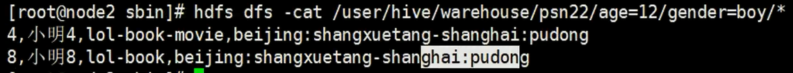

# Hive 动态分区

### Hive 参数

hive 参数、变量
hive当中的参数、变量，都是以命名空间开头

| **命名空间** | **读写权限** | **含义**                                                     |
| ------------ | ------------ | ------------------------------------------------------------ |
| hiveconf     | 可读写       | hive-site.xml当中的各配置变量  例：hive --hiveconf hive.cli.print.header=true |
| system       | 可读写       | 系统变量，包含JVM运行参数等  例：system:user.name=root       |
| env          | 只读         | 环境变量  例：env:JAVA_HOME                                  |
| hivevar      | 可读写       | 例：hive -d val=key                                          |

通过${}方式进行引用，其中system、env下的变量必须以前缀开头

#### hive 参数设置方式

1、修改配置文件 ${HIVE_HOME}/conf/hive-site.xml
2、启动hive cli时，通过--hiveconf key=value的方式进行设置
例：hive --hiveconf hive.cli.print.header=true
3、进入cli之后，通过使用set命令设置

#### hive set命令

- 在hive CLI控制台可以通过set对hive中的参数进行查询、设置
- set设置：
  set hive.cli.print.header=true;
- set查看
  set hive.cli.print.header
- hive参数初始化配置
  当前用户家目录下的.hiverc文件
  如:   ~/.hiverc
  如果没有，可直接创建该文件，将需要设置的参数写到该文件中，hive启动运行时，会加载改文件中的配置。
- hive历史操作命令集
  ~/.hivehistory


## 1、设置动态分区

hive 动态分区

### 开启支持动态分区

- set hive.exec.dynamic.partition=true;

  默认：true

- set hive.exec.dynamic.partition.mode=nostrict;

  默认：strict（至少有一个分区列是静态分区）

- 相关参数

  - set hive.exec.max.dynamic.partitions.pernode;

    每一个执行mr节点上，允许创建的动态分区的最大数量(100)

  - set hive.exec.max.dynamic.partitions;

    所有执行mr节点上，允许创建的所有动态分区的最大数量(1000)

  - set hive.exec.max.created.files;

    所有的mr job允许创建的文件的最大数量(100000)


```shell
 hive > set hive.exec.dynamici.partition=true;  #开启动态分区，默认是false
 hive > set hive.exec.dynamic.partition.mode=nonstrict; #开启允许所有分区都是动态的，否则必须要有静态分区才能使用。
```

## 案列分析：

材料：

```
1,小明1,12,man,1o1-book-movie,beijing:shangxuetang-shanghai:pudong
2,小明2,13,boy,1ol-book-movie,beijing:shangxuetang-shanghai:pudong
3,小明3,13,man,1ol-book-movie,beijing:shangxuetang-shanghai:pudong
4,小明4,12,boy,lol-book-movie,beijing:shangxuetang-shanghai:pudong
5,小明5,13,man,1ol-movie,beijing :shangxuetang-shanghai:pudong
6,小明6,13,boy,lol-book-movie,beijing:shangxuetang-shanghai:pudong
7,小明7,13,man,lol-book,beijing:shangxuetang-shanghai:pudong
8,小明8,12,boy,lol-book,beijing:shangxuetang-shanghai:pudong
9,小明9,12,man,1ol-book-movie,beijing:shangxuetang-shanghai:pudong
```

建造表：[这个表示源数据]

```sql
create table psn(
	id int,
    name string,
    age int,
    gender string,
    likes array<string>,
    address map<string,string>
)
row format delimited
fields terminated by ','
collection items treminated by '-'
map keys terminated by ':';

##导入数据
load data local inpath '/root/data/test1' into table psn;
```

创建个动态分区的表

```sql
create table psn_1(
	id int,
    name string,
    likes array<string>,
    address map<string,string>
)
partitioned by (age int,gender string)
row format delimited
fields terminated by ','
collection items treminated by '-'
map keys terminated by ':';
```

插入数据：把源数据表psn的数据插入到psn_1的表中。

```sql
from psn
insert into psn_1 partition(age,gender)
select id,name,likes,address,age,gender,
```

使用hdfs查询的文件的时候就会发现：




## 动态分区的相关参数

```
set hive.exec.max.dynamic.partitions.pemode;
》每一个执行mr节点上,允许创建的动态分区的最大数量(100)
set hive.exec.max.dynamic.partitions;
》所有执行mr节点上，允许创建的所有动态分区的最大数量(1000)
set hive.exec.max created.files;
》所有的mr job允许创建的文件的最大数量(100000)
```

