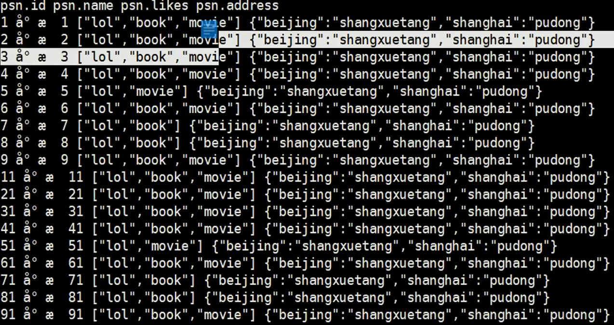
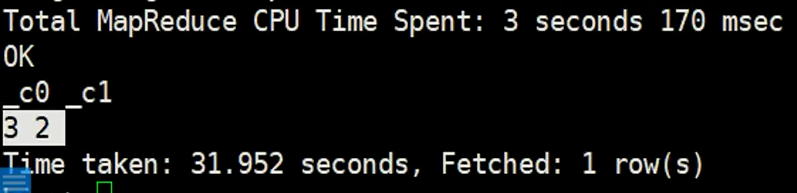

# Hive 其他

## Hive Lateral View

hive Lateral View
- Lateral View用于和UDTF函数(explode、 split) 结合来使用。

- 首先通过UDTF函数拆分成多行，再将多行结果组合成一个支持别名的虚拟表。

- 主要解决在select使用UDTF做查询过程中，查询只能包含单个UDTF,不能包含其他字段、以及多个UDTF的问题

- 语法:
  -  LATERAL VIEW udtf( expression) tableAlias AS columnAlias (:' columnAlias)

   

实例：



```sql
select count(distinct(myCol1)),count(distinct(myCol2)) from psn
LATERAL VIEW explode(likes) myTable1 AS myConl1
LATERAL VIEW explode(address) myTable2 AS myCol2,myCol3;  
```



别名和列名是可以随便取名的，


## Hive 视图

-和关系型数据库中的普通视图-样, hive也支持视图
- 特点:
● 不支持物化视图
● 只能查询，不能做加载数据操作
● 视图的创建，只是保存一份元数据，查询视图时才执行对应的子查询
● view定义中若包含了ORDER BY/LIMIT语句， 当查询视图时也进行ORDER BYLIMIT语句操作, view当中定义的优先级更高
● view支持迭代视图


## Hive 索引

创建索引：

```sql
CREATE INDEX index_name
  ON TABLE base_table_name (col_name, ...)
  AS index_type
  [WITH DEFERRED REBUILD]
  [IDXPROPERTIES (property_name=property_value, ...)]
  [IN TABLE index_table_name]
  [
     [ ROW FORMAT ...] STORED AS ...
     | STORED BY ...
  ]
  [LOCATION hdfs_path]
  [TBLPROPERTIES (...)]
  [COMMENT "index comment"];
```

### Drop Index

```shell
DROP INDEX [IF EXISTS] index_name ON table_name;
```

DROP INDEX drops the index, as well as deleting the index table.

In Hive 0.7.0 or later, DROP returns an error if the index doesn't exist, unless IF EXISTS is specified or the configuration variable [hive.exec.drop.ignorenonexistent](https://cwiki.apache.org/confluence/display/Hive/Configuration+Properties#ConfigurationProperties-hive.exec.drop.ignorenonexistent) is set to true.

### Alter Index

```shell
ALTER INDEX index_name ON table_name [PARTITION partition_spec] REBUILD;
```

ALTER INDEX ... REBUILD builds an index that was created using the WITH DEFERRED REBUILD clause, or rebuilds a previously built index. If PARTITION is specified, only that partition is rebuilt.


