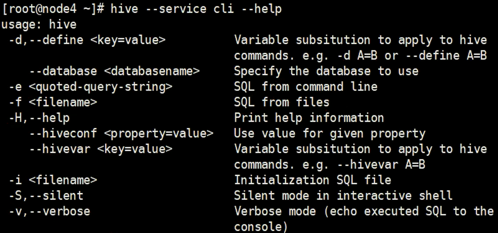

# Hive 运行方式、GUI接口和权限管理

## Hive 运行方式

1、 命令行方式CLI ：控制台方式

​		不光是可以执行HSQL命令，还可以执行DFS命令， 也可以执行本地系统命令，如

```shell
hive > ! ls /
```

2、脚本运行方式 （生产环境中应用很多）



```shell
[]$ hive -e "select * from psn" # 查询表中的数据，查询玩后退出
```

通过脚本shell

hive.sh

```shell
hive -e "select * from psn"
```

添加可执行权限后执行也是可以的


静默执行

```shell
hvie -S -e "select * from psn"
```

```shell
hive -f "hsql文件" # 加载一个可执行的hsql文件，
hive -i "初始化当前会话的参数文件" #初始化当前会话的一个设置hive的客服端的参数，执行后进入hive的客服端
```


3、JDBC 方式 hiveservie2

4、Web GUI 接口 (Hwi、hue等)

## Hive GUI接口

## Hive 权限管理

[官方文档](https://cwiki.apache.org/confluence/display/Hive/LanguageManual+Authorization)

常用的三种授权模型:

1、Storage Based Authorizati on in the Metastore Server

 	基于存储的授权-可以对Metastore中的元数据进行保护，但是没有提供更加细粒度的访问控制(例如:列级别、行级别），表级别的权限管理。

2、SQL Stan dards Based Authori zation in HiveServer2

​	基于SQL标准的Hive授权-完全兼容SQL的授权模型，推荐使用该模式。

3、Default Hive Authorization (Legacy Mode)

​	hive默认授权.设计目的仅仅只是为了防止用户产生误操作，而不是防止恶意用户访问未经授权的数据。

### 基于hiveservice2的认证方式：

[官方文档](https://cwiki.apache.org/confluence/display/Hive/SQL+Standard+Based+Hive+Authorization)

完全兼容SQL的授权模型
除支持对于用户的授权认证，还支持角色role的授权认证

- role可理解为是一 组权限的集合，通过role为用户授权

- -个用户可以具有一 个或多个角色

- 默认包含另种角色: public、 admin

限制:
1、启用当前认证方式之后，dfs, add, delete, compile, and reset等命令被禁用。
2、通过set命令设置hive confi gurati on的方式被限制某些用户使用。
	可通过修改配置文件hive-site.xml中hive secunity authorization. sqlstd confwhitelist进行配置)
3、添加、删除函数以及宏的操作，仅为具有admin的用户开放。
4、用户自定义函数(开放支持永久的自定义函数)，可通过具有admin角色的用户创建，其他用户都可以
使用。
5、Transform功能被禁用。

#### HiveServer2中基于SQL标准的授权

尽管基于存储的授权可以在数据库，表和分区级别提供访问控制，但是由于文件系统提供的访问控制在目录和文件级别，因此它不能在更高级的级别（例如列和视图）上控制授权。细粒度访问控制的前提是数据服务器，它只能提供用户需要（或有权访问）的列和行。在文件系统访问的情况下，整个文件将提供给用户。HiveServer2满足此条件，因为它有一个API（通过使用SQL）可以理解行和列，并且仅可以提供SQL查询所要求的列和行。

[基于SQL标准的授权](https://cwiki.apache.org/confluence/display/Hive/SQL+Standard+Based+Hive+Authorization) （在Hive 0.13.0中引入，[HIVE-5837](https://issues.apache.org/jira/browse/HIVE-5837)） 可用于启用细粒度的访问控制。它基于用于授权的SQL标准，并使用熟悉的grant / revoke语句来控制访问。需要通过HiveServer2配置启用它。 

Hive 权限管理
三种授权模型：
1、Storage Based Authorization in the Metastore Server
基于存储的授权 - 可以对Metastore中的元数据进行保护，但是没有提供更加细粒度的访问控制（例如：列级别、行级别）。
2、SQL Standards Based Authorization in HiveServer2
基于SQL标准的Hive授权 - 完全兼容SQL的授权模型，推荐使用该模式。
3、Default Hive Authorization (Legacy Mode)
hive默认授权 - 设计目的仅仅只是为了防止用户产生误操作，而不是防止恶意用户访问未经授权的数据。

Hive - SQL Standards Based Authorization in HiveServer2
完全兼容SQL的授权模型
除支持对于用户的授权认证，还支持角色role的授权认证
role可理解为是一组权限的集合，通过role为用户授权
一个用户可以具有一个或多个角色
默认包含另种角色：public、admin


Hive - SQL Standards Based Authorization in HiveServer2
限制：
1、启用当前认证方式之后，dfs, add, delete, compile, and reset等命令被禁用。
2、通过set命令设置hive configuration的方式被限制某些用户使用。
（可通过修改配置文件hive-site.xml中hive.security.authorization.sqlstd.confwhitelist进行配置）
3、添加、删除函数以及宏的操作，仅为具有admin的用户开放。
4、用户自定义函数（开放支持永久的自定义函数），可通过具有admin角色的用户创建，其他用户都可以使用。
5、Transform功能被禁用。


Hive - SQL Standards Based Authorization in HiveServer2
在hive服务端修改配置文件hive-site.xml添加以下配置内容：

```xml
<property>
  <name>hive.security.authorization.enabled</name>
  <value>true</value>
</property>
<property>
  <name>hive.server2.enable.doAs</name>
  <value>false</value>
</property>
<property>
  <name>hive.users.in.admin.role</name>
  <value>root</value>
</property>
<property>
  <name>hive.security.authorization.manager</name>
  <value>org.apache.hadoop.hive.ql.security.authorization.plugin.sqlstd.SQLStdHiveAuthorizerFactory</value>
</property>
<property>
  <name>hive.security.authenticator.manager</name>
  <value>org.apache.hadoop.hive.ql.security.SessionStateUserAuthenticator</value>
</property>

```

服务端启动hiveserver2；客户端通过beeline进行连接.

Hive权限管理
角色的添加、删除、查看、设置：

```
CREATE ROLE role_name;  -- 创建角色
DROP ROLE role_name;  -- 删除角色
SET ROLE (role_name|ALL|NONE);  -- 设置角色
SHOW CURRENT ROLES;  -- 查看当前具有的角色
SHOW ROLES;  -- 查看所有存在的角色
```


Hive权限管理
角色的授予、移除、查看

```
将角色授予某个用户、角色：
GRANT role_name [, role_name] ...
TO principal_specification [, principal_specification] ...
[ WITH ADMIN OPTION ];

principal_specification
  : USER user
  | ROLE role

```


```
移除某个用户、角色的角色：
REVOKE [ADMIN OPTION FOR] role_name [, role_name] ...
FROM principal_specification [, principal_specification] ... ;

principal_specification
  : USER user
  | ROLE role
```


```
查看授予某个用户、角色的角色列表
SHOW ROLE GRANT (USER|ROLE) principal_name;

```


```
查看属于某种角色的用户、角色列表
SHOW PRINCIPALS role_name;

```


Hive权限管理
权限：

```
SELECT privilege – gives read access to an object.
INSERT privilege – gives ability to add data to an object (table).
UPDATE privilege – gives ability to run update queries on an object (table).
DELETE privilege – gives ability to delete data in an object (table).
ALL PRIVILEGES – gives all privileges (gets translated into all the above privileges).
```


Hive权限管理
权限的授予、移除、查看

```
将权限授予某个用户、角色：
GRANT
    priv_type [, priv_type ] ...
    ON table_or_view_name
    TO principal_specification [, principal_specification] ...
    [WITH GRANT OPTION];

```

```
principal_specification
  : USER user
  | ROLE role
 
priv_type
  : INSERT | SELECT | UPDATE | DELETE | ALL

```

```
移除某个用户、角色的权限：
REVOKE [GRANT OPTION FOR]
    priv_type [, priv_type ] ...
    ON table_or_view_name
    FROM principal_specification [, principal_specification] ... ;


```

```
查看某个用户、角色的权限：
SHOW GRANT [principal_name] ON (ALL| ([TABLE] table_or_view_name)

```


权限表：


| Action                                           | Select       | Insert     | Update | Delete            | Owership        | Admin | URL Privilege(RWX Permission +  Ownership)    |
| ------------------------------------------------ | ------------ | ---------- | ------ | ----------------- | --------------- | ----- | --------------------------------------------- |
| ALTER DATABASE                                   |              |            |        |                   |                 | Y     |                                               |
| ALTER INDEX PROPERTIES                           |              |            |        |                   | Y               |       |                                               |
| ALTER INDEX REBUILD                              |              |            |        |                   | Y               |       |                                               |
| ALTER PARTITION LOCATION                         |              |            |        |                   | Y               |       | Y (for new partition location)                |
| ALTER TABLE (all of them except  the ones above) |              |            |        |                   | Y               |       |                                               |
| ALTER TABLE ADD PARTITION                        |              | Y          |        |                   |                 |       | Y (for partition location)                    |
| ALTER TABLE DROP PARTITION                       |              |            |        | Y                 |                 |       |                                               |
| ALTER TABLE LOCATION                             |              |            |        |                   | Y               |       | Y (for new location)                          |
| ALTER VIEW PROPERTIES                            |              |            |        |                   | Y               |       |                                               |
| ALTER VIEW RENAME                                |              |            |        |                   | Y               |       |                                               |
| ANALYZE TABLE                                    | Y            | Y          |        |                   |                 |       |                                               |
| CREATE DATABASE                                  |              |            |        |                   |                 |       | Y (if custom location specified)              |
| CREATE FUNCTION                                  |              |            |        |                   |                 | Y     |                                               |
| CREATE INDEX                                     |              |            |        |                   | Y (of table)    |       |                                               |
| CREATE MACRO                                     |              |            |        |                   |                 | Y     |                                               |
| CREATE TABLE                                     |              |            |        |                   | Y (of database) |       | Y (for create external  table – the location) |
| CREATE TABLE AS SELECT                           | Y (of input) |            |        |                   | Y (of database) |       |                                               |
| CREATE VIEW                                      | Y + G        |            |        |                   |                 |       |                                               |
| DELETE                                           |              |            |        | Y                 |                 |       |                                               |
| DESCRIBE TABLE                                   | Y            |            |        |                   |                 |       |                                               |
| DROP DATABASE                                    |              |            |        |                   | Y               |       |                                               |
| DROP FUNCTION                                    |              |            |        |                   |                 | Y     |                                               |
| DROP INDEX                                       |              |            |        |                   | Y               |       |                                               |
| DROP MACRO                                       |              |            |        |                   |                 | Y     |                                               |
| DROP TABLE                                       |              |            |        |                   | Y               |       |                                               |
| DROP VIEW                                        |              |            |        |                   | Y               |       |                                               |
| DROP VIEW PROPERTIES                             |              |            |        |                   | Y               |       |                                               |
| EXPLAIN                                          | Y            |            |        |                   |                 |       |                                               |
| INSERT                                           |              | Y          |        | Y (for OVERWRITE) |                 |       |                                               |
| LOAD                                             |              | Y (output) |        | Y (output)        |                 |       | Y (input location)                            |
| MSCK (metastore check)                           |              |            |        |                   |                 | Y     |                                               |
| SELECT                                           | Y            |            |        |                   |                 |       |                                               |
| SHOW COLUMNS                                     | Y            |            |        |                   |                 |       |                                               |
| SHOW CREATE TABLE                                | Y+G          |            |        |                   |                 |       |                                               |
| SHOW PARTITIONS                                  | Y            |            |        |                   |                 |       |                                               |
| SHOW TABLE PROPERTIES                            | Y            |            |        |                   |                 |       |                                               |
| SHOW TABLE STATUS                                | Y            |            |        |                   |                 |       |                                               |
| TRUNCATE TABLE                                   |              |            |        |                   | Y               |       |                                               |
| UPDATE                                           |              |            | Y      |                   |                 |       |                                               |

```
Y:  Privilege required.
Y + G:  Privilege "WITH GRANT OPTION" required.
```

