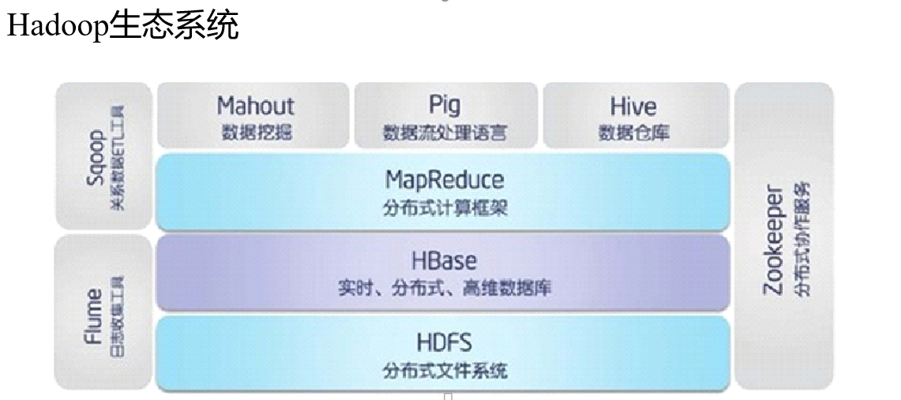
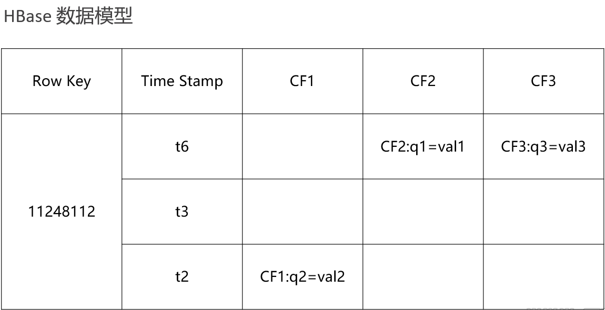

# HBase 入门

### Hadoop中的HBase

ETL，是英文Extract-Transform-Load的缩写，用来描述将数据从来源端经过抽取（extract）、转换（transform）、加载（load）至目的端的过程。

### 简介：

非关系型数据库知识面扩展

- Cassandra hbase mongodb 
- Couchdb，文件存储数据库
- Neo4j非关系型图数据库

Hbase

- Hadoop Database，是一个高可靠性、高性能、面向列、可伸缩、实时读写的分布式数据库

- 利用Hadoop HDFS作为其文件存储系统,利用Hadoop MapReduce来处理HBase中的海量数据,利用Zookeeper作为其分布式协同服务

- 主要用来存储非结构化和半结构化的松散数据（列存 NoSQL 数据库）

### HBase 数据模型

[开发文档：](https://hbase.apache.org/book.html#conceptual.view)

### Column Family列族 & qualifier列

- HBase表中的每个列都归属于某个列族，列族必须作为表模式(schema)定义的一部分预先给出。如 create ‘test’, ‘course’；

- 列名以列族作为前缀，每个“列族”都可以有多个列成员(column)；如course:math, course:english, 新的列族成员（列）可以随后按需、动态加入；

- 权限控制、存储以及调优都是在列族层面进行的；

- HBase把同一列族里面的数据存储在同一目录下，由几个文件保存。

### Timestamp时间戳

- 在HBase每个cell存储单元对同一份数据有多个版本，根据唯一的时间戳来区分每个版本之间的差异，不同版本的数据按照时间倒序排序，最新的数据版本排在最前面。

- 时间戳的类型是 64位整型。

- 时间戳可以由HBase(在数据写入时自动)赋值，此时时间戳是精确到毫秒的当前系统时间。

- 时间戳也可以由客户显式赋值，如果应用程序要避免数据版本冲突，就必须自己生成具有唯一性的时间戳。

### Cell单元格

- 由行和列的坐标交叉决定；

- 单元格是有版本的；

- 单元格的内容是未解析的字节数组；
  - 由{row key， column( =\<family> +\<qualifier>)， version} 唯一确定的单元。
  - cell中的数据是没有类型的，全部是字节数组形式存贮。

### HLog(WAL log)【预写日志】

- HLog文件就是一个普通的Hadoop Sequence File，Sequence File 的Key是HLogKey对象，HLogKey中记录了写入数据的归属信息，除了table和region名字外，同时还包括 sequence number和timestamp，timestamp是” 写入时间”，sequence number的起始值为0，或者是最近一次存入文件系统中sequence number。
- HLog SequeceFile的Value是HBase的KeyValue对象，即对应HFile中的KeyValue。

