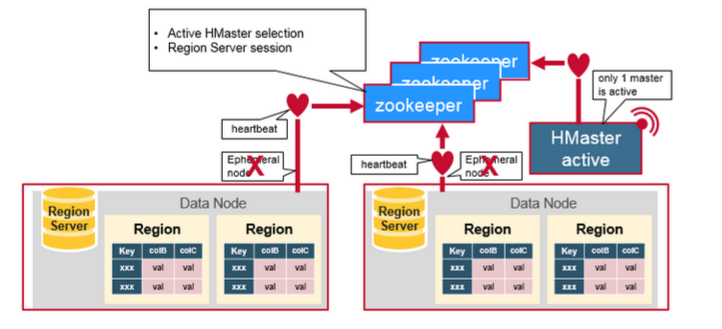
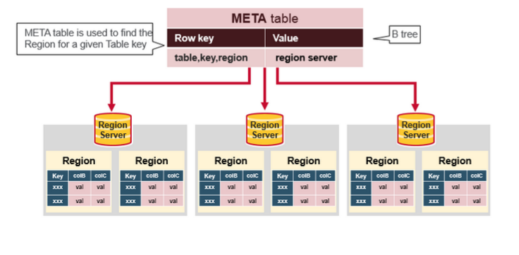
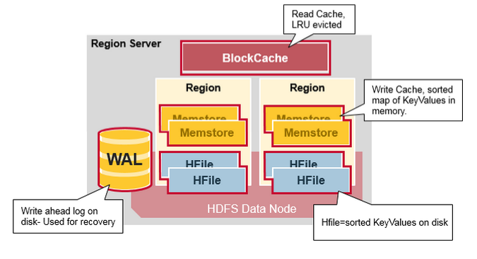
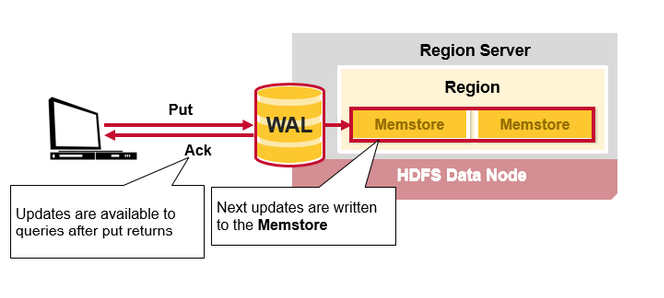
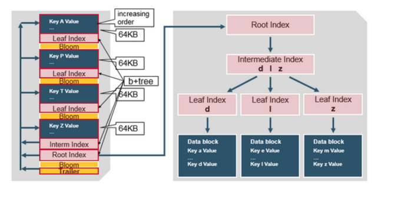

# HBase架构

 HBase隶属于hadoop生态系统，它参考了谷歌的BigTable建模，实现的编程语言为 Java, 建立在hdfs之上，提供高可靠性、高性能、列存储、可伸缩、实时读写的数据库系统。它仅能通过主键(row key)和主键的range来检索数据，主要用来存储非结构化和半结构化的松散数据。与hadoop一样，Hbase目标主要依靠横向扩展，通过不断增加廉价的商用服务器，来增加计算和存储能力。Hbase数据库中的表一般有这样的特点：

- 大： 一个表可以有上亿行，上百万列
- 面向列: 面向列(族)的存储和权限控制，列(族)独立检索
- 稀疏: 对于为空(null)的列，并不占用存储空间，因此，表可以设计的非常稀疏

## 1、系统架构

其中**HMaster节点**用于：

1. 管理HRegionServer，实现其负载均衡。
2. 管理和分配HRegion，比如在HRegion split时分配新的HRegion；在HRegionServer退出时迁移其内的HRegion到其他HRegionServer上。
3. 实现DDL操作（Data Definition Language，namespace和table的增删改，column familiy的增删改等）。
4. 管理namespace和table的元数据（实际存储在HDFS上）。
5. 权限控制（ACL）。

**HRegionServer节点**用于：

1. 存放和管理本地HRegion。
2. 读写HDFS，管理Table中的数据。
3. Client直接通过HRegionServer读写数据（从HMaster中获取元数据，找到RowKey所在的HRegion/HRegionServer后）。

**ZooKeeper集群是协调系统**，用于：

1. 存放整个 HBase集群的元数据以及集群的状态信息。
2. 实现HMaster主从节点的failover。

HBase Client通过RPC方式和HMaster、HRegionServer通信；一个HRegionServer可以存放1000个HRegion；底层Table数据存储于HDFS中，而HRegion所处理的数据尽量和数据所在的DataNode在一起，实现数据的本地化；数据本地化并不是总能实现，比如在HRegion移动(如因Split)时，需要等下一次Compact才能继续回到本地化。

## 2、详细介绍

物理上，Hbase 是由三种类型的 server 组成的的主从式（master-slave）架构：Region servers提供用于读取和写入的数据。访问数据时，客户端直接与HBase RegionServer通信。Region 分配，DDL（创建，删除表）操作由HBase HMaster处理。作为HDFS一部分的Zookeeper维护活动集群状态。

Hadoop DataNode存储 Region Server正在管理的数据，所有HBase数据都存储在HDFS文件中。Region Server它们与HDFS数据节点并置，从而使RegionServers服务的数据具有数据局部性（将数据放置在需要的地方）。HBase 的数据在写的时候是本地的，但是当 region 被迁移的时候，数据就可能不再满足本地性了，直到完成 compaction，才能又恢复到本地。NameNode维护构成文件的所有物理数据块的元数据信息。

HBase架构图二

## Regions

HBase表[Table]按行键[row key]范围水平划分为“Regions”。Region包含表中该Region的开始键[start key]和结束键[end key]之间的所有行[row]。将Region分配给群集中称为“Region Servers”的节点，这些Region为读取和写入提供数据。Region server可以服务大约1,000个Region。

## HBase HMaster

Region分配，DDL（创建，删除表）操作由HBase HMaster处理。

主要负责：

1. 协调 region servers
   - 启动时分配Region，重新分配Region以进行恢复或负载平衡
   - 监视群集中的所有RegionServer实例（侦听来自Zookeeper的通知）
2. 管理功能
   - 用于创建，删除，更新表

## ZooKeeper

HBase使用ZooKeeper作为分布式协调服务来维护集群中的server状态。Zookeeper维护哪些server处于活动状态并且可用，并提供server故障通知。Zookeeper使用共识来保证共同的共享状态。请注意，应该有三到五台机器来达成共识。

## 组件如何协同工作

Zookeeper用于协调分布式系统成员的共享状态信息。Region server和HMaster （ctive HMaster）通过会话连接到ZooKeeper。 ZooKeeper通过心跳维护临时节点（ephemeral nodes）以进行活动会话。

每个 Region Server 都会创建一个 ephemeral 节点。HMaster 会监控这些节点来发现可用的 Region Servers，同样它也会监控这些节点是否出现故障。

HMaster 们会竞争创建 ephemeral 节点，而 Zookeeper 决定谁是第一个作为在线 HMaster，保证线上只有一个 HMaster。在线 HMaster（active HMaster） 会给 Zookeeper 发送心跳，不在线的待机 HMaster （inactive HMaster） 会监听 active HMaster 可能出现的故障并随时准备上位。

如果有一个 Region Server 或者 HMaster 出现故障或各种原因导致发送心跳失败，它们与 Zookeeper 的 session 就会过期，这个 ephemeral 节点就会被删除下线，监听者们就会收到这个消息。Active HMaster 监听的是 region servers 下线的消息，然后会恢复故障的 region server 以及它所负责的 region 数据。而 Inactive HMaster 关心的则是 active HMaster 下线的消息，然后竞争上线变成 active HMaster。

## HBase首先读取或写入

有一个称为META【Meta table】表的特殊HBase目录表，该表保存集群中Region的位置。 ZooKeeper存储META【Meta table】表的位置。

这是客户端第一次读取或写入HBase时发生的情况：

1. 客户端从ZooKeeper获取托管META表的Region服务器。

2. 客户端将查询.META。服务器以获取与其要访问的行键相对应的Region server。客户端将该信息与META表位置一起缓存。

3. 它将从相应的Region server获取行。

## HBase Meta Table

- 该META表是一个HBase表，用于保留系统中所有Region的列表。
- META表就像一棵b-tree
- META。表结构如下：
  - Key: region start key,region id
  - Values: RegionServer

## Region Server Components

Region server在HDFS数据节点【DataNode】上运行，并具有以下组件：

- WAL：预写日志是分布式文件系统上的文件。 WAL用于存储尚未持久存储的新数据。发生故障时用于恢复。
- BlockCache：是读取缓存。它将经常读取的数据存储在内存中。满时将逐出最近最少使用的数据。
- MemStore：是写缓存。它存储尚未写入磁盘的新数据。在写入磁盘之前先对其进行排序。每个Region的每个列族【column family 】都有一个MemStore。
- Hfile将行作为已排序的键值存储在磁盘上。

## HBase Write Steps (1)

当客户端发出Put请求时，第一步是将数据写入预写日志WAL：

- 编辑内容将附加到存储在磁盘上的WAL文件的末尾。
- WAL用于恢复服务器崩溃时尚未持久的数据。

## HBase Write Steps (2)

将数据写入WAL后，将其放置在MemStore中。然后，放置请求确认将返回给客户端。

## HBase MemStore

MemStore将更新存储为已排序的KeyValue，与将其存储在HFile中相同。每个列族只有一个MemStore。更新是按列族排序的。

## HBase Region Flush

MemStore 中累积了足够多的的数据后，整个有序数据集就会被写入一个新的 HFile 文件到 HDFS 上。HBase 为每个 Column Family 都创建一个 HFile，里面存储了具体的 Cell，也即 KeyValue 数据。随着时间推移，HFile 会不断产生，因为 KeyValue 会不断地从 MemStore 中被刷写到硬盘上。

注意这也是为什么 HBase 要限制 Column Family 数量的一个原因。每个 Column Family 都有一个 MemStore；如果一个 MemStore 满了，所有的 MemStore 都会被刷写到硬盘。同时它也会记录最后写入的数据的最大序列号（sequence number），这样系统就能知道目前为止哪些数据已经被持久化了。

最大序列号是一个 meta 信息，被存储在每个 HFile 中，来表示持久化进行到哪条数据了，应该从哪里继续。当 region 启动时，这些序列号会被读取，取其中最大的一个，作为基础序列号，后面的新的数据更新就会在该值的基础上递增产生新的序列号。

## HBase HFile

数据存储在包含排序的key/values的HFile中。当MemStore累积足够的数据时，整个排序的KeyValue集将写入HDFS中的新HFile。这是一个顺序写入。这非常快，因为它避免了移动磁盘驱动器磁头。

## HBase HFile结构

HFile包含多层索引，该索引使HBase无需读取整个文件即可查找数据。多级索引就像一个b + tree：

- 键值对以升序存储
- 在64KB“blocks”中逐行索引索引键值数据
- 每个块都有自己的叶子索引
- 每个块的最后一个键放在中间索引中
- 根索引指向中间索引

trailer 指向元数据块，并在将数据持久保存到文件的末尾写入。trailer 还包含诸如绽放过滤器和时间范围信息之类的信息。布隆过滤器帮助跳过不包含特定rowkey的文件。如果文件不在读取所需的时间范围内，则时间范围信息对于跳过文件很有用。

## HFile Index

索引是在打开HFile并将其保存在内存中时加载的。这允许通过单个磁盘查找执行查找。

## HBase Read Merge

我们已经发现，每行（row）的 KeyValue cells 可能位于不同的地方，这些 cell 可能被写入了 HFile，可能是最近刚更新的，还在 MemStore 中，也可能最近刚读过，缓存在 Block Cache 中。所以，当你读一行 row 时，系统怎么将对应的 cells 返回呢？一次 read 操作会将 Block Cache，MemStore 和 HFile 中的 cell 进行合并：

- 首先 scanner 从 Block Cache 读取 cells。最近读取的 KeyValue 都被缓存在这里，这是 一个 LRU 缓存。
- 然后 scanner 读取 MemStore，即写缓存，包含了最近更新的数据。
- 如果 scanner 没有在 BlockCache 和 MemStore 都没找到对应的 cells，则 HBase 会使用 Block Cache 中的索引和布隆过滤器来加载对应的 HFile 到内存，查找到请求的 row cells。

之前讨论过，每个 MemStore 可能会有多个 HFile，所以一次 read 请求可能需要多读个文件，这可能会影响性能，这被称为读放大（read amplification）。

## HBase Minor Compaction

HBase将自动选择一些较小的HFile，并将它们重写为较少的较大Hfile。此过程称为 minor compaction。较小的压缩通过将较小的文件重写为较少但较大的文件，然后执行合并排序来减少存储文件的数量。

## HBase Major Compaction

Major Compaction 合并重写每个 Column Family 下的所有的 HFiles，成为一个单独的大 HFile，在这个过程中，被删除的和过期的 cell 会被真正从物理上删除，这能提高读的性能。但是因为 major compaction 会重写所有的 HFile，会产生大量的硬盘 I/O 和网络开销。这被称为写放大（Write Amplification）。

Major compaction 可以被设定为自动调度。因为存在 write amplification 的问题，major compaction 一般都安排在周末和半夜。MapR 数据库对此做出了改进，并不需要做 compaction。Major compaction 还能将因为服务器 crash 或者负载均衡导致的数据迁移重新移回到离 Region Server 的地方，这样就能恢复 data locality。

## Region = Contiguous Keys

我们再来回顾一下 region 的概念：

HBase Table 被水平切分成一个或数个 regions。每个 region 包含了连续的，有序的一段 rows，以 start key 和 end key 为边界。
每个 region 的默认大小为 1GB。
region 里的数据由 Region Server 负责读写，和 client 交互。
每个 Region Server 可以管理约 1000 个 regions（它们可能来自一张表或者多张表）。

## Region Split

最初，每个表只有一个Region。当区域过大时，它将分为两个child regions。两个子区域【child regions】（代表原始区域的一半）在同一区域服务器上并行打开，然后将拆分报告给HMaster。出于负载平衡的原因，HMaster可以计划将新Region移到其他服务器。

## 读取负载均衡

Splitting 一开始是发生在同一台 region server 上的，但是出于负载均衡的原因，HMaster 可能会将新的 regions 迁移给它 region server，这会导致那些 region server 需要访问离它比较远的 HDFS 数据，直到 major compaction 的到来，它会将那些远方的数据重新移回到离 region server 节点附近的地方。

## HDFS数据备份

所有的读写都发生在 HDFS 的主 DataNode 节点上。 HDFS 会自动备份 WAL 和 HFile 的文件 blocks。HBase 依赖于 HDFS 来保证数据完整安全。当数据被写入 HDFS 时，一份会写入本地节点，另外两个备份会被写入其它节点。

WAL 和 HFiles 都会持久化到硬盘并备份。那么 HBase 是怎么恢复 MemStore 中还未被持久化到 HFile 的数据呢？下面的章节会讨论这个问题。

## HBase故障恢复

当某个 Region Server 发生 crash 时，它所管理的 region 就无法被访问了，直到 crash 被检测到，然后故障恢复完成，这些 region 才能恢复访问。Zookeeper 依靠心跳检测发现节点故障，然后 HMaster 会收到 region server 故障的通知。

当 HMaster 发现某个 region server 故障，HMaster 会将这个 region server 所管理的 regions 分配给其它健康的 region servers。为了恢复故障的 region server 的 MemStore 中还未被持久化到 HFile 的数据，HMaster 会将 WAL 分割成几个文件，将它们保存在新的 region server 上。每个 region server 然后回放各自拿到的 WAL 碎片中的数据，来为它所分配到的新 region 建立 MemStore。

## 数据恢复

WAL 包含了一系列的修改操作，每个修改都表示一个 put 或者 delete 操作。这些修改按照时间顺序依次写入，持久化时它们被依次写入 WAL 文件的尾部。

当数据仍然在 MemStore 还未被持久化到 HFile 怎么办呢？WAL 文件会被回放。操作的方法是读取 WAL 文件，排序并添加所有的修改记录到 MemStore，最后 MemStore 会被刷写到 HFile。

Apache HBase 架构的优点
强一致性：

- 当 write 返回时，所有的 reader 都会读到同样的值。

自动扩展性

- 数据变大时 region 会分裂。
- 使用 HDFS 存储备份数据。

内置恢复功能

- 使用 Write Ahead Log （类似于文件系统中的日志）

与 Hadoop 结合：

- 使用 MapReduce 处理 HBase 数据会非常直观。

Apache HBase 也有问题

业务持续可靠性：

- WAL 回放很慢。
- 故障恢复很慢。
- Major Compaction 时候 I/O 会飙升。

---

参考资料：

https://www.cnblogs.com/laoqing/p/12091471.html

http://www.blogjava.net/DLevin/archive/2015/08/22/426877.html

https://zhuanlan.zhihu.com/p/30414252

https://segmentfault.com/a/1190000019959411