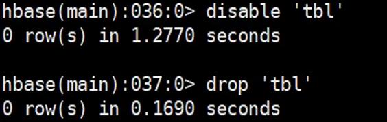

# Quick Start - Standalone HBase

## 1、简单配置

选择一个 [Apache 下载镜像](http://www.apache.org/dyn/closer.cgi/hbase/)，下载 *HBase Releases*. 点击 `stable`目录，然后下载后缀为 `.tar.gz` 的文件; 例如 `hbase-0.95-SNAPSHOT.tar.gz`.

解压缩，然后进入到那个要解压的目录.

```
$ tar xfz hbase-0.95-SNAPSHOT.tar.gz
$ cd hbase-0.95-SNAPSHOT
```


配置JAVA_HOME，在conf/hbase-env.sh文件中找到配置自己的JAVA_HOME路径


在PATH目录下面添加一个一个HBASE_HOME的变量，追加带尾部HBASE_HOME/bin


现在你已经可以启动HBase了。但是你可能需要先编辑 `conf/hbase-site.xml` 去配置`hbase.rootdir`，来选择HBase将数据写到哪个目录 . `zookeeper` 配置，选择没有`zookeeper `的节点，因为HBASE自带有Zookeeper服务

```xml
<configuration>
  <property>
    <name>hbase.rootdir</name>
    <value>file:///home/mgs/hbase</value>
  </property>
  <property>
    <name>hbase.zookeeper.property.dataDir</name>
    <value>/home/mgs/zookeeper</value>
  </property>
</configuration>
```

将 `DIRECTORY` 替换成你期望写文件的目录. 默认 `hbase.rootdir` 是指向 `/tmp/hbase-${user.name}` ，也就说你会在重启后丢失数据(重启的时候操作系统会清理`/tmp`目录)

## 2、启动

启动一个HBase伪分布式

```shell
>start-hbase.sh
[root@hadoopNode01 ~]# jps
1784 Jps
1693 HMaster

```

Web访问端口\<HOST>:60010


## 3、启动一个客服端连接

```
> hbase shell
```

## 4、主要帮助文档

```shell
hbase(main):001:0> help
HBase Shell, version 0.98.23-hadoop2, r44c724b56dc1431209f561cb997fce805f9f45f9, Wed Oct  5 01:05:05 UTC 2016
Type 'help "COMMAND"', (e.g. 'help "get"' -- the quotes are necessary) for help on a specific command.
Commands are grouped. Type 'help "COMMAND_GROUP"', (e.g. 'help "general"') for help on a command group.

COMMAND GROUPS:
  Group name: general
  Commands: processlist, status, table_help, version, whoami

  Group name: ddl
  Commands: alter, alter_async, alter_status, create, describe, disable, disable_all, drop, drop_all, enable, enable_all, exists, get_table, is_disabled, is_enabled, list, show_filters

  Group name: namespace
  Commands: alter_namespace, create_namespace, describe_namespace, drop_namespace, list_namespace, list_namespace_tables

  Group name: dml
  Commands: append, count, delete, deleteall, get, get_counter, get_splits, incr, put, scan, truncate, truncate_preserve

  Group name: tools
  Commands: assign, balance_switch, balancer, balancer_enabled, catalogjanitor_enabled, catalogjanitor_run, catalogjanitor_switch, close_region, compact, compact_rs, flush, hlog_roll, major_compact, merge_region, move, split, trace, unassign, zk_dump

  Group name: replication
  Commands: add_peer, disable_peer, disable_table_replication, enable_peer, enable_table_replication, get_peer_config, list_peer_configs, list_peers, list_replicated_tables, remove_peer, set_peer_tableCFs, show_peer_tableCFs, update_peer_config

  Group name: snapshots
  Commands: clone_snapshot, delete_all_snapshot, delete_snapshot, delete_table_snapshots, list_snapshots, list_table_snapshots, restore_snapshot, snapshot

  Group name: security
  Commands: grant, list_security_capabilities, revoke, user_permission

  Group name: visibility labels
  Commands: add_labels, clear_auths, get_auths, list_labels, set_auths, set_visibility

SHELL USAGE:
Quote all names in HBase Shell such as table and column names.  Commas delimit
command parameters.  Type <RETURN> after entering a command to run it.
Dictionaries of configuration used in the creation and alteration of tables are
Ruby Hashes. They look like this:

  {'key1' => 'value1', 'key2' => 'value2', ...}

and are opened and closed with curley-braces.  Key/values are delimited by the
'=>' character combination.  Usually keys are predefined constants such as
NAME, VERSIONS, COMPRESSION, etc.  Constants do not need to be quoted.  Type
'Object.constants' to see a (messy) list of all constants in the environment.

If you are using binary keys or values and need to enter them in the shell, use
double-quote'd hexadecimal representation. For example:

  hbase> get 't1', "key\x03\x3f\xcd"
  hbase> get 't1', "key\003\023\011"
  hbase> put 't1', "test\xef\xff", 'f1:', "\x01\x33\x40"

The HBase shell is the (J)Ruby IRB with the above HBase-specific commands added.
For more on the HBase Shell, see http://hbase.apache.org/book.html
```

### status

观察节点状态

```shell
hbase(main):004:0> status
SLF4J: Class path contains multiple SLF4J bindings.
SLF4J: Found binding in [jar:file:/opt/mgs/hbase-0.98.23-hadoop2/lib/slf4j-log4j12-1.6.4.jar!/org/slf4j/impl/StaticLoggerBinder.class]
SLF4J: Found binding in [jar:file:/opt/mgs/hadoop-2.7.5/share/hadoop/common/lib/slf4j-log4j12-1.7.10.jar!/org/slf4j/impl/StaticLoggerBinder.class]
SLF4J: See http://www.slf4j.org/codes.html#multiple_bindings for an explanation.
1 active master, 0 backup masters, 1 servers, 0 dead, 2.0000 average load

```

### table_help

```shell
hbase(main):007:0> table_help
Help for table-reference commands.

You can either create a table via 'create' and then manipulate the table via commands like 'put', 'get', etc.
See the standard help information for how to use each of these commands.

However, as of 0.96, you can also get a reference to a table, on which you can invoke commands.
For instance, you can get create a table and keep around a reference to it via:

   hbase> t = create 't', 'cf'

Or, if you have already created the table, you can get a reference to it:

   hbase> t = get_table 't'

You can do things like call 'put' on the table:

  hbase> t.put 'r', 'cf:q', 'v'

which puts a row 'r' with column family 'cf', qualifier 'q' and value 'v' into table t.

To read the data out, you can scan the table:

  hbase> t.scan

which will read all the rows in table 't'.

Essentially, any command that takes a table name can also be done via table reference.
Other commands include things like: get, delete, deleteall,
get_all_columns, get_counter, count, incr. These functions, along with
the standard JRuby object methods are also available via tab completion.

For more information on how to use each of these commands, you can also just type:

   hbase> t.help 'scan'

which will output more information on how to use that command.

You can also do general admin actions directly on a table; things like enable, disable,
flush and drop just by typing:

   hbase> t.enable
   hbase> t.flush
   hbase> t.disable
   hbase> t.drop

Note that after dropping a table, your reference to it becomes useless and further usage
is undefined (and not recommended).

```


## 5、物理存储

进入到配置文件制定的/home/mgs/文件下面

```shell
[root@hadoopNode01 mgs]# pwd
/home/mgs
[root@hadoopNode01 mgs]# ll
total 0
drwxr-xr-x 6 root root 141 Jul  5 09:55 hbase
drwxr-xr-x 3 root root  25 Jul  5 09:55 zookeeper
[root@hadoopNode01 mgs]# 
```

在文件hbase目录下面存储文件

```shell
[root@hadoopNode01 hbase]# ls
data  hbase.id  hbase.version  oldWALs  WALs
```

`WALS`是开始写入的日志信息，当进行玩持久化会写入`oldWALS`文件夹下面

`data`则是存储数据的文件夹。*因为是伪分布式，文件存储在直接存储在文件系统里面*


```shell
[root@hadoopNode01 data]# pwd
/home/mgs/hbase/data
[root@hadoopNode01 data]# ls
default  hbase
[root@hadoopNode01 data]# 
```

在data下面有两个命名空间

```shell
hbase(main):010:0> list_namespace
NAMESPACE
default 
hbase                    
2 row(s) in 0.1040 seconds

```

`default`是默认的命名空间，

`hbase`是保存元数据信息的文件

## 6、创建表和插入数据

### `create` 命令

```shell
hbase(main):002:0> create

ERROR: wrong number of arguments (0 for 1)

Here is some help for this command:
Creates a table. Pass a table name, and a set of column family
specifications (at least one), and, optionally, table configuration.
Column specification can be a simple string (name), or a dictionary
(dictionaries are described below in main help output), necessarily 
including NAME attribute. 
Examples:

Create a table with namespace=ns1 and table qualifier=t1
  hbase> create 'ns1:t1', {NAME => 'f1', VERSIONS => 5}

Create a table with namespace=default and table qualifier=t1
  hbase> create 't1', {NAME => 'f1'}, {NAME => 'f2'}, {NAME => 'f3'}
  hbase> # The above in shorthand would be the following:
  hbase> create 't1', 'f1', 'f2', 'f3'
  hbase> create 't1', {NAME => 'f1', VERSIONS => 1, TTL => 2592000, BLOCKCACHE => true}
  hbase> create 't1', {NAME => 'f1', CONFIGURATION => {'hbase.hstore.blockingStoreFiles' => '10'}}
  
Table configuration options can be put at the end.
Examples:

  hbase> create 'ns1:t1', 'f1', SPLITS => ['10', '20', '30', '40']
  hbase> create 't1', 'f1', SPLITS => ['10', '20', '30', '40']
  hbase> create 't1', 'f1', SPLITS_FILE => 'splits.txt', OWNER => 'johndoe'
  hbase> create 't1', {NAME => 'f1', VERSIONS => 5}, METADATA => { 'mykey' => 'myvalue' }
  hbase> # Optionally pre-split the table into NUMREGIONS, using
  hbase> # SPLITALGO ("HexStringSplit", "UniformSplit" or classname)
  hbase> create 't1', 'f1', {NUMREGIONS => 15, SPLITALGO => 'HexStringSplit'}
  hbase> create 't1', 'f1', {NUMREGIONS => 15, SPLITALGO => 'HexStringSplit', CONFIGURATION => {'hbase.hregion.scan.loadColumnFamiliesOnDemand' => 'true'}}
  hbase> create 't1', {NAME => 'f1', DFS_REPLICATION => 1}

You can also keep around a reference to the created table:

  hbase> t1 = create 't1', 'f1'

Which gives you a reference to the table named 't1', on which you can then
call methods.
```

```shell
hbase(main):003:0> create 'tbl1','cf'
SLF4J: Class path contains multiple SLF4J bindings.
SLF4J: Found binding in [jar:file:/opt/mgs/hbase-0.98.23-hadoop2/lib/slf4j-log4j12-1.6.4.jar!/org/slf4j/impl/StaticLoggerBinder.class]
SLF4J: Found binding in [jar:file:/opt/mgs/hadoop-2.7.5/share/hadoop/common/lib/slf4j-log4j12-1.7.10.jar!/org/slf4j/impl/StaticLoggerBinder.class]
SLF4J: See http://www.slf4j.org/codes.html#multiple_bindings for an explanation.
0 row(s) in 2.1930 seconds

=> Hbase::Table - tbl1
hbase(main):004:0> list
TABLE                                                                             
tbl1                                                                              
1 row(s) in 0.0790 seconds

=> ["tbl1"]
hbase(main):005:0> 
```

### `put`命令

```shell
hbase(main):005:0> put

ERROR: wrong number of arguments (0 for 4)

Here is some help for this command:
Put a cell 'value' at specified table/row/column and optionally
timestamp coordinates.  To put a cell value into table 'ns1:t1' or 't1'
at row 'r1' under column 'c1' marked with the time 'ts1', do:

  hbase> put 'ns1:t1', 'r1', 'c1', 'value'
  hbase> put 't1', 'r1', 'c1', 'value'
  hbase> put 't1', 'r1', 'c1', 'value', ts1
  hbase> put 't1', 'r1', 'c1', 'value', {ATTRIBUTES=>{'mykey'=>'myvalue'}}
  hbase> put 't1', 'r1', 'c1', 'value', ts1, {ATTRIBUTES=>{'mykey'=>'myvalue'}}
  hbase> put 't1', 'r1', 'c1', 'value', ts1, {VISIBILITY=>'PRIVATE|SECRET'}

The same commands also can be run on a table reference. Suppose you had a reference
t to table 't1', the corresponding command would be:

  hbase> t.put 'r1', 'c1', 'value', ts1, {ATTRIBUTES=>{'mykey'=>'myvalue'}}


hbase(main):006:0> put 'tbl1', '2', 'cf:name', 'shaoyayu'
0 row(s) in 0.2240 seconds

```


### `get`与`scan`

```shell
hbase(main):007:0> get

ERROR: wrong number of arguments (0 for 2)

Here is some help for this command:
Get row or cell contents; pass table name, row, and optionally
a dictionary of column(s), timestamp, timerange and versions. Examples:

  hbase> get 'ns1:t1', 'r1'
  hbase> get 't1', 'r1'
  hbase> get 't1', 'r1', {TIMERANGE => [ts1, ts2]}
  hbase> get 't1', 'r1', {COLUMN => 'c1'}
  hbase> get 't1', 'r1', {COLUMN => ['c1', 'c2', 'c3']}
  hbase> get 't1', 'r1', {COLUMN => 'c1', TIMESTAMP => ts1}
  hbase> get 't1', 'r1', {COLUMN => 'c1', TIMERANGE => [ts1, ts2], VERSIONS => 4}
  hbase> get 't1', 'r1', {COLUMN => 'c1', TIMESTAMP => ts1, VERSIONS => 4}
  hbase> get 't1', 'r1', {FILTER => "ValueFilter(=, 'binary:abc')"}
  hbase> get 't1', 'r1', 'c1'
  hbase> get 't1', 'r1', 'c1', 'c2'
  hbase> get 't1', 'r1', ['c1', 'c2']
  hbsase> get 't1','r1', {COLUMN => 'c1', ATTRIBUTES => {'mykey'=>'myvalue'}}
  hbsase> get 't1','r1', {COLUMN => 'c1', AUTHORIZATIONS => ['PRIVATE','SECRET']}

Besides the default 'toStringBinary' format, 'get' also supports custom formatting by
column.  A user can define a FORMATTER by adding it to the column name in the get
specification.  The FORMATTER can be stipulated: 

 1. either as a org.apache.hadoop.hbase.util.Bytes method name (e.g, toInt, toString)
 2. or as a custom class followed by method name: e.g. 'c(MyFormatterClass).format'.

Example formatting cf:qualifier1 and cf:qualifier2 both as Integers: 
  hbase> get 't1', 'r1' {COLUMN => ['cf:qualifier1:toInt',
    'cf:qualifier2:c(org.apache.hadoop.hbase.util.Bytes).toInt'] } 

Note that you can specify a FORMATTER by column only (cf:qualifer).  You cannot specify
a FORMATTER for all columns of a column family.
    
The same commands also can be run on a reference to a table (obtained via get_table or
create_table). Suppose you had a reference t to table 't1', the corresponding commands
would be:

  hbase> t.get 'r1'
  hbase> t.get 'r1', {TIMERANGE => [ts1, ts2]}
  hbase> t.get 'r1', {COLUMN => 'c1'}
  hbase> t.get 'r1', {COLUMN => ['c1', 'c2', 'c3']}
  hbase> t.get 'r1', {COLUMN => 'c1', TIMESTAMP => ts1}
  hbase> t.get 'r1', {COLUMN => 'c1', TIMERANGE => [ts1, ts2], VERSIONS => 4}
  hbase> t.get 'r1', {COLUMN => 'c1', TIMESTAMP => ts1, VERSIONS => 4}
  hbase> t.get 'r1', {FILTER => "ValueFilter(=, 'binary:abc')"}
  hbase> t.get 'r1', 'c1'
  hbase> t.get 'r1', 'c1', 'c2'
  hbase> t.get 'r1', ['c1', 'c2']


hbase(main):008:0> scan

ERROR: wrong number of arguments (0 for 1)

Here is some help for this command:
Scan a table; pass table name and optionally a dictionary of scanner
specifications.  Scanner specifications may include one or more of:
TIMERANGE, FILTER, LIMIT, STARTROW, STOPROW, TIMESTAMP, MAXLENGTH,
or COLUMNS, CACHE or RAW, VERSIONS

If no columns are specified, all columns will be scanned.
To scan all members of a column family, leave the qualifier empty as in
'col_family'.

The filter can be specified in two ways:
1. Using a filterString - more information on this is available in the
Filter Language document attached to the HBASE-4176 JIRA
2. Using the entire package name of the filter.

Some examples:

  hbase> scan 'hbase:meta'
  hbase> scan 'hbase:meta', {COLUMNS => 'info:regioninfo'}
  hbase> scan 'ns1:t1', {COLUMNS => ['c1', 'c2'], LIMIT => 10, STARTROW => 'xyz'}
  hbase> scan 't1', {COLUMNS => ['c1', 'c2'], LIMIT => 10, STARTROW => 'xyz'}
  hbase> scan 't1', {COLUMNS => 'c1', TIMERANGE => [1303668804, 1303668904]}
  hbase> scan 't1', {REVERSED => true}
  hbase> scan 't1', {FILTER => "(PrefixFilter ('row2') AND
    (QualifierFilter (>=, 'binary:xyz'))) AND (TimestampsFilter ( 123, 456))"}
  hbase> scan 't1', {FILTER =>
    org.apache.hadoop.hbase.filter.ColumnPaginationFilter.new(1, 0)}
For setting the Operation Attributes 
  hbase> scan 't1', { COLUMNS => ['c1', 'c2'], ATTRIBUTES => {'mykey' => 'myvalue'}}
  hbase> scan 't1', { COLUMNS => ['c1', 'c2'], AUTHORIZATIONS => ['PRIVATE','SECRET']}
For experts, there is an additional option -- CACHE_BLOCKS -- which
switches block caching for the scanner on (true) or off (false).  By
default it is enabled.  Examples:

  hbase> scan 't1', {COLUMNS => ['c1', 'c2'], CACHE_BLOCKS => false}

Also for experts, there is an advanced option -- RAW -- which instructs the
scanner to return all cells (including delete markers and uncollected deleted
cells). This option cannot be combined with requesting specific COLUMNS.
Disabled by default.  Example:

  hbase> scan 't1', {RAW => true, VERSIONS => 10}

Besides the default 'toStringBinary' format, 'scan' supports custom formatting
by column.  A user can define a FORMATTER by adding it to the column name in
the scan specification.  The FORMATTER can be stipulated: 

 1. either as a org.apache.hadoop.hbase.util.Bytes method name (e.g, toInt, toString)
 2. or as a custom class followed by method name: e.g. 'c(MyFormatterClass).format'.

Example formatting cf:qualifier1 and cf:qualifier2 both as Integers: 
  hbase> scan 't1', {COLUMNS => ['cf:qualifier1:toInt',
    'cf:qualifier2:c(org.apache.hadoop.hbase.util.Bytes).toInt'] } 

Note that you can specify a FORMATTER by column only (cf:qualifer).  You cannot
specify a FORMATTER for all columns of a column family.

Scan can also be used directly from a table, by first getting a reference to a
table, like such:

  hbase> t = get_table 't'
  hbase> t.scan

Note in the above situation, you can still provide all the filtering, columns,
options, etc as described above.

hbase(main):009:0> 

```

```shell
hbase(main):009:0> get 'tbl1','2'
COLUMN                         CELL                                                                                   
 cf:name                       timestamp=1593934861748, value=shaoyayu                                                
1 row(s) in 0.0880 seconds

hbase(main):010:0> scan 'tbl1'
ROW                            COLUMN+CELL                                                                            
 2                             column=cf:name, timestamp=1593934861748, value=shaoyayu                                
1 row(s) in 0.0430 seconds


```

### `flush` 命令

溢写数据，把menstore数据持久化

```shell
hbase(main):011:0> flush 'tbl1'
0 row(s) in 0.0800 seconds
```

```shell
[root@hadoopNode01 cf]# pwd
/home/mgs/hbase/data/default/tbl1/f653e6925c4fa0e8b20c06a163c2a321/cf
[root@hadoopNode01 cf]# ll
total 4
-rw-rw-rw- 1 root root 981 Jul  5 15:53 8fa435876b304c218ed63113b0a711f6
[root@hadoopNode01 cf]# hbase hfile
SLF4J: Class path contains multiple SLF4J bindings.
SLF4J: Found binding in [jar:file:/opt/mgs/hbase-0.98.23-hadoop2/lib/slf4j-log4j12-1.6.4.jar!/org/slf4j/impl/StaticLoggerBinder.class]
SLF4J: Found binding in [jar:file:/opt/mgs/hadoop-2.7.5/share/hadoop/common/lib/slf4j-log4j12-1.7.10.jar!/org/slf4j/impl/StaticLoggerBinder.class]
SLF4J: See http://www.slf4j.org/codes.html#multiple_bindings for an explanation.
2020-07-05 15:59:36,271 INFO  [main] Configuration.deprecation: fs.default.name is deprecated. Instead, use fs.defaultFS
usage: HFile [-a] [-b] [-e] [-f <arg> | -r <arg>] [-h] [-k] [-m] [-p]
       [-s] [-v] [-w <arg>]
 -a,--checkfamily         Enable family check
 -b,--printblocks         Print block index meta data
 -e,--printkey            Print keys
 -f,--file <arg>          File to scan. Pass full-path; e.g.
                          hdfs://a:9000/hbase/hbase:meta/12/34
 -h,--printblockheaders   Print block headers for each block.
 -k,--checkrow            Enable row order check; looks for out-of-order
                          keys
 -m,--printmeta           Print meta data of file
 -p,--printkv             Print key/value pairs
 -r,--region <arg>        Region to scan. Pass region name; e.g.
                          'hbase:meta,,1'
 -s,--stats               Print statistics
 -v,--verbose             Verbose output; emits file and meta data
                          delimiters
 -w,--seekToRow <arg>     Seek to this row and print all the kvs for this
                          row only
```

当flush在cf文件夹下面超过三个文件的时候，会进行压缩成一个文件，

### `delete` 命令

```shell
hbase(main):012:0> delete

ERROR: wrong number of arguments (0 for 3)

Here is some help for this command:
Put a delete cell value at specified table/row/column and optionally
timestamp coordinates.  Deletes must match the deleted cell's
coordinates exactly.  When scanning, a delete cell suppresses older
versions. To delete a cell from  't1' at row 'r1' under column 'c1'
marked with the time 'ts1', do:

  hbase> delete 'ns1:t1', 'r1', 'c1', ts1
  hbase> delete 't1', 'r1', 'c1', ts1
  hbase> delete 't1', 'r1', 'c1', ts1, {VISIBILITY=>'PRIVATE|SECRET'}

The same command can also be run on a table reference. Suppose you had a reference
t to table 't1', the corresponding command would be:

  hbase> t.delete 'r1', 'c1',  ts1
  hbase> t.delete 'r1', 'c1',  ts1, {VISIBILITY=>'PRIVATE|SECRET'}


hbase(main):013:0> 
```


### `disable` 与 `drop` 命令




`drop` 删除表的时候需要`disable` 清除数据先。