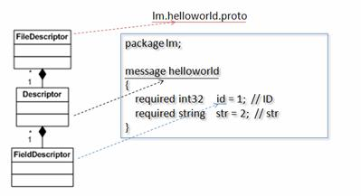
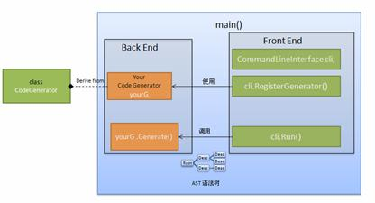
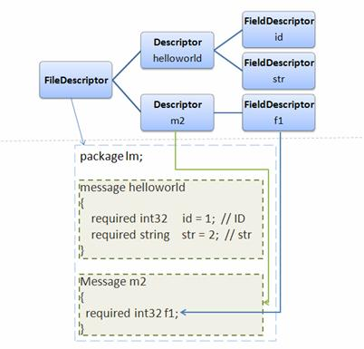
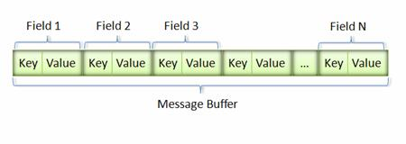
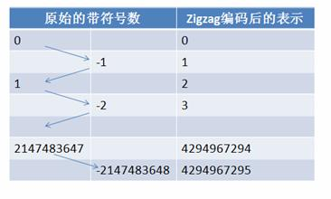

# HBase与Protobuf

## 简介

[官方文档](https://developers.google.com/protocol-buffers)

什么是 Google Protocol Buffer？ 假如您在网上搜索，应该会得到类似这样的文字介绍：

Google Protocol Buffer( 简称 Protobuf) 是 Google 公司内部的混合语言数据标准，目前已经正在使用的有超过 48,162 种报文格式定义和超过 12,183 个 .proto 文件。他们用于 RPC 系统和持续数据存储系统。

Protocol Buffers 是一种轻便高效的结构化数据存储格式，可以用于结构化数据串行化，或者说序列化。它很适合做数据存储或 RPC 数据交换格式。可用于通讯协议、数据存储等领域的语言无关、平台无关、可扩展的序列化结构数据格式。目前提供了 C++、Java、Python 三种语言的 API。

### 一个简单的例子

#### **安装** **Google Protocol Buffer**

在网站 http://code.google.com/p/protobuf/downloads/list上可以下载 Protobuf 的源代码。然后解压编译安装便可以使用它了。

安装步骤如下所示：

```
 tar -xzf protobuf-2.1.0.tar.gz 

 cd protobuf-2.1.0 

 ./configure --prefix=$INSTALL_DIR 

 make 

 make check 

 make install
```


#### **关于简单例子的描述**

我打算使用 Protobuf 和 C++ 开发一个十分简单的例子程序。

该程序由两部分组成。第一部分被称为 Writer，第二部分叫做 Reader。

Writer 负责将一些结构化的数据写入一个磁盘文件，Reader 则负责从该磁盘文件中读取结构化数据并打印到屏幕上。

准备用于演示的结构化数据是 HelloWorld，它包含两个基本数据：

·     ID，为一个整数类型的数据

·     Str，这是一个字符串

#### **书写** **.proto** **文件**

首先我们需要编写一个 proto 文件，定义我们程序中需要处理的结构化数据，在 protobuf 的术语中，结构化数据被称为 Message。proto 文件非常类似 java 或者 C 语言的数据定义。代码清单 1 显示了例子应用中的 proto 文件内容。

#### **清单** **1. proto** **文件**

```
 package lm; 

 message helloworld 

 { 

  required int32   id = 1; // ID 

  required string  str = 2; // str 

  optional int32   opt = 3; //optional field 

 }
```

一个比较好的习惯是认真对待 proto 文件的文件名。比如将命名规则定于如下：

 packageName.MessageName.proto

在上例中，package 名字叫做 lm，定义了一个消息 helloworld，该消息有三个成员，类型为 int32 的 id，另一个为类型为 string 的成员 str。opt 是一个可选的成员，即消息中可以不包含该成员。

#### **编译** **.proto** **文件**

写好 proto 文件之后就可以用 Protobuf 编译器将该文件编译成目标语言了。本例中我们将使用 C++。

假设您的 proto 文件存放在 $SRC_DIR 下面，您也想把生成的文件放在同一个目录下，则可以使用如下命令：

 protoc -I=$SRC_DIR --cpp_out=$DST_DIR $SRC_DIR/addressbook.proto

命令将生成两个文件：

lm.helloworld.pb.h ， 定义了 C++ 类的头文件

lm.helloworld.pb.cc ， C++ 类的实现文件

在生成的头文件中，定义了一个 C++ 类 helloworld，后面的 Writer 和 Reader 将使用这个类来对消息进行操作。诸如对消息的成员进行赋值，将消息序列化等等都有相应的方法。

#### **编写** **writer** **和** **Reader**

如前所述，Writer 将把一个结构化数据写入磁盘，以便其他人来读取。假如我们不使用 Protobuf，其实也有许多的选择。一个可能的方法是将数据转换为字符串，然后将字符串写入磁盘。转换为字符串的方法可以使用 sprintf()，这非常简单。数字 123 可以变成字符串”123”。

这样做似乎没有什么不妥，但是仔细考虑一下就会发现，这样的做法对写 Reader 的那个人的要求比较高，Reader 的作者必须了 Writer 的细节。比如”123”可以是单个数字 123，但也可以是三个数字 1,2 和 3，等等。这么说来，我们还必须让 Writer 定义一种分隔符一样的字符，以便 Reader 可以正确读取。但分隔符也许还会引起其他的什么问题。最后我们发现一个简单的 Helloworld 也需要写许多处理消息格式的代码。

如果使用 Protobuf，那么这些细节就可以不需要应用程序来考虑了。

使用 Protobuf，Writer 的工作很简单，需要处理的结构化数据由 .proto 文件描述，经过上一节中的编译过程后，该数据化结构对应了一个 C++ 的类，并定义在 lm.helloworld.pb.h 中。对于本例，类名为 lm::helloworld。

Writer 需要 include 该头文件，然后便可以使用这个类了。

现在，在 Writer 代码中，将要存入磁盘的结构化数据由一个 lm::helloworld 类的对象表示，它提供了一系列的 get/set 函数用来修改和读取结构化数据中的数据成员，或者叫 field。

当我们需要将该结构化数据保存到磁盘上时，类 lm::helloworld 已经提供相应的方法来把一个复杂的数据变成一个字节序列，我们可以将这个字节序列写入磁盘。

对于想要读取这个数据的程序来说，也只需要使用类 lm::helloworld 的相应反序列化方法来将这个字节序列重新转换会结构化数据。这同我们开始时那个“123”的想法类似，不过 Protobuf 想的远远比我们那个粗糙的字符串转换要全面，因此，我们不如放心将这类事情交给 Protobuf 吧。

程序清单 2 演示了 Writer 的主要代码，您一定会觉得很简单吧？

#### **清单** **2. Writer** **的主要代码**

```
 \#include "lm.helloworld.pb.h"

 int main(void) 
 { 
 lm::helloworld msg1; 
 msg1.set_id(101); 
 msg1.set_str(“hello”); 
 // Write the new address book back to disk. 
 fstream output("./log", ios::out | ios::trunc | ios::binary); 
 if (!msg1.SerializeToOstream(&output)) { 
   cerr << "Failed to write msg." << endl; 
   return -1; 
 }     
 return 0; 
 }
```

Msg1 是一个 helloworld 类的对象，set_id() 用来设置 id 的值。SerializeToOstream 将对象序列化后写入一个 fstream 流。

代码清单 3 列出了 reader 的主要代码。

#### **清单** **3. Reader**

```
 \#include "lm.helloworld.pb.h" 
 void ListMsg(const lm::helloworld & msg) {
 cout << msg.id() << endl; 
 cout << msg.str() << endl; 
 } 
 int main(int argc, char* argv[]) { 
 lm::helloworld msg1; 
 { 
  fstream input("./log", ios::in | ios::binary); 
  if (!msg1.ParseFromIstream(&input)) { 
   cerr << "Failed to parse address book." << endl; 
   return -1; 
  } 
 } 
 ListMsg(msg1); 
 … 
 }
```

同样，Reader 声明类 helloworld 的对象 msg1，然后利用 ParseFromIstream 从一个 fstream 流中读取信息并反序列化。此后，ListMsg 中采用 get 方法读取消息的内部信息，并进行打印输出操作。

**运行结果**

运行 Writer 和 Reader 的结果如下：

```
 >writer 

 >reader 

 101

 Hello
```

Reader 读取文件 log 中的序列化信息并打印到屏幕上。本文中所有的例子代码都可以在附件中下载。您可以亲身体验一下。

这个例子本身并无意义，但只要您稍加修改就可以将它变成更加有用的程序。比如将磁盘替换为网络 socket，那么就可以实现基于网络的数据交换任务。而存储和交换正是 Protobuf 最有效的应用领域。


## 和其他类似技术的比较

看完这个简单的例子之后，希望您已经能理解 Protobuf 能做什么了，那么您可能会说，世上还有很多其他的类似技术啊，比如 XML，JSON，Thrift 等等。和他们相比，Protobuf 有什么不同呢？

简单说来 Protobuf 的主要优点就是：简单，快。

这有测试为证，项目 thrift-protobuf-compare 比较了这些类似的技术，图 1 显示了该项目的一项测试结果，Total Time.

 图 1. 性能测试结果


Total Time 指一个对象操作的整个时间，包括创建对象，将对象序列化为内存中的字节序列，然后再反序列化的整个过程。从测试结果可以看到 Protobuf 的成绩很好，感兴趣的读者可以自行到网站 http://code.google.com/p/thrift-protobuf-compare/wiki/Benchmarking上了解更详细的测试结果。

### **Protobuf** **的优点**

Protobuf 有如 XML，不过它更小、更快、也更简单。你可以定义自己的数据结构，然后使用代码生成器生成的代码来读写这个数据结构。你甚至可以在无需重新部署程序的情况下更新数据结构。只需使用 Protobuf 对数据结构进行一次描述，即可利用各种不同语言或从各种不同数据流中对你的结构化数据轻松读写。

它有一个非常棒的特性，即“向后”兼容性好，人们不必破坏已部署的、依靠“老”数据格式的程序就可以对数据结构进行升级。这样您的程序就可以不必担心因为消息结构的改变而造成的大规模的代码重构或者迁移的问题。因为添加新的消息中的 field 并不会引起已经发布的程序的任何改变。

Protobuf 语义更清晰，无需类似 XML 解析器的东西（因为 Protobuf 编译器会将 .proto 文件编译生成对应的数据访问类以对 Protobuf 数据进行序列化、反序列化操作）。

使用 Protobuf 无需学习复杂的文档对象模型，Protobuf 的编程模式比较友好，简单易学，同时它拥有良好的文档和示例，对于喜欢简单事物的人们而言，Protobuf 比其他的技术更加有吸引力。

### **Protobuf** **的不足**

Protbuf 与 XML 相比也有不足之处。它功能简单，无法用来表示复杂的概念。

XML 已经成为多种行业标准的编写工具，Protobuf 只是 Google 公司内部使用的工具，在通用性上还差很多。

由于文本并不适合用来描述数据结构，所以 Protobuf 也不适合用来对基于文本的标记文档（如 HTML）建模。另外，由于 XML 具有某种程度上的自解释性，它可以被人直接读取编辑，在这一点上 Protobuf 不行，它以二进制的方式存储，除非你有 .proto 定义，否则你没法直接读出 Protobuf 的任何内容【 2 】。

## **高级应用话题**

### **更复杂的** Message

到这里为止，我们只给出了一个简单的没有任何用处的例子。在实际应用中，人们往往需要定义更加复杂的 Message。我们用“复杂”这个词，不仅仅是指从个数上说有更多的 fields 或者更多类型的 fields，而是指更加复杂的数据结构：

**嵌套** **Message**

嵌套是一个神奇的概念，一旦拥有嵌套能力，消息的表达能力就会非常强大。

代码清单 4 给出一个嵌套 Message 的例子。

**清单** **4.** **嵌套** **Message** **的例子**

```
 message Person { 

 required string name = 1; 

 required int32 id = 2;    // Unique ID number for this person. 

 optional string email = 3; 

 

 enum PhoneType { 

  MOBILE = 0; 

  HOME = 1; 

  WORK = 2; 

 } 

 

 message PhoneNumber { 

  required string number = 1; 

  optional PhoneType type = 2 [default = HOME]; 

 } 

 repeated PhoneNumber phone = 4; 

 }
```

在 Message Person 中，定义了嵌套消息 PhoneNumber，并用来定义 Person 消息中的 phone 域。这使得人们可以定义更加复杂的数据结构。

**4.1.2 Import Message**

在一个 .proto 文件中，还可以用 Import 关键字引入在其他 .proto 文件中定义的消息，这可以称做 Import Message，或者 Dependency Message。

比如下例：

**清单** **5.** **代码**

```
import common.header; 

 message youMsg{ 

 required common.info_header header = 1; 

 required string youPrivateData = 2; 

 }
```

其中 ,common.info_header定义在common.header包内。

Import Message 的用处主要在于提供了方便的代码管理机制，类似 C 语言中的头文件。您可以将一些公用的 Message 定义在一个 package 中，然后在别的 .proto 文件中引入该 package，进而使用其中的消息定义。

Google Protocol Buffer 可以很好地支持嵌套 Message 和引入 Message，从而让定义复杂的数据结构的工作变得非常轻松愉快。

### **动态编译**

一般情况下，使用 Protobuf 的人们都会先写好 .proto 文件，再用 Protobuf 编译器生成目标语言所需要的源代码文件。将这些生成的代码和应用程序一起编译。

可是在某且情况下，人们无法预先知道 .proto 文件，他们需要动态处理一些未知的 .proto 文件。比如一个通用的消息转发中间件，它不可能预知需要处理怎样的消息。这需要动态编译 .proto 文件，并使用其中的 Message。

Protobuf 提供了 google::protobuf::compiler 包来完成动态编译的功能。主要的类叫做 importer，定义在 importer.h 中。使用 Importer 非常简单，下图展示了与 Import 和其它几个重要的类的关系。

**图** **2. Importer** **类**


Import 类对象中包含三个主要的对象，分别为处理错误的 MultiFileErrorCollector 类，定义 .proto 文件源目录的 SourceTree 类。

下面还是通过实例说明这些类的关系和使用吧。

对于给定的 proto 文件，比如 lm.helloworld.proto，在程序中动态编译它只需要很少的一些代码。如代码清单 6 所示。

**清单** **6.** **代码**

```
 google::protobuf::compiler::MultiFileErrorCollector errorCollector；
 google::protobuf::compiler::DiskSourceTree sourceTree; 
 google::protobuf::compiler::Importer importer(&sourceTree, &errorCollector); 
 sourceTree.MapPath("", protosrc); 
 importer.import(“lm.helloworld.proto”);
```

首先构造一个 importer 对象。构造函数需要两个入口参数，一个是 source Tree 对象，该对象指定了存放 .proto 文件的源目录。第二个参数是一个 error collector 对象，该对象有一个 AddError 方法，用来处理解析 .proto 文件时遇到的语法错误。

之后，需要动态编译一个 .proto 文件时，只需调用 importer 对象的 import 方法。非常简单。

那么我们如何使用动态编译后的 Message 呢？我们需要首先了解几个其他的类

Package google::protobuf::compiler 中提供了以下几个类，用来表示一个 .proto 文件中定义的 message，以及 Message 中的 field，如图所示。

**图** **3.** **各个** **Compiler** **类之间的关系**



类 FileDescriptor 表示一个编译后的 .proto 文件；类 Descriptor 对应该文件中的一个 Message；类 FieldDescriptor 描述一个 Message 中的一个具体 Field。

比如编译完 lm.helloworld.proto 之后，可以通过如下代码得到 lm.helloworld.id 的定义：

**清单** **7.** **得到** **lm.helloworld.id** **的定义的代码**

```
 const protobuf::Descriptor *desc = 
  importer_.pool()->FindMessageTypeByName(“lm.helloworld”); 
 const protobuf::FieldDescriptor* field = 
  desc->pool()->FindFileByName (“id”);
```

通过 Descriptor，FieldDescriptor 的各种方法和属性，应用程序可以获得各种关于 Message 定义的信息。比如通过 field->name() 得到 field 的名字。这样，您就可以使用一个动态定义的消息了。

### **编写新的** **proto** **编译器**

随 Google Protocol Buffer 源代码一起发布的编译器 protoc 支持 3 种编程语言：C++，java 和 Python。但使用 Google Protocol Buffer 的 Compiler 包，您可以开发出支持其他语言的新的编译器。

类 CommandLineInterface 封装了 protoc 编译器的前端，包括命令行参数的解析，proto 文件的编译等功能。您所需要做的是实现类 CodeGenerator 的派生类，实现诸如代码生成等后端工作：

程序的大体框架如图所示：

**图** **4. XML** **编译器框图**



在 main() 函数内，生成 CommandLineInterface 的对象 cli，调用其 RegisterGenerator() 方法将新语言的后端代码生成器 yourG 对象注册给 cli 对象。然后调用 cli 的 Run() 方法即可。

这样生成的编译器和 protoc 的使用方法相同，接受同样的命令行参数，cli 将对用户输入的 .proto 进行词法语法等分析工作，最终生成一个语法树。该树的结构如图所示。

**图** **5.** **语法树**



其根节点为一个 FileDescriptor 对象（请参考“动态编译”一节），并作为输入参数被传入 yourG 的 Generator() 方法。在这个方法内，您可以遍历语法树，然后生成对应的您所需要的代码。简单说来，要想实现一个新的 compiler，您只需要写一个 main 函数，和一个实现了方法 Generator() 的派生类即可。

在本文的下载附件中，有一个参考例子，将 .proto 文件编译生成 XML 的 compiler，可以作为参考。

## **Protobuf** **的更多细节**

人们一直在强调，同 XML 相比， Protobuf 的主要优点在于性能高。它以高效的二进制方式存储，比 XML 小 3 到 10 倍，快 20 到 100 倍。

对于这些 “小 3 到 10 倍”,“快 20 到 100 倍”的说法，严肃的程序员需要一个解释。因此在本文的最后，让我们稍微深入 Protobuf 的内部实现吧。

有两项技术保证了采用 Protobuf 的程序能获得相对于 XML 极大的性能提高。

第一点，我们可以考察 Protobuf 序列化后的信息内容。您可以看到 Protocol Buffer 信息的表示非常紧凑，这意味着消息的体积减少，自然需要更少的资源。比如网络上传输的字节数更少，需要的 IO 更少等，从而提高性能。

第二点我们需要理解 Protobuf 封解包的大致过程，从而理解为什么会比 XML 快很多。

**Google Protocol Buffer** **的** **Encoding**

Protobuf 序列化后所生成的二进制消息非常紧凑，这得益于 Protobuf 采用的非常巧妙的 Encoding 方法。

考察消息结构之前，让我首先要介绍一个叫做 Varint 的术语。

Varint 是一种紧凑的表示数字的方法。它用一个或多个字节来表示一个数字，值越小的数字使用越少的字节数。这能减少用来表示数字的字节数。

比如对于 int32 类型的数字，一般需要 4 个 byte 来表示。但是采用 Varint，对于很小的 int32 类型的数字，则可以用 1 个 byte 来表示。当然凡事都有好的也有不好的一面，采用 Varint 表示法，大的数字则需要 5 个 byte 来表示。从统计的角度来说，一般不会所有的消息中的数字都是大数，因此大多数情况下，采用 Varint 后，可以用更少的字节数来表示数字信息。下面就详细介绍一下 Varint。

Varint 中的每个 byte 的最高位 bit 有特殊的含义，如果该位为 1，表示后续的 byte 也是该数字的一部分，如果该位为 0，则结束。其他的 7 个 bit 都用来表示数字。因此小于 128 的数字都可以用一个 byte 表示。大于 128 的数字，比如 300，会用两个字节来表示：1010 1100 0000 0010

下图演示了 Google Protocol Buffer 如何解析两个 bytes。注意到最终计算前将两个 byte 的位置相互交换过一次，这是因为 Google Protocol Buffer 字节序采用 little-endian 的方式。

**图** **6. Varint** **编码**


消息经过序列化后会成为一个二进制数据流，该流中的数据为一系列的 Key-Value 对。如下图所示：

**图** **7. Message Buffer**



采用这种 Key-Pair 结构无需使用分隔符来分割不同的 Field。对于可选的 Field，如果消息中不存在该 field，那么在最终的 Message Buffer 中就没有该 field，这些特性都有助于节约消息本身的大小。

以代码清单 1 中的消息为例。假设我们生成如下的一个消息 Test1:

```
 Test1.id = 10; 

 Test1.str = “hello”；
```

则最终的 Message Buffer 中有两个 Key-Value 对，一个对应消息中的 id；另一个对应 str。

Key 用来标识具体的 field，在解包的时候，Protocol Buffer 根据 Key 就可以知道相应的 Value 应该对应于消息中的哪一个 field。

Key 的定义如下：

```
 (field_number << 3) | wire_type
```

可以看到 Key 由两部分组成。第一部分是 field_number，比如消息 lm.helloworld 中 field id 的 field_number 为 1。第二部分为 wire_type。表示 Value 的传输类型。

Wire Type 可能的类型如下表所示：

**表** **1. Wire Type**

| **Type** | **Meaning**   | **Used For**                                              |
| -------- | ------------- | --------------------------------------------------------- |
| 0        | Varint        | int32, int64, uint32, uint64, sint32, sint64, bool,  enum |
| 1        | 64-bit        | fixed64, sfixed64, double                                 |
| 2        | Length-delimi | string, bytes, embedded messages, packed repeated  fields |
| 3        | Start group   | Groups (deprecated)                                       |
| 4        | End group     | Groups (deprecated)                                       |
| 5        | 32-bit        | fixed32, sfixed32, float                                  |

在我们的例子当中，field id 所采用的数据类型为 int32，因此对应的 wire type 为 0。细心的读者或许会看到在 Type 0 所能表示的数据类型中有 int32 和 sint32 这两个非常类似的数据类型。Google Protocol Buffer 区别它们的主要意图也是为了减少 encoding 后的字节数。

在计算机内，一个负数一般会被表示为一个很大的整数，因为计算机定义负数的符号位为数字的最高位。如果采用 Varint 表示一个负数，那么一定需要 5 个 byte。为此 Google Protocol Buffer 定义了 sint32 这种类型，采用 zigzag 编码。

Zigzag 编码用无符号数来表示有符号数字，正数和负数交错，这就是 zigzag 这个词的含义了。

如图所示：

**图** **8. ZigZag** **编码**



使用 zigzag 编码，绝对值小的数字，无论正负都可以采用较少的 byte 来表示，充分利用了 Varint 这种技术。

其他的数据类型，比如字符串等则采用类似数据库中的 varchar 的表示方法，即用一个 varint 表示长度，然后将其余部分紧跟在这个长度部分之后即可。

通过以上对 protobuf Encoding 方法的介绍，想必您也已经发现 protobuf 消息的内容小，适于网络传输。假如您对那些有关技术细节的描述缺乏耐心和兴趣，那么下面这个简单而直观的比较应该能给您更加深刻的印象。

对于代码清单 1 中的消息，用 Protobuf 序列化后的字节序列为：

```
 08 65 12 06 48 65 6C 6C 6F 77
```

而如果用 XML，则类似这样：

```
 31 30 31 3C 2F 69 64 3E 3C 6E 61 6D 65 3E 68 65 
 6C 6C 6F 3C 2F 6E 61 6D 65 3E 3C 2F 68 65 6C 6C 
 6F 77 6F 72 6C 64 3E 
```

 

一共 55 个字节，这些奇怪的数字需要稍微解释一下，其含义用 ASCII 表示如下：

```
 <helloworld> 

  <id>101</id> 

  <name>hello</name> 

 </helloworld>
```

**封解包的速度**

首先我们来了解一下 XML 的封解包过程。XML 需要从文件中读取出字符串，再转换为 XML 文档对象结构模型。之后，再从 XML 文档对象结构模型中读取指定节点的字符串，最后再将这个字符串转换成指定类型的变量。这个过程非常复杂，其中将 XML 文件转换为文档对象结构模型的过程通常需要完成词法文法分析等大量消耗 CPU 的复杂计算。

反观 Protobuf，它只需要简单地将一个二进制序列，按照指定的格式读取到 C++ 对应的结构类型中就可以了。从上一节的描述可以看到消息的 decoding 过程也可以通过几个位移操作组成的表达式计算即可完成。速度非常快。

为了说明这并不是我拍脑袋随意想出来的说法，下面让我们简单分析一下 Protobuf 解包的代码流程吧。

以代码清单 3 中的 Reader 为例，该程序首先调用 msg1 的 ParseFromIstream 方法，这个方法解析从文件读入的二进制数据流，并将解析出来的数据赋予 helloworld 类的相应数据成员。

该过程可以用下图表示：

**图** **9.** **解包流程图**


整个解析过程需要 Protobuf 本身的框架代码和由 Protobuf 编译器生成的代码共同完成。Protobuf 提供了基类 Message 以及 Message_lite 作为通用的 Framework，，CodedInputStream 类，WireFormatLite 类等提供了对二进制数据的 decode 功能，从 5.1 节的分析来看，Protobuf 的解码可以通过几个简单的数学运算完成，无需复杂的词法语法分析，因此 ReadTag() 等方法都非常快。 在这个调用路径上的其他类和方法都非常简单，感兴趣的读者可以自行阅读。 相对于 XML 的解析过程，以上的流程图实在是非常简单吧？这也就是 Protobuf 效率高的第二个原因了

 

