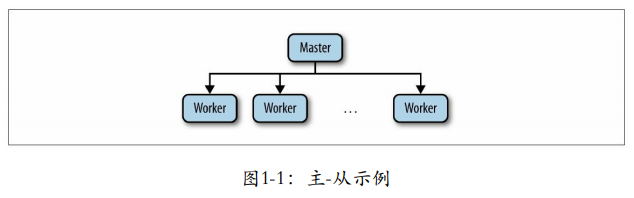
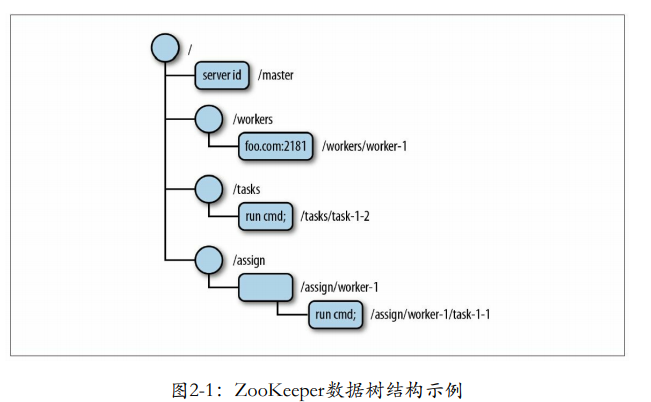

# Zookeeper 架构

> 材料大部分来源于网上，我会备注网址
>
> 学习学习
>
> 推荐阅读：https://developer.ibm.com/zh/articles/os-cn-zookeeper/

## [项目介绍](https://cwiki.apache.org/confluence/display/ZOOKEEPER/ProjectDescription)

[转至元数据结尾](https://cwiki.apache.org/confluence/display/ZOOKEEPER/ProjectDescription#page-metadata-end)

- 由 [Benjamin Reed](https://cwiki.apache.org/confluence/display/~breed)创建, 最终由 [Carlos D. Morales](https://cwiki.apache.org/confluence/display/~ytsejammer)修改于 [十一月 16, 2012](https://cwiki.apache.org/confluence/pages/diffpagesbyversion.action?pageId=24193436&selectedPageVersions=4&selectedPageVersions=5)

[转至元数据起始](https://cwiki.apache.org/confluence/display/ZOOKEEPER/ProjectDescription#page-metadata-start)

## ZooKeeper概述

ZooKeeper允许分布式进程通过数据寄存器（我们称这些寄存器为znodes）的共享分层名称空间相互协调，就像文件系统一样。与普通文件系统不同，ZooKeeper向其客户端提供高吞吐量，低延迟，高可用性，对znode的严格有序访问。ZooKeeper的性能方面允许它在大型分布式系统中使用。可靠性方面阻止了它成为大型系统中的单点故障。它严格的排序允许在客户端实现复杂的同步原语。

ZooKeeper提供的名称空间与标准文件系统的名称空间非常相似。名称是由斜杠（“ /”）分隔的一系列路径元素。ZooKeeper名称空间中的每个znode均由路径标识。每个znode都有一个父对象，其路径是znode的前缀，元素少一个；此规则的例外是root（“ /”），它没有父项。另外，与标准文件系统完全一样，如果znode有子节点，则无法删除它。

ZooKeeper与标准文件系统之间的主要区别在于，每个znode都可以具有与之关联的数据（每个文件也可以是目录，反之亦然），并且znode限于它们可以拥有的数据量。ZooKeeper旨在存储协调数据：状态信息，配置，位置信息等。此类元信息通常以千字节（如果不是字节）来度量。ZooKeeper具有1M的内置完整性检查，以防止将其用作大型数据存储，但通常用于存储小得多的数据。


服务本身在组成该服务的一组计算机上复制。这些机器在持久性存储中维护数据树的内存映像以及事务日志和快照。因为数据被保存在内存中，所以ZooKeeper能够获得非常高的吞吐量和低延迟数。内存数据库的缺点是ZooKeeper可以管理的数据库大小受内存限制。此限制是保持znodes中存储的数据量较小的另一个原因。

组成ZooKeeper服务的服务器都必须彼此了解。只要大多数服务器可用，ZooKeeper服务将可用。客户端还必须知道服务器列表。客户端使用此服务器列表为ZooKeeper服务创建一个句柄。

客户端仅连接到单个ZooKeeper服务器。客户端维护一个TCP连接，通过该连接发送请求，获取响应，获取监视事件并发送心跳。如果与服务器的TCP连接断开，则客户端将连接到其他服务器。当客户端首次连接到ZooKeeper服务时，第一台ZooKeeper服务器将为该客户端设置会话。如果客户端需要连接到另一台服务器，则该会话将与新服务器重新建立。

ZooKeeper客户端发送的读取请求在客户端连接到的ZooKeeper服务器上本地处理。如果读取请求在znode上注册了一个监视，则该监视也会在ZooKeeper服务器上本地跟踪。写请求被转发到其他ZooKeeper服务器，并在生成响应之前经过共识。同步请求也将转发到另一台服务器，但实际上并没有达成共识。因此，读请求的吞吐量随服务器数量成比例增长，写请求的吞吐量随服务器数量而减小。

订单对ZooKeeper非常重要；几乎与强迫症有关。所有更新均已全部订购。ZooKeeper实际上会为每个更新标记一个可反映此顺序的数字。我们将此数字称为zxid（ZooKeeper交易ID）。每个更新将具有唯一的zxid。阅读（和观看）的顺序与更新有关。读取响应将标记有为读取服务的服务器处理的最后zxid。

> 来源官方文档

## 主从架构模型

​		我们从理论上介绍了分布式系统，现在，是时候让它更具体一点了。考虑在分布式系统设计中一个得到广泛应用的架构：一个主-从（master-worker）架构（图1-1）。该系统中遵循这个架构的一个重要例子是HBase——一个Google的数据存储系统（BigTable）模型的实现，在最高层，主节点服务器（HMaster）负责跟踪区域服务器（HRegionServer）是否可用，并分派区域到服务器。因本书未涉及这些内容，如欲了解它如何使用ZooKeeper等更多细节，建议查看HBase相关文档。我们讨论的焦点是一般的主-从架构。



一般在这种架构中，主节点进程负责跟踪从节点状态和任务的有效 性，并分配任务到从节点。对ZooKeeper来说，这个架构风格具有代表 性，阐述了大多数流行的任务，如选举主节点，跟踪有效的从节点，维 护应用元数据。

要实现主-从模式的系统，我们必须解决以下三个关键问题：

 **主节点崩溃** 

如果主节点发送错误并失效，系统将无法分配新的任务或重新分配 已失败的任务。 

**从节点崩溃**

 如果从节点崩溃，已分配的任务将无法完成。 

**通信故障** 

​		如果主节点和从节点之间无法进行信息交换，从节点将无法得知新 任务分配给它。 为了处理这些问题，之前的主节点出现问题时，系统需要可靠地选 举一个新的主节点，判断哪些从节点有效，并判定一个从节点的状态相 对于系统其他部分是否失效。我们将会在下文中介绍这些任务。

**主节点失效** 

​		主节点失效时，我们需要有一个备份主节点（backup master）。当 主要主节点（primary master）崩溃时，备份主节点接管主要主节点的角 色，进行故障转移，然而，这并不是简单开始处理进入主节点的请求。 新的主要主节点需要能够恢复到旧的主要主节点崩溃时的状态。对于主 节点状态的可恢复性，我们不能依靠从已经崩溃的主节点来获取这些信 息，而需要从其他地方获取，也就是通过ZooKeeper来获取。 状态恢复并不是唯一的重要问题。假如主节点有效，备份主节点却 认为主节点已经崩溃。这种错误的假设可能发生在以下情况，例如主节 点负载很高，导致消息任意延迟（关于这部分内容请参见1.1.4节），备 份主节点将会接管成为主节点的角色，执行所有必需的程序，最终可能 以主节点的角色开始执行，成为第二个主要主节点。更糟的是，如果一 些从节点无法与主要主节点通信，如由于网络分区（network partition） 错误导致，这些从节点可能会停止与主要主节点的通信，而与第二个主 要主节点建立主-从关系。针对这个场景中导致的问题，我们一般称之 为脑裂（split-brain）：系统中两个或者多个部分开始独立工作，导致整 体行为不一致性。我们需要找出一种方法来处理主节点失效的情况，关 键是我们需要避免发生脑裂的情况

**从节点失效**

​		客户端向主节点提交任务，之后主节点将任务派发到有效的从节点 中。从节点接收到派发的任务，执行完这些任务后会向主节点报告执行 状态。主节点下一步会将执行结果通知给客户端。 如果从节点崩溃了，所有已派发给这个从节点且尚未完成的任务需 要重新派发。其中首要需求是让主节点具有检测从节点的崩溃的能力。 主节点必须能够检测到从节点的崩溃，并确定哪些从节点是否有效以便 派发崩溃节点的任务。一个从节点崩溃时，从节点也许执行了部分任 务，也许全部执行完，但没有报告结果。如果整个运算过程产生了其他 作用，我们还有必要执行某些恢复过程来清除之前的状态。

**通信故障**

 如果一个从节点与主节点的网络连接断开，比如网络分区 （network partition）导致，重新分配一个任务可能会导致两个从节点执 行相同的任务。如果一个任务允许多次执行，我们在进行任务再分配时 可以不用验证第一个从节点是否完成了该任务。如果一个任务不允许， 那么我们的应用需要适应多个从节点执行相同任务的可能性。

关于“仅一次”和“最多一次”的语义
对任务加锁并不能保证一个任务执行多次，比如以下场景中描述的情况：
1.主节点M1派发任务T1给从节点W1。
2.W1为任务T1获取锁，执行任务，然后释放锁。
3.M1怀疑W1已经崩溃，所以再次派发任务T1给从节点W2。
4.W2为任务T1获取锁，执行任务，然后释放锁。
		在这里，T1的锁并没有阻止任务被执行两次，因为两个从节点间运行任务时没有步骤交错。处理类似情况就需要“仅一次”和“最多一次”的语义学，而这又依赖于应用的特定处理机制。例如，如果应用数据使用了时间戳数据，而假定任务会修改应用数据，那么该任务的执行成功就取决于这个任务所取得的这个时间戳的值。如果改变应用状态的操作不是原子性操作，那么应用还需要具有局部变更的回退能力，否则最终将导致应用的非一致性。
之所以讨论这些问题，最主要的原因是想说明实现这些语义学的应用是非常困难的。对这些语义学的实现细节并不是本书所讨论的内容。
		通信故障导致的另一个重要问题是对锁等同步原语的影响。因为节点可能崩溃，而系统也可能网络分区（network partition），锁机制也会阻止任务的继续执行。因此ZooKeeper也需要实现处理这些情况的机制。首先，客户端可以告诉ZooKeeper某些数据的状态是临时状态（ephemeral）；其次，同时ZooKeeper需要客户端定时发送是否存活的通知，如果一个客户端未能及时发送通知，那么所有从属于这个客户端的临时状态的数据将全部被删除。通过这两个机制，在崩溃或通信故障发生时，我们就可以预防客户端独立运行而发生的应用宕机。
		回想一下之前讨论的内容，如果我们不能控制系统中的消息延迟，就不能确定一个客户端是崩溃还是运行缓慢，因此，当我们猜测一个客户端已经崩溃，而实际上我们也需要假设客户端仅仅是执行缓慢，其在后续还可能执行一些其他操作。

**任务总结**

根据之前描述的这些，我们可以得到以下主-从架构的需求：

**主节点选举**

这是关键的一步，使得主节点可以给从节点分配任务。

**崩溃检测**

主节点必须具有检测从节点崩溃或失去连接的能力。

**组成员关系管理**

主节点必须具有知道哪一个从节点可以执行任务的能力。

**元数据管理**

主节点和从节点必须具有通过某种可靠的方式来保存分配状态和执行状态的能力。

理想的方式是，以上每一个任务都需要通过原语的方式暴露给应用，对开发者完全隐藏实现细节。ZooKeeper提供了实现这些原语的关键机制，因此，开发者可以通过这些实现一个最适合他们需求、更加关注应用逻辑的分布式应用。贯穿本书，我们经常会涉及像主节点选举、崩溃检测这些原语任务的实现，因为这些是建立分布式应用的具体任务。

> 来源：ZooKeeper-分布式过程协同技术详解

## ZooKeeper基础

很多用于协作的原语常常在很多应用之间共享，因此，设计一个用 于协作需求的服务的方法往往是提供原语列表，暴露出每个原语的实例 化调用方法，并直接控制这些实例。比如，我们可以说分布式锁机制组 成了一个重要的原语，同时暴露出创建（create）、获取（acquire）和 释放（release）三个调用方法。 

这种设计存在一些重大的缺陷：首先，我们要么预先提出一份详尽 的原语列表，要么提供API的扩展，以便引入新的原语；其次，以这种 方式实现原语的服务使得应用丧失了灵活性。

 因此，在ZooKeeper中我们另辟蹊径。ZooKeeper并不直接暴露原 语，取而代之，它暴露了由一小部分调用方法组成的类似文件系统的 API，以便允许应用实现自己的原语。我们通常使用菜谱（recipes）来 表示这些原语的实现。菜谱包括ZooKeeper操作和维护一个小型的数据 节点，这些节点被称为znode，采用类似于文件系统的层级树状结构进 行管理。图2-1描述了一个znode树的结构，根节点包含4个子节点，其 中三个子节点拥有下一级节点，叶子节点存储了数据信息。



针对一个znode，没有数据常常表达了重要的信息。比如，在主-从 模式的例子中，主节点的znode没有数据，表示当前还没有选举出主节 点。而图2-1中涉及的一些其他znode节点在主-从模式的配置中非常有 用：

```
·/workers节点作为父节点，其下每个znode子节点保存了系统中一个可用从节点信息。如图2-1所示，有一个从节点（foot.com：2181）。
·/tasks节点作为父节点，其下每个znode子节点保存了所有已经创建并等待从节点执行的任务的信息，主-从模式的应用的客户端在/tasks下添加一个znode子节点，用来表示一个新任务，并等待任务状态的
znode节点。
·/assign节点作为父节点，其下每个znode子节点保存了分配到某个从节点的一个任务信息，当主节点为某个从节点分配了一个任务，就会在/assign下增加一个子节点。
```


角色模型

- 集群状态（可用/不可用）
- 主从分工

攘其外

- 统一视图
  - 会话session
  - 数据模型Znode
    - 目录结构
    - 节点类型

- 事件监听Watcher

原理：

- 原子消息广播协议ZAB
  - paxos

    - journalnode

    - sentinel

    - zookeeper à ZAB

  - zxid ,myid：

  - ZXID:epoch+ID

- 广播模式原理

- 恢复模式原理：无主模型：zab： zxid ,myid

应用场景

- 统一命名
- 配置管理
- 集群管理


•角色模型

- 集群状态
  - 选举模式 安其内

  - 广播模式 壤其外

- Server状态
     - LOOKING：当前Server不知道leader是谁，正在搜寻
  - LEADING：当前Server即为选举出来的leader
  - FOLLOWING：leader已经选举出来，当前Server与之同步

- 主从分工

  - 领导者（leader）
    - 负责进行投票的发起和决议，更新系统状态

  - 学习者（learner）
    - 包括跟随者（follower）和观察者（observer），follower用于接受客户端请求并向客户端返回结果，在选主过程中参与投票

  - Observer
    - 可以接受客户端连接，将写请求转发给 leader，但observer不参加投票过程，只同步leader 的状态，observer的目的是为了扩展系统，提高读取 速度

  - 客户端（client）
    - 请求发起方

数据模型Znode

目录结构 节点间具有父子关系

- 层次的，目录型结构，便于管理逻辑关系
- 节点znode而非文件file

znode信息

- 包含最大1MB的数据信息
- 记录了Zxid等元数据信息

节点类型


大部分分布式应用需要一个主控、协调器或控制器来管理物理分布的子进程（如资源、任务分配等）

目前，大部分应用需要开发私有的协调程序，缺乏一个通用的机制

协调程序的反复编写浪费，且难以形成通用、伸缩性好的协调器

ZooKeeper：提供通用的分布式锁服务，用以协调分布式应用

- Keepalived监控节点不好管理
- Keepalive 采用优先级监控
- 没有协同工作
- 功能单一
- Keepalive可扩展性差


•Hadoop,使用Zookeeper的事件处理确保整个集群只有一个NameNode,存储配置信息等.

•HBase,使用Zookeeper的事件处理确保整个集群只有一个HMaster,察觉HRegionServer联机和宕机,存储访问控制列表等.


