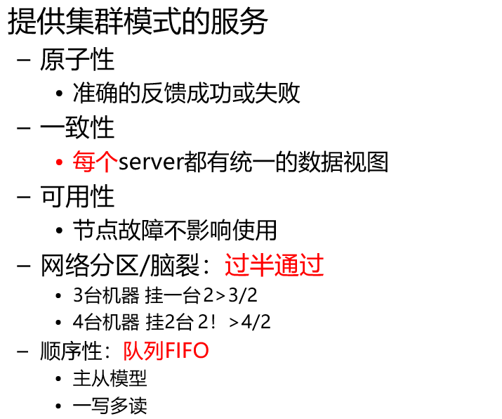

# Zookeeper 安装与配置

> 我使用的是解压版的，
>
> 直接解压配置环境变量就行了，这里不对安装进行过多的描述

## zook.cfg

> 在文件的/conf/下面的模板配置文件修改成`zook.cfg` 文件

```shell
# The number of milliseconds of each tick
tickTime=2000
# The number of ticks that the initial 
# synchronization phase can take
initLimit=10
# The number of ticks that can pass between 
# sending a request and getting an acknowledgement
syncLimit=5
# the directory where the snapshot is stored.
# do not use /tmp for storage, /tmp here is just 
# example sakes.
dataDir=/var/mgs/zookeeper
# the port at which the clients will connect
clientPort=2181
# the maximum number of client connections.
# increase this if you need to handle more clients
#maxClientCnxns=60
#
# Be sure to read the maintenance section of the 
# administrator guide before turning on autopurge.
#
# http://zookeeper.apache.org/doc/current/zookeeperAdmin.html#sc_maintenance
#
# The number of snapshots to retain in dataDir
#autopurge.snapRetainCount=3
# Purge task interval in hours
# Set to "0" to disable auto purge feature
#autopurge.purgeInterval=1
# 2888 配置对外服务的端口
# 3888 选举端口
server.1=hadoopNode02:2888:3888
server.2=hadoopNode03:2888:3888
server.3=hadoopNode04:2888:3888
```

> 需要将Zookeeper分发到其他的节点上。
>
> •tickTime：发送心跳的间隔时间，单位：毫秒
>
> •dataDir：zookeeper保存数据的目录。
>
> •clientPort：客户端连接 Zookeeper 服务器的端口，Zookeeper  会监听这个端口，接受客
>
> •户端的访问请求。
>
> •initLimit： 这个配置项是用来配置 Zookeeper 接受客户端（这里所说的客户端不是用户连 接 Zookeeper 服务器的客户端，而是 Zookeeper 服务器集群中连接到 Leader 的 Follower 服务器）初始化连接时最长能忍受多少个心跳时间间隔数。当已经超过 5 个心跳的 时间（也就是 tickTime）长度后 Zookeeper 服务器还没有收到客户端的返回信息，那么表 明这个客户端连接失败。总的时间长度就是 5*2000=10 秒
>
> •syncLimit：这个配置项标识 Leader 与 Follower 之间发送消息，请求和应答时间长度，最
>
> •长不能超过多少个 tickTime 的时间长度，总的时间长度就是 2*2000=4 秒
>
> •server.A=B：C：D：其 中 A 是一个数字，表示这个是第几号服务器；B 是这个服务器的 ip  地址；C 表示的是这个服务器与集群中的 Leader 服务器交换信息的端口；D 表示的是万一 集群中的 Leader 服务器挂了，需要一个端口来重新进行选举，选出一个新的 Leader，而这 个端口就是用来执行选举时服务器相互通信的端口。如果是伪集群的配置方式，由于 B 都是 一样，所以不同的 Zookeeper 实例通信端口号不能一样，所以要给它们分配不同的端口号

在文件目录 `dataDir =/var/mgs/zookeeper ` 下面创建一个文件`myid` 输入自己节点的编号

```shell
[hadoopNode01]: echo 1 /var/mgs/zookeeper/myid
[hadoopNode02]: echo 2 /var/mgs/zookeeper/myid
[hadoopNode03]: echo 3 /var/mgs/zookeeper/myid
```


同时启动zk服务

```shell
[root@hadoopNode04 ~]# zkServer.sh start
ZooKeeper JMX enabled by default
Using config: /opt/mgs/zookeeper-3.4.14/bin/../conf/zoo.cfg
Starting zookeeper ... STARTED
```


查询zk的服务状态

```shell
[root@hadoopNode02 ~]# zkServer.sh status
ZooKeeper JMX enabled by default
Using config: /opt/mgs/zookeeper-3.4.14/bin/../conf/zoo.cfg
Mode: follower
----------------
[root@hadoopNode03 ~]# zkServer.sh status
ZooKeeper JMX enabled by default
Using config: /opt/mgs/zookeeper-3.4.14/bin/../conf/zoo.cfg
Mode: leader
----------------
[root@hadoopNode04 ~]# zkServer.sh status
ZooKeeper JMX enabled by default
Using config: /opt/mgs/zookeeper-3.4.14/bin/../conf/zoo.cfg
Mode: follower
```


客服端连接

```shell
root@hadoopNode04 ~]# zkCli.sh 
Connecting to localhost:2181
2020-07-17 10:55:39,015 [myid:] - INFO  [main:Environment@100] - Client
......
Session establishment complete on server localhost/127.0.0.1:2181, sessionid = 0x3000018aaf60000, negotiated timeout = 30000

WATCHER::

WatchedEvent state:SyncConnected type:None path:null
[zk: localhost:2181(CONNECTED) 0] help
ZooKeeper -server host:port cmd args
	stat path [watch]
	set path data [version]
	ls path [watch]
	delquota [-n|-b] path
	ls2 path [watch]
	setAcl path acl
	setquota -n|-b val path
	history 
	redo cmdno
	printwatches on|off
	delete path [version]
	sync path
	listquota path
	rmr path
	get path [watch]
	create [-s] [-e] path data acl
	addauth scheme auth
	quit 
	getAcl path
	close 
	connect host:port
[zk: localhost:2181(CONNECTED) 1] 
```


创建一个节点：

```shell
[zk: localhost:2181(CONNECTED) 2] ls /
[zookeeper, yarn-leader-election, hadoop-ha, hbase]
[zk: localhost:2181(CONNECTED) 3] create /mgs helloZk
Created /mgs
[zk: localhost:2181(CONNECTED) 4] ls /
[mgs, zookeeper, yarn-leader-election, hadoop-ha, hbase]
```


查询注册信息

```shell
[zk: localhost:2181(CONNECTED) 5] get /mgs
helloZk
# czxid 创建注册服务的事务版本号，c代表创建
cZxid = 0x1600000004
# time 时间	c创建
ctime = Fri Jul 17 11:00:00 CST 2020
# 修改的事务id m 修改的
mZxid = 0x1600000004
mtime = Fri Jul 17 11:00:00 CST 2020
# 最新目录下面的 子目录事务id pzxid
pZxid = 0x1600000004
cversion = 0
dataVersion = 0
aclVersion = 0
ephemeralOwner = 0x0
dataLength = 7
numChildren = 0
```

事务的版本号是线性增长的，每一次操作都是


## 介绍




### 数据模型Znode

- 目录结构 节点间具有父子关系
  - 层次的，目录型结构，便于管理逻辑关系
  - 节点znode而非文件file

- znode信息
  - 包含最大1MB的数据信息
  - 记录了Zxid等元数据信息

- 节点类型


•Znode有两种类型，短暂的（ephemeral）和持久的（persistent）

•Znode支持序列SEQUENTIAL：leader

–短暂znode的客户端会话结束时，zookeeper会将该短暂znode删除，短暂znode不可以有子节点

–持久znode不依赖于客户端会话，只有当客户端明确要删除该持久znode时才会被删除

•Znode的类型在创建时确定并且之后不能再修改

•Znode有四种形式的目录节点

- PERSISTENT

–EPHEMERAL

–PERSISTENT_SEQUENTIAL

–EPHEMERAL_SEQUENTIAL

```shell
# 创建一个临时节点
> create -e /test te
# 创建一个序列化节点
> create -s /test te
# 序列化节点的创建会随机的产生一个尾号，自己也可以在已经有的节点尾号上面创建一个序列化节点
```


