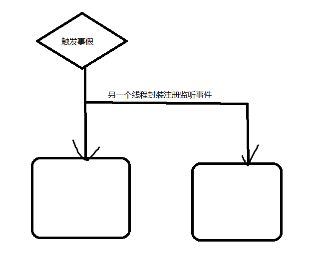

# Zookeeper java API

## 测试

### pom

```xml
<!-- https://mvnrepository.com/artifact/org.apache.zookeeper/zookeeper -->
<dependency>
    <groupId>org.apache.zookeeper</groupId>
    <artifactId>zookeeper</artifactId>
    <version>3.4.5</version>
    <type>pom</type>
</dependency>
```

### 测试案例

```java
package testZK;

import java.io.IOException;
import java.util.List;

import org.apache.zookeeper.CreateMode;
import org.apache.zookeeper.KeeperException;
import org.apache.zookeeper.WatchedEvent;
import org.apache.zookeeper.Watcher;
import org.apache.zookeeper.ZooDefs.Ids;
import org.apache.zookeeper.ZooKeeper;
import org.apache.zookeeper.data.Stat;
import org.junit.After;
import org.junit.Assert;
import org.junit.Before;
import org.junit.Test;
import org.slf4j.Logger;
import org.slf4j.LoggerFactory;

public class ZookeeperTest {
	//会话过期时间 30S
	private static final int SESSION_TIMEOUT = 30000;
	//日志输出
	public static final Logger LOGGER = LoggerFactory.getLogger(ZookeeperTest.class);
	//监听节点事假回调
	private Watcher watcher =  new Watcher() {

		public void process(WatchedEvent event) {
			LOGGER.info("process : " + event.getType());
		}
	};
	//实例化一个客服端
	private ZooKeeper zooKeeper;
	
	/**
	 *   zookeeper 
	 * 初始化一个连接对象
	 * @throws IOException
	 */
	@Before
	public void connect() throws IOException {
//		indicate : all servers 
		zooKeeper  = new ZooKeeper("hadoopNode02:2181,hadoopNode03:2181,hadoopNode04:2181", SESSION_TIMEOUT, watcher);
	}
	
	/**
	 *  关闭
	 */
	@After
	public void close() {
		try {
			zooKeeper.close();
		} catch (InterruptedException e) {
			e.printStackTrace();
		}
	}

	/**
	 * 创建 znode 
	 *  1.CreateMode  
	 *  PERSISTENT
	 *  PERSISTENT_SEQUENTIAL
	 *  EPHEMERAL
	 *  EPHEMERAL_SEQUENTIAL
	 *  Access Control List: 访问控制列表
	 *  https://baike.baidu.com/item/ACL/362453?fr=aladdin
	 *  OPEN_ACL_UNSAFE: ANYONE CAN VISIT 
	 * <br>------------------------------<br>
	 */
	@Test
	public void testCreate() {
		String result = null;
		 try {
             //创建一个临时性节点，会话关闭的时候就会被删除 CreateMode . PERSISTENT创建一个永久性节点
			 result = zooKeeper.create("/zk002", "zk002data-e".getBytes(), Ids.OPEN_ACL_UNSAFE, CreateMode.EPHEMERAL);
			 Thread.sleep(30000);
		} catch (Exception e) {
			 LOGGER.error(e.getMessage());
			 Assert.fail();
		}
		 LOGGER.info("create result : {}", result);
	 }
	
	/**
	 * 删除
	 */
	@Test
	public void testDelete() {
		 try {
			zooKeeper.delete("/zk001", -1);
		} catch (Exception e) {
			 LOGGER.error(e.getMessage());
			 Assert.fail();
		}
	}
	
	/**
	 *   ��ȡ���
	 */
	/**
	 * 
	 */
	@Test
	public void testGetData() {
		String result = null;
		 try {
			 byte[] bytes = zooKeeper.getData("/sxt", null, null);
			 result = new String(bytes);
		} catch (Exception e) {
			 LOGGER.error(e.getMessage());
			 Assert.fail();
		}
		 LOGGER.info("getdata result------------------------------------------------- : {}", result);
	}
    
    /**
    * 当你第一次使用get获取参数的时候，第二次准备获取的时候，突然你原先连接的服务器节点宕机后，会从新的
    * 与另一个节点建立连接。
    *
    */
	@Test
	public void testGetData01() throws Exception {
		String result = null;
		try {
			byte[] bytes = zooKeeper.getData("/zk001", null, null);
			result = new String(bytes);
		} catch (Exception e) {
			LOGGER.error(e.getMessage());
			Assert.fail();
		}
		LOGGER.info("getdata result-----------------1------------------ : {}", result);
		
		Thread.sleep(30000);
		
		byte[] bytes;
		try {
			bytes = zooKeeper.getData("/zk001", null, null);
			result = new String(bytes);
		} catch (KeeperException | InterruptedException e) {
			// TODO Auto-generated catch block
			e.printStackTrace();
		}
		LOGGER.info("getdata result-----------------2-------------------- : {}", result);
		
		
		
		
		
	}
	
	/**
	 *   注册
	 */
	@Test
	public void testGetDataWatch() {
		String result = null;
		 try {
			 System.out.println("get:");
			 byte[] bytes = zooKeeper.getData("/zk001", new Watcher() {
				public void process(WatchedEvent event) {
					LOGGER.info("testGetDataWatch  watch : {}", event.getType());
					System.out.println("watcher ok");
					
				}
			 }, null);
			 result = new String(bytes);
		} catch (Exception e) {
			 LOGGER.error(e.getMessage());
			 Assert.fail();
		}
		 LOGGER.info("getdata result------------------------------------------ : {}", result);
		 
		 // wacth  NodeDataChanged
		 try {
			 System.out.println("set:");
			 zooKeeper.setData("/zk001", "testSetDataWAWWW".getBytes(), -1);
			 System.out.println("set:");
			 zooKeeper.setData("/zk001", "testSetDataWAWWW".getBytes(), -1);
		} catch (Exception e) {
			 LOGGER.error(e.getMessage());
			 Assert.fail();
		}
		 System.out.println("over");
	}
	
	/**
	 *    �жϽڵ��Ƿ����
	 *    �����Ƿ������Ŀ¼�ڵ㣬����� watcher ���ڴ��� ZooKeeperʵ��ʱָ���� watcher
	 */
	@Test
	public void testExists() {
		Stat stat = null;
		 try {
			 stat = zooKeeper.exists("/zk001", false);
		} catch (Exception e) {
			 LOGGER.error(e.getMessage());
			 Assert.fail();
		}
		 Assert.assertNotNull(stat);
		 LOGGER.info("exists result : {}", stat.getCzxid());
	}
	
	/**
	 *     ���ö�Ӧznode�µ����  ,  -1��ʾƥ�����а汾
	 */
	@Test
	public void testSetData() {
		Stat stat = null;
		 try {
			 stat = zooKeeper.setData("/zk001", "testSetData".getBytes(), -1);
		} catch (Exception e) {
			 LOGGER.error(e.getMessage());
			 Assert.fail();
		}
		 Assert.assertNotNull(stat);
		 LOGGER.info("exists result : {}", stat.getVersion());	
	}
	
	/**
	 *    �жϽڵ��Ƿ����, 
	 *    �����Ƿ������Ŀ¼�ڵ㣬����� watcher ���ڴ��� ZooKeeperʵ��ʱָ���� watcher
	 */
	@Test
	public void testExistsWatch1() {
		Stat stat = null;
		 try {
			 stat = zooKeeper.exists("/zk001", true);
		} catch (Exception e) {
			 LOGGER.error(e.getMessage());
			 Assert.fail();
		}
		 Assert.assertNotNull(stat);
		 
		 try {
			zooKeeper.delete("/zk001", -1);
		} catch (Exception e) {
			e.printStackTrace();
		}
	}
	
	/**
	 *    �жϽڵ��Ƿ����, 
	 *    ���ü�����Ŀ¼�ڵ�� Watcher
	 */
	@Test
	public void testExistsWatch2() {
		Stat stat = null;
		 try {
			 stat = zooKeeper.exists("/zk002", new Watcher() {
				@Override
				public void process(WatchedEvent event) {
					LOGGER.info("testExistsWatch2  watch : {}", event.getType());
				}
			 });
		} catch (Exception e) {
			 LOGGER.error(e.getMessage());
			 Assert.fail();
		}
		 Assert.assertNotNull(stat);
		 
		 // ����watch �е�process����   NodeDataChanged
		 try {
			zooKeeper.setData("/zk002", "testExistsWatch2".getBytes(), -1);
		} catch (Exception e) {
			e.printStackTrace();
		}
		 
		 // ���ᴥ��watch ֻ�ᴥ��һ��
		 try {
			zooKeeper.delete("/zk002", -1);
		} catch (Exception e) {
			e.printStackTrace();
		}
	}
	
	/**
	 *  ��ȡָ���ڵ��µ��ӽڵ�
	 */
	@Test
	public void testGetChild() {
		 try {
			 zooKeeper.create("/zk/001", "001".getBytes(), Ids.OPEN_ACL_UNSAFE, CreateMode.PERSISTENT);
			 zooKeeper.create("/zk/002", "002".getBytes(), Ids.OPEN_ACL_UNSAFE, CreateMode.PERSISTENT);
			 
			 List<String> list = zooKeeper.getChildren("/zk", true);
			for (String node : list) {
				LOGGER.info("fffffff {}", node);
			}
		} catch (Exception e) {
			 LOGGER.error(e.getMessage());
			 Assert.fail();
		}
	}
}

```

> 会跟主节点创建连接

### testGetDataWatch方法研究



被触发事件后，会启动另一个线程进行回调事件。在get方法中注册的事件只会被触发一回，第二次事件被触发会不会被调用。递归调用的话可以被执行两次。【个人不推荐在注册事件中递归】


## 一个简单的手表客户端

为了向您介绍ZooKeeper Java API，我们在这里开发了一个非常简单的监视客户端。该ZooKeeper客户端监视znode的更改并通过启动或停止程序来响应。


### 要求

客户有四个要求：

- 它采用以下参数：
- ZooKeeper服务的地址
- znode的名称-要监视的znode的名称
- 要将输出写入的文件名
- 带有参数的可执行文件。
- 它获取与znode关联的数据并启动可执行文件。
- 如果znode更改，则客户端将重新获取内容并重新启动可执行文件。
- 如果znode消失，则客户端将杀死可执行文件。


### 程序设计

按照惯例，ZooKeeper应用程序分为两个单元，一个单元维护连接，另一个单元监视数据。在此应用程序中，名为**Executor**的类维护ZooKeeper连接，而名为**DataMonitor**的类监视ZooKeeper树中的数据。另外，执行程序包含主线程并包含执行逻辑。它负责根据znode的状态，与用户进行的交互很少，以及与您作为参数传入的可执行程序之间的交互，以及示例（根据要求）关闭并重新启动的示例。


### 执行者班

Executor对象是示例应用程序的主要容器。如上文“ [程序设计”中](https://zookeeper.apache.org/doc/r3.6.1/javaExample.html#sc_design)所述，它同时包含**ZooKeeper**对象**DataMonitor**。

```java
// from the Executor class...

public static void main(String[] args) {
    if (args.length < 4) {
        System.err
                .println("USAGE: Executor hostPort znode filename program [args ...]");
        System.exit(2);
    }
    String hostPort = args[0];
    String znode = args[1];
    String filename = args[2];
    String exec[] = new String[args.length - 3];
    System.arraycopy(args, 3, exec, 0, exec.length);
    try {
        new Executor(hostPort, znode, filename, exec).run();
    } catch (Exception e) {
        e.printStackTrace();
    }
}

public Executor(String hostPort, String znode, String filename,
        String exec[]) throws KeeperException, IOException {
    this.filename = filename;
    this.exec = exec;
    zk = new ZooKeeper(hostPort, 3000, this);
    dm = new DataMonitor(zk, znode, null, this);
}

public void run() {
    try {
        synchronized (this) {
            while (!dm.dead) {
                wait();
            }
        }
    } catch (InterruptedException e) {
    }
}
```

回忆执行器的工作是启动和停止您在命令行中输入名称的可执行文件。这样做是为了响应ZooKeeper对象触发的事件。如您在上面的代码中看到的，执行器将对自身的引用作为ZooKeeper构造函数中的Watcher参数传递。它还将对自身的引用作为DataMonitorListener参数传递给DataMonitor构造函数。根据执行程序的定义，它实现以下两个接口：

```
public class Executor implements Watcher, Runnable, DataMonitor.DataMonitorListener {
...
```

该**看守**接口由动物园管理员的Java API定义。ZooKeeper使用它来通讯回其容器。它仅支持一种方法，`process()`而ZooKeeper使用它来传达主线程可能感兴趣的通用事件，例如ZooKeeper连接的状态或ZooKeeper会话。在此示例中，执行程序仅将这些事件转发给DataMonitor，以决定如何处理它们。这样做只是为了说明这一点，按照惯例，Executor或某些类似于Executor的对象“拥有” ZooKeeper连接，但是可以将事件委托给其他事件给其他对象。它还将其用作触发监视事件的默认通道。（稍后对此有更多介绍。）

```java
public void process(WatchedEvent event) {
    dm.process(event);
}
```

的**DataMonitorListener**接口，在另一方面，是不是动物园管理员API的一部分。这是一个完全自定义的界面，专门为此示例应用程序设计。DataMonitor对象使用它来通讯回其容器，该容器也是Executor对象。DataMonitorListener接口如下所示：

```java
public interface DataMonitorListener {
    /**
    * The existence status of the node has changed.
    */
    void exists(byte data[]);

    /**
    * The ZooKeeper session is no longer valid.
    *
    * @param rc
    * the ZooKeeper reason code
    */
    void closing(int rc);
}
```

此接口在DataMonitor类中定义，并在Executor类中实现。当`Executor.exists()`被调用时，执行人决定是否启动或关闭按要求。回想一下，当znode不再*存在*时，require要求杀死可执行文件。

当`Executor.closing()`被调用时，执行器决定是否响应ZooKeeper连接永久消失而自行关闭。

您可能已经猜到了，DataMonitor是调用这些方法的对象，以响应ZooKeeper状态的变化。

这是执行器对`DataMonitorListener.exists()`和的执行`DataMonitorListener.closing`：

```java
public void exists( byte[] data ) {
    if (data == null) {
        if (child != null) {
            System.out.println("Killing process");
            child.destroy();
            try {
                child.waitFor();
            } catch (InterruptedException e) {
           }
        }
        child = null;
    } else {
        if (child != null) {
            System.out.println("Stopping child");
            child.destroy();
            try {
               child.waitFor();
            } catch (InterruptedException e) {
            e.printStackTrace();
            }
        }
        try {
            FileOutputStream fos = new FileOutputStream(filename);
            fos.write(data);
            fos.close();
        } catch (IOException e) {
            e.printStackTrace();
        }
        try {
            System.out.println("Starting child");
            child = Runtime.getRuntime().exec(exec);
            new StreamWriter(child.getInputStream(), System.out);
            new StreamWriter(child.getErrorStream(), System.err);
        } catch (IOException e) {
            e.printStackTrace();
        }
    }
}

public void closing(int rc) {
    synchronized (this) {
        notifyAll();
    }
}
```


### DataMonitor类

DataMonitor类具有ZooKeeper逻辑的实质。它主要是异步的和事件驱动的。DataMonitor通过以下方式在构造函数中启动：

```java
public DataMonitor(ZooKeeper zk, String znode, Watcher chainedWatcher,
        DataMonitorListener listener) {
    this.zk = zk;
    this.znode = znode;
    this.chainedWatcher = chainedWatcher;
    this.listener = listener;

    // Get things started by checking if the node exists. We are going
    // to be completely event driven
```

调用`ZooKeeper.exists()`检查znode是否存在，设置监视，并将对自身（`this`）的引用作为完成回调对象传递。从这个意义上说，它开始了，因为真正的处理过程是在触发手表时发生的。

#### 注意

> 不要将完成回调与监视回调混淆。在`ZooKeeper.exists()`完成回调，这恰好是该方法`StatCallback.processResult()`中在DataMonitor对象实现，当异步调用*手表的设置*（通过操作`ZooKeeper.exists()`）在服务器上完成。
>
> 另一方面，手表的触发将事件发送到*Executor*对象，因为Executor已注册为ZooKeeper对象的Watcher。
>
> 顺便说一句，您可能会注意到，DataMonitor也可以将自己注册为该特定监视事件的监视者。这是ZooKeeper 3.0.0（多个监视程序的支持）的新增功能。但是，在此示例中，DataMonitor不会注册为观察者。

当`ZooKeeper.exists()`操作在服务器上完成时，ZooKeeper API在客户端上调用以下完成回调：

```java
public void processResult(int rc, String path, Object ctx, Stat stat) {
    boolean exists;
    switch (rc) {
    case Code.Ok:
        exists = true;
        break;
    case Code.NoNode:
        exists = false;
        break;
    case Code.SessionExpired:
    case Code.NoAuth:
        dead = true;
        listener.closing(rc);
        return;
    default:
        // Retry errors
        zk.exists(znode, true, this, null);
        return;
    }

    byte b[] = null;
    if (exists) {
        try {
            b = zk.getData(znode, false, null);
        } catch (KeeperException e) {
            // We don't need to worry about recovering now. The watch
            // callbacks will kick off any exception handling
            e.printStackTrace();
        } catch (InterruptedException e) {
            return;
        }
    }     
    if ((b == null &amp;&amp; b != prevData)
        || (b != null &amp;&amp; !Arrays.equals(prevData, b))) {
        listener.exists(b);</emphasis>
        prevData = b;
    }
}
```

该代码首先检查错误代码中是否存在znode，致命错误和可恢复错误。如果文件（或znode）存在，它将从znode获取数据，然后在状态发生变化时调用Executor的exist（）回调。注意，它不必对getData调用进行任何异常处理，因为它可以`ZooKeeper.getData()`监视任何可能导致错误的事件：如果节点在调用之前被删除，则由`ZooKeeper.exists()`触发器设置的watch事件将触发回调；如果出现通信错误，则在恢复连接时将触发连接监视事件。

最后，请注意DataMonitor如何处理监视事件：

```java
public void process(WatchedEvent event) {
    String path = event.getPath();
    if (event.getType() == Event.EventType.None) {
        // We are are being told that the state of the
        // connection has changed
        switch (event.getState()) {
        case SyncConnected:
            // In this particular example we don't need to do anything
            // here - watches are automatically re-registered with
            // server and any watches triggered while the client was
            // disconnected will be delivered (in order of course)
            break;
        case Expired:
            // It's all over
            dead = true;
            listener.closing(KeeperException.Code.SessionExpired);
            break;
        }
    } else {
        if (path != null && path.equals(znode)) {
            // Something has changed on the node, let's find out
            zk.exists(znode, true, this, null);
        }
    }
    if (chainedWatcher != null) {
        chainedWatcher.process(event);
    }
}
```

如果客户端ZooKeeper库可以在会话期满（Expired事件）之前重新建立与ZooKeeper的通信通道（SyncConnected事件），则将使用服务器自动重建所有会话的手表（手表的自动重置是新的ZooKeeper 3.0.0）。有关更多信息，请参见程序员指南中的[ZooKeeper手表](https://zookeeper.apache.org/doc/r3.6.1/zookeeperProgrammers.html#ch_zkWatches)。在此函数中，当DataMonitor获取znode事件时，它会调用`ZooKeeper.exists()`以找出发生了什么变化。


### 完整的示例清单

#### Executor.java

```java
/**
 * A simple example program to use DataMonitor to start and
 * stop executables based on a znode. The program watches the
 * specified znode and saves the data that corresponds to the
 * znode in the filesystem. It also starts the specified program
 * with the specified arguments when the znode exists and kills
 * the program if the znode goes away.
 */
import java.io.FileOutputStream;
import java.io.IOException;
import java.io.InputStream;
import java.io.OutputStream;

import org.apache.zookeeper.KeeperException;
import org.apache.zookeeper.WatchedEvent;
import org.apache.zookeeper.Watcher;
import org.apache.zookeeper.ZooKeeper;

public class Executor
    implements Watcher, Runnable, DataMonitor.DataMonitorListener
{
    String znode;
    DataMonitor dm;
    ZooKeeper zk;
    String filename;
    String exec[];
    Process child;

    public Executor(String hostPort, String znode, String filename,
            String exec[]) throws KeeperException, IOException {
        this.filename = filename;
        this.exec = exec;
        zk = new ZooKeeper(hostPort, 3000, this);
        dm = new DataMonitor(zk, znode, null, this);
    }

    /**
     * @param args
     */
    public static void main(String[] args) {
        if (args.length < 4) {
            System.err
                    .println("USAGE: Executor hostPort znode filename program [args ...]");
            System.exit(2);
        }
        String hostPort = args[0];
        String znode = args[1];
        String filename = args[2];
        String exec[] = new String[args.length - 3];
        System.arraycopy(args, 3, exec, 0, exec.length);
        try {
            new Executor(hostPort, znode, filename, exec).run();
        } catch (Exception e) {
            e.printStackTrace();
        }
    }

    /***************************************************************************
     * We do process any events ourselves, we just need to forward them on.
     *
     * @see org.apache.zookeeper.Watcher#process(org.apache.zookeeper.proto.WatcherEvent)
     */
    public void process(WatchedEvent event) {
        dm.process(event);
    }

    public void run() {
        try {
            synchronized (this) {
                while (!dm.dead) {
                    wait();
                }
            }
        } catch (InterruptedException e) {
        }
    }

    public void closing(int rc) {
        synchronized (this) {
            notifyAll();
        }
    }

    static class StreamWriter extends Thread {
        OutputStream os;

        InputStream is;

        StreamWriter(InputStream is, OutputStream os) {
            this.is = is;
            this.os = os;
            start();
        }

        public void run() {
            byte b[] = new byte[80];
            int rc;
            try {
                while ((rc = is.read(b)) > 0) {
                    os.write(b, 0, rc);
                }
            } catch (IOException e) {
            }

        }
    }

    public void exists(byte[] data) {
        if (data == null) {
            if (child != null) {
                System.out.println("Killing process");
                child.destroy();
                try {
                    child.waitFor();
                } catch (InterruptedException e) {
                }
            }
            child = null;
        } else {
            if (child != null) {
                System.out.println("Stopping child");
                child.destroy();
                try {
                    child.waitFor();
                } catch (InterruptedException e) {
                    e.printStackTrace();
                }
            }
            try {
                FileOutputStream fos = new FileOutputStream(filename);
                fos.write(data);
                fos.close();
            } catch (IOException e) {
                e.printStackTrace();
            }
            try {
                System.out.println("Starting child");
                child = Runtime.getRuntime().exec(exec);
                new StreamWriter(child.getInputStream(), System.out);
                new StreamWriter(child.getErrorStream(), System.err);
            } catch (IOException e) {
                e.printStackTrace();
            }
        }
    }
}
```

#### DataMonitor.java

```java
/**
 * A simple class that monitors the data and existence of a ZooKeeper
 * node. It uses asynchronous ZooKeeper APIs.
 */
import java.util.Arrays;

import org.apache.zookeeper.KeeperException;
import org.apache.zookeeper.WatchedEvent;
import org.apache.zookeeper.Watcher;
import org.apache.zookeeper.ZooKeeper;
import org.apache.zookeeper.AsyncCallback.StatCallback;
import org.apache.zookeeper.KeeperException.Code;
import org.apache.zookeeper.data.Stat;

public class DataMonitor implements Watcher, StatCallback {

    ZooKeeper zk;
    String znode;
    Watcher chainedWatcher;
    boolean dead;
    DataMonitorListener listener;
    byte prevData[];

    public DataMonitor(ZooKeeper zk, String znode, Watcher chainedWatcher,
            DataMonitorListener listener) {
        this.zk = zk;
        this.znode = znode;
        this.chainedWatcher = chainedWatcher;
        this.listener = listener;
        // Get things started by checking if the node exists. We are going
        // to be completely event driven
        zk.exists(znode, true, this, null);
    }

    /**
     * Other classes use the DataMonitor by implementing this method
     */
    public interface DataMonitorListener {
        /**
         * The existence status of the node has changed.
         */
        void exists(byte data[]);

        /**
         * The ZooKeeper session is no longer valid.
         *
         * @param rc
         *                the ZooKeeper reason code
         */
        void closing(int rc);
    }

    public void process(WatchedEvent event) {
        String path = event.getPath();
        if (event.getType() == Event.EventType.None) {
            // We are are being told that the state of the
            // connection has changed
            switch (event.getState()) {
            case SyncConnected:
                // In this particular example we don't need to do anything
                // here - watches are automatically re-registered with
                // server and any watches triggered while the client was
                // disconnected will be delivered (in order of course)
                break;
            case Expired:
                // It's all over
                dead = true;
                listener.closing(KeeperException.Code.SessionExpired);
                break;
            }
        } else {
            if (path != null && path.equals(znode)) {
                // Something has changed on the node, let's find out
                zk.exists(znode, true, this, null);
            }
        }
        if (chainedWatcher != null) {
            chainedWatcher.process(event);
        }
    }

    public void processResult(int rc, String path, Object ctx, Stat stat) {
        boolean exists;
        switch (rc) {
        case Code.Ok:
            exists = true;
            break;
        case Code.NoNode:
            exists = false;
            break;
        case Code.SessionExpired:
        case Code.NoAuth:
            dead = true;
            listener.closing(rc);
            return;
        default:
            // Retry errors
            zk.exists(znode, true, this, null);
            return;
        }

        byte b[] = null;
        if (exists) {
            try {
                b = zk.getData(znode, false, null);
            } catch (KeeperException e) {
                // We don't need to worry about recovering now. The watch
                // callbacks will kick off any exception handling
                e.printStackTrace();
            } catch (InterruptedException e) {
                return;
            }
        }
        if ((b == null && b != prevData)
                || (b != null && !Arrays.equals(prevData, b))) {
            listener.exists(b);
            prevData = b;
        }
    }
}
```