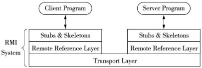
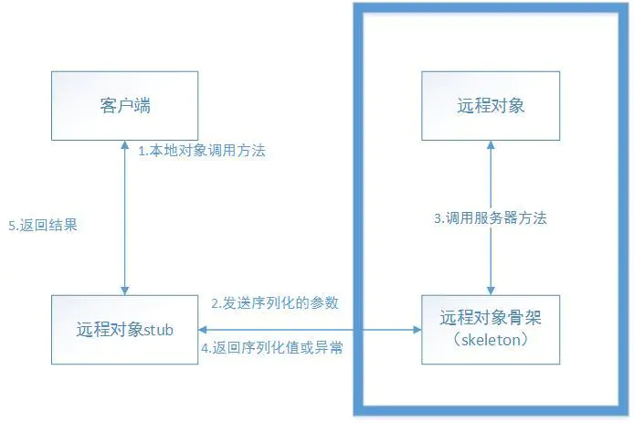
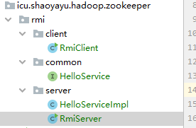

# Zookeeper 与RMI

> 参考：
>
> https://my.oschina.net/huangyong/blog/345164
>
> https://www.jianshu.com/p/d8ffa1ff0727
>
> https://developer.ibm.com/zh/articles/os-cn-zookeeper/

## RMI 

### RMI简介

RMI（Remoete Method Invocation 远程过程调用），是Java虚拟机的服务调用机制，也就是“跨虚拟机”的调用。例如，服务A 在 JVM1 中运行，服务B 在 JVM2 中运行，服务A 与 服务B 可相互进行远程调用，就像调用本地方法一样，这就是 RMI。在分布式系统中，我们使用 RMI 技术可轻松将 `服务提供者`（Service Provider）与 `服务消费者`（Service Consumer）进行分离，充分体现组件之间的弱耦合，系统架构更易于扩展。

RMI是Java支撑分布式系统的基石，例如著名的EJB组件。RMI是远程过程调用（RPC）的一种面向对象实现，RMI底层是通过socket通信和对象序列化技术来实现的。

### RMI基本原理

RMI的目的就是要使运行在不同的计算机中的对象之间的调用表现得像本地调用一样。RMI应用程序通常包括两个独立的程序:服务器程序和客户机程序。RMI 需要将行为的定义与行为的实现分别定义, 并允许将行为定义代码与行为实现代码存放并运行在不同的 JVM 上。在 RMI 中, 远程服务的定义是存放在继承了 Remote的接口中。远程服务的实现代码存放在实现该定义接口的类中。

RMI 支持两个类实现一个相同的远程服务接口: 一个类实现行为并运行在服务器上, 而另一个类作为一个远程服务的代理运行在客户机上。客户程序发出关于代理对象的调用方法, RMI 将该调用请求发送到远程 JVM 上, 并且进一步发送到实现的方法中。实现方法将结果发送给代理, 再通过代理将结果返回给调用者。

RMI 构建三个抽象层, 高层覆盖低层, 分别负责Socket通信, 参数和结果的序列化和反序列化等工作。存根( Stub) 和骨架( Skeleton) 合在一起形成了 RMI 构架协议。下面的引用层被用来寻找各自的通信伙伴,在这一层还有一个提供名字服务的部分, 称为注册表( registry) 。最下一层是传输层, 是依赖于 TCP/IP 协议实现客户机与服务器的互联。



当客户端调用远程对象方法时, 存根负责把要调用的远程对象方法的方法名及其参数编组打包,并将该包向下经远程引用层、传输层转发给远程对象所在的服务器。通过 RMI 系统的 RMI 注册表实现的简单服务器名字服务, 可定位远程对象所在的服务器。

该包到达服务器后, 向上经远程引用层, 被远程对象的 Skeleton 接收, 此 Skeleton 解析客户包中的方法名及编组的参数后, 在服务器端执行客户要调用的远程对象方法, 然后将该方法的返回值( 或产生的异常) 打包后通过相反路线返回给客户端, 客户端的 Stub 将返回结果解析后传递给客户程序。事实上, 不仅客户端程序可以通过存根调用服务器端的远程对象的方法, 而服务器端的程序亦可通过由客户端传递的远程接口回调客户端的远程对象方法。在分布式系统中, 所有的计算机可以是服务器, 同时又可以是客户机。



作者：忘净空
链接：https://www.jianshu.com/p/d8ffa1ff0727
来源：简书
著作权归作者所有。商业转载请联系作者获得授权，非商业转载请注明出处。


## 案例：

包目录：



服务端：

```java
package icu.shaoyayu.hadoop.zookeeper.rmi.server;

import java.net.MalformedURLException;
import java.rmi.Naming;
import java.rmi.RemoteException;
import java.rmi.registry.LocateRegistry;

/**
 * @author shaoyayu
 * @date 2020/7/18 15:41
 * @E_Mail
 * @Version 1.0.0
 * @readme ：
 */
public class RmiServer {

    public static void main(String[] args) throws RemoteException, MalformedURLException {
        int port = 1099;

        String url = "rmi://localhost:1099/demo.zookeeper.remoting.server.HelloServiceImpl";
        LocateRegistry.createRegistry(port);
        Naming.rebind(url, new HelloServiceImpl());
    }
}
```

```java
package icu.shaoyayu.hadoop.zookeeper.rmi.server;

import icu.shaoyayu.hadoop.zookeeper.rmi.common.HelloService;

import java.rmi.RemoteException;
import java.rmi.server.UnicastRemoteObject;

/**
 * @author shaoyayu
 * @date 2020/7/18 15:44
 * @E_Mail
 * @Version 1.0.0
 * @readme ：
 */
public class HelloServiceImpl extends UnicastRemoteObject implements HelloService {

    protected HelloServiceImpl() throws RemoteException {
    }

    @Override
    public String sayHello(String name) throws RemoteException {
        System.out.println("server:  "+name);
        return String.format("Hello %s", name);
    }
}
```

公共模块

```java
package icu.shaoyayu.hadoop.zookeeper.rmi.common;

import java.rmi.Remote;
import java.rmi.RemoteException;

/**
 * @author shaoyayu
 * @date 2020/7/18 15:43
 * @E_Mail
 * @Version 1.0.0
 * @readme ：
 */
public interface HelloService extends Remote {

    String sayHello(String name) throws RemoteException;
}
```

客服端

```java
package icu.shaoyayu.hadoop.zookeeper.rmi.client;

import icu.shaoyayu.hadoop.zookeeper.rmi.common.HelloService;

import java.rmi.Naming;

/**
 * @author shaoyayu
 * @date 2020/7/18 15:44
 * @E_Mail
 * @Version 1.0.0
 * @readme ：
 */
public class  RmiClient {

    public static void main(String[] args) throws Exception {
        //schema host port
        String url = "rmi://localhost:1099/demo.zookeeper.remoting.server.HelloServiceImpl";
        //proxy
        HelloService helloService = (HelloService) Naming.lookup(url);
        String result = helloService.sayHello("Jack");
        System.out.println(result);
    }
}
```

启动服务端后连接服务


## Zookeeper 使用案例

```java
package demo.zookeeper.remoting.server;
 
import demo.zookeeper.remoting.common.HelloService;
 
public class Server {
 
    public static void main(String[] args) throws Exception {
//        if (args.length != 2) {
//            System.err.println("please using command: java Server <rmi_host> <rmi_port>");
//            System.exit(-1);
//        }
// 
//        String host = args[0];
//        int port = Integer.parseInt(args[1]);
// 
    	
        String host = "192.168.133.1";//虚拟网卡可以和linux通讯的地址 
        int port = Integer.parseInt("11214");//每启动一个server，端口号递增，手动启动
        ServiceProvider provider = new ServiceProvider();
 
        HelloService helloService = new HelloServiceImpl();
        provider.publish(helloService, host, port);
 
        Thread.sleep(Long.MAX_VALUE);
    }
}
```


```java
package demo.zookeeper.remoting.common;
 
public interface Constant {
 
    String ZK_CONNECTION_STRING = "192.168.133.19:2181,192.168.133.20:2181,192.168.133.21:2181";
    int ZK_SESSION_TIMEOUT = 5000;
    String ZK_REGISTRY_PATH = "/registry";
    String ZK_PROVIDER_PATH = ZK_REGISTRY_PATH + "/provider";
}
```


```java
package demo.zookeeper.remoting.common;
 
import java.rmi.Remote;
import java.rmi.RemoteException;
 
public interface HelloService extends Remote {
 
    String sayHello(String name) throws RemoteException;
}
```


```java
package demo.zookeeper.remoting.server;
 
import demo.zookeeper.remoting.common.Constant;
import java.io.IOException;
import java.net.MalformedURLException;
import java.rmi.Naming;
import java.rmi.Remote;
import java.rmi.RemoteException;
import java.rmi.registry.LocateRegistry;
import java.util.concurrent.CountDownLatch;
import org.apache.zookeeper.CreateMode;
import org.apache.zookeeper.KeeperException;
import org.apache.zookeeper.WatchedEvent;
import org.apache.zookeeper.Watcher;
import org.apache.zookeeper.ZooDefs;
import org.apache.zookeeper.ZooKeeper;
import org.slf4j.Logger;
import org.slf4j.LoggerFactory;
 
public class ServiceProvider {
 
    private static final Logger LOGGER = LoggerFactory.getLogger(ServiceProvider.class);
 
    private CountDownLatch latch = new CountDownLatch(1);
 
    
    /**
     * 发布RMI服务，注册RMI地址到Zookeeper中
     * @param remote HelloService对象
     * @param host 服务器主机
     * @param port 服务器端口
     */
    public void publish(Remote remote, String host, int port) {
        String url = publishService(remote, host, port); 
        if (url != null) {
            ZooKeeper zk = connectServer();
            if (zk != null) {
                createNode(zk, url); 
            }
        }
    }
 
    // 发布RMI服务  注册端口 绑定对象
    private String publishService(Remote remote, String host, int port) {
        String url = null;
        try {
            url = String.format("rmi://%s:%d/%s", host, port, remote.getClass().getName());
            LocateRegistry.createRegistry(port);
            Naming.rebind(url, remote);
            LOGGER.debug("publish rmi service (url: {})", url);
        } catch (RemoteException | MalformedURLException e) {
            LOGGER.error("", e);
        }
        return url;
    }
 
    // 连接 ZooKeeper 服务器 集群
    private ZooKeeper connectServer() {
        ZooKeeper zk = null;
        try {
            zk = new ZooKeeper(Constant.ZK_CONNECTION_STRING, Constant.ZK_SESSION_TIMEOUT, new Watcher() {
                @Override
                public void process(WatchedEvent event) {
                    if (event.getState() == Event.KeeperState.SyncConnected) {
                        latch.countDown(); //
                    }
                }
            });
            latch.await(); 
        } catch (IOException | InterruptedException e) {
            LOGGER.error("", e);
        }
        return zk;
    }
 
    // 带序列化的临时性节点
    private void createNode(ZooKeeper zk, String url) {
        try {
            byte[] data = url.getBytes();
            String path = zk.create(Constant.ZK_PROVIDER_PATH, data, ZooDefs.Ids.OPEN_ACL_UNSAFE, CreateMode.EPHEMERAL_SEQUENTIAL);
            LOGGER.debug("create zookeeper node ({} => {})", path, url);
        } catch (KeeperException | InterruptedException e) {
            LOGGER.error("", e);
        }
    }
    
    
}
```


```java
package demo.zookeeper.remoting.client;
 
import demo.zookeeper.remoting.common.Constant;
import java.io.IOException;
import java.net.MalformedURLException;
import java.rmi.ConnectException;
import java.rmi.Naming;
import java.rmi.NotBoundException;
import java.rmi.Remote;
import java.rmi.RemoteException;
import java.util.ArrayList;
import java.util.List;
import java.util.concurrent.CountDownLatch;
import java.util.concurrent.ThreadLocalRandom;
import org.apache.zookeeper.KeeperException;
import org.apache.zookeeper.WatchedEvent;
import org.apache.zookeeper.Watcher;
import org.apache.zookeeper.ZooKeeper;
import org.slf4j.Logger;
import org.slf4j.LoggerFactory;
 
public class ServiceConsumer {
 
    private static final Logger LOGGER = LoggerFactory.getLogger(ServiceConsumer.class);
 
    private CountDownLatch latch = new CountDownLatch(1);
 
    private volatile List<String> urlList = new ArrayList<>(); 
 
    public ServiceConsumer() {
        ZooKeeper zk = connectServer(); 
        if (zk != null) {
            watchNode(zk); 
        }
    }
 
    // 查找 RMI 服务 
    public <T extends Remote> T lookup() {
        T service = null;
        int size = urlList.size();
        if (size > 0) {
            String url;
            if (size == 1) {
                url = urlList.get(0); 
                LOGGER.debug("using only url: {}", url);
            } else {
                url = urlList.get(ThreadLocalRandom.current().nextInt(size));
                LOGGER.debug("using random url: {}", url);
            }
            System.out.println(url);
            service = lookupService(url); 
        }
        return service;
    }
 
   
    private ZooKeeper connectServer() {
        ZooKeeper zk = null;
        try {
            zk = new ZooKeeper(Constant.ZK_CONNECTION_STRING, Constant.ZK_SESSION_TIMEOUT, new Watcher() {
                @Override
                public void process(WatchedEvent event) {
                    if (event.getState() == Event.KeeperState.SyncConnected) {
                        latch.countDown();
                    }
                }
            });
            latch.await(); 
        } catch (IOException | InterruptedException e) {
            LOGGER.error("", e);
        }
        return zk;
    }
    private void watchNode(final ZooKeeper zk) {
        try {
            List<String> nodeList = zk.getChildren(Constant.ZK_REGISTRY_PATH, new Watcher() {
                @Override
                public void process(WatchedEvent event) {
                    if (event.getType() == Event.EventType.NodeChildrenChanged) {
                        watchNode(zk);
                    }
                }
            });
            List<String> dataList = new ArrayList<>(); 
            for (String node : nodeList) {
                byte[] data = zk.getData(Constant.ZK_REGISTRY_PATH + "/" + node, false, null); 
                dataList.add(new String(data));
            }
            LOGGER.debug("node data: {}", dataList);
            urlList = dataList;
        } catch (KeeperException | InterruptedException e) {
            LOGGER.error("", e);
        }
    }
    @SuppressWarnings("unchecked")
    private <T> T lookupService(String url) {
        T remote = null;
        try {
            remote = (T) Naming.lookup(url);
        } catch (NotBoundException | MalformedURLException | RemoteException e) {
            if (e instanceof ConnectException) {
                LOGGER.error("ConnectException -> url: {}", url);
                if (urlList.size() != 0) {
                    url = urlList.get(0);
                    return lookupService(url);
                }
            }
            LOGGER.error("", e);
        }
        return remote;
    }
}
```


```java
package demo.zookeeper.remoting.client;
 
import demo.zookeeper.remoting.common.HelloService;
 
public class Client {
 
    public static void main(String[] args) throws Exception {
        ServiceConsumer consumer = new ServiceConsumer();
// zookeeper测试
        while (true) {
            HelloService helloService = consumer.lookup();
            String result = helloService.sayHello("Jack");
            System.out.println(result);
            Thread.sleep(3000);
        }
    }
}
```

