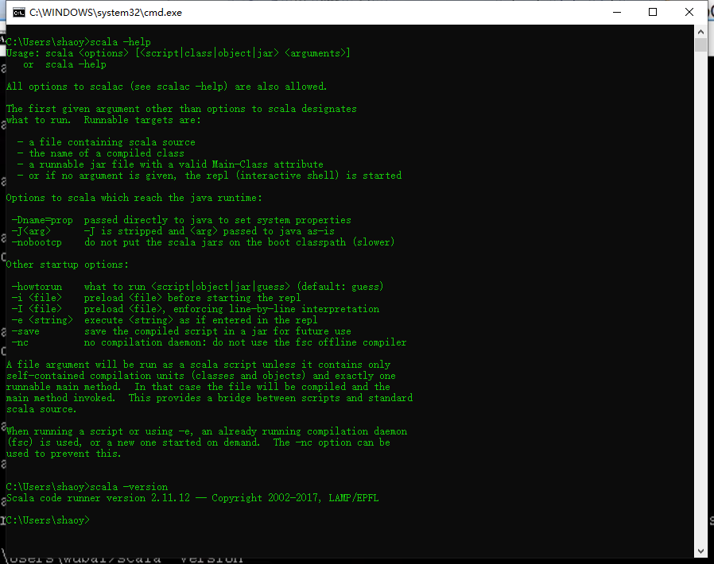
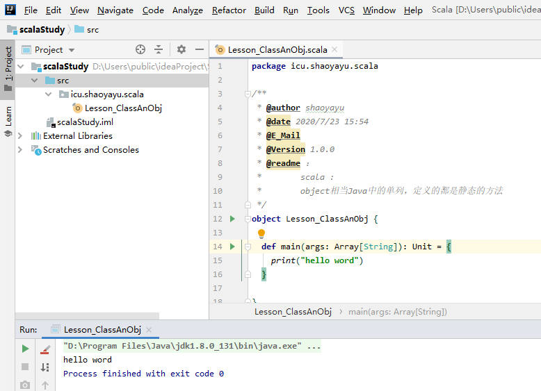

# Scala 介绍与环境配置

## Scala介绍

[官方文档](https://www.scala-lang.org/)

Scala用一种简洁的高级语言将面向对象和函数式编程结合在一起。 Scala的静态类型有助于避免复杂应用程序中的错误，其JVM和JavaScript运行时使您可以轻松访问庞大的库生态系统来构建高性能系统。

> Spark1.6中使用的是Scala2.10。 Spark2.0版本以上使用是Scala2.11版本。
>
> 版本：本次学习是2.11.12

### 六个特性

1、无缝Java互操作

Scala在JVM上运行，因此Java和Scala堆栈可以自由混合以实现完全无缝的集成。

2、类型推断

因此类型系统不会感到那么静止。不适用于类型系统。让文字系统为您服务！

Scala编译器对静态类型很聪明。大多数时候，您不需要告诉它变量的类型。相反，其强大的类型推断功能将为您解决它们。

3、CONCURRENCY & DISTRIBUTION

对集合使用数据并行操作，对并行使用和分发使用参与者，对异步编程使用

4、特质 

将Java样式的接口的灵活性与类的功能结合在一起。想一想原则上的多重继承。

5、模式匹配

在Scala中，案例类用于表示结构数据类型。它们隐式地为类提供有意义的toString，equals和hashCode方法，以及通过模式匹配进行解构的能力。

6、高阶功能

函数是一流的对象。以保证类型安全的方式编写它们。在任何地方使用它们，并将它们传递给任何东西。

## 下载安装

[下载地址](https://www.scala-lang.org/download/all.html)

安装的时候不要选择有中文或空格的目录【一定不要安装在空格目录下面和中文目录，我才采坑的】

### 配置SCALA_HOME

跟配置JAVA_HOME一样。

## IDEA 配置开发环境

在插件市场搜索SCALA第一个安装即可

如果版本不兼容推荐去https://plugins.jetbrains.com/plugin/1347-scala 查找下载对于的插件包安装

