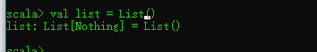

# Scala 基础

## 数据类型

数据类型描述

- Byte 8bit的有符号数字,范围在-128 -- 127

- Short 16 bit有符号数字,范围在-32768 -- 32767

- Int 32 bit有符号数字,范围-2147483648到2147483647

- Long 64 bit有符号数字,范围-9223372036854775808到9223372036854775807

- Float 32 bit IEEE 754单精度浮点数

- Double 64 bit IEEE 754双精度浮点数

- Char 16 bit Unicode字符.范围U+0000到U+FFFF

- String字符串

- Boolean布尔类型

- Unit表示无值,和其他语言中void等同

  - 函数返回没有值 Unit fun();

- Null空值或者空引用

- Nothing所有其他类型的子类型,表示没有值

  

  有点想java里面的泛型

- Any所有类型的超类,任何实例都属于Any类型

  基于Object下，载Scala里面的一种父类

- AnyRef所有引用类型的超类

- AnyVal所有值类型的超类

数据类型的关系：


Null
Trait,其唯-实例为null ,是AnyRef的子类，*不是* AnyVal的子类
Nothing
Trait ,所有类型(包括AnyRef和AnyVal )的子类,没有实例
None
lOption的两个子类之一,另一个是Some，用于安全的函数返回值
Unit
无返回值的函数的类型,和java的void对应
Nil
长度为0的List

## Object和class

```scala
package icu.shaoyayu.scala


/**
 * @author shaoyayu
 * @date 2020/7/23 15:54
 * @E_Mail
 * @Version 1.0.0
 * @readme ：
 *        scala :
 *        object相当Java中的单列，定义的都是静态的方法 ，类似java的工具类
 *        val定义的静态常量是不可修改的，var定义的变量是可以修改的，类型是自动推断的,
 *        val创建的变量类型回收内存比较快，但是var创建的变量回收内存比较慢
 *        在Scala的代码中，每一行的分号是可以省略不写的
 */

class Pos(sname : String, sage : Int){
  //在Scala中的类是可以传递参数的，写法如上所示。(变量名:变量类型，.....)，一定写数据类型。Object是不可以传递参数的，
  //当然你可以不传递参数要是可以的。Pos(val sname : String, sage : Int)在使用val变量的时候，相当于把sname当成了Pos的属性，在使用pos变量的时候可以应用“.”取出sname
  val name = sname  //相当于成员属性
  val age = sage  //使用val后的变量不能被修改，但是使用var的变量在后面应用的时候可以被修改
  var gender = 'M'  //默认的变量安全级别是public

  //重写构造方法
  def this(yname:String,yage:Int,ygender:Char){
    this(yname,yage)  //重写构造的时候必须先调用原来的构造方法。在第一行的时候
    this.gender = ygender //新加入的值是var类型的
  }

  def printNamFun(): Unit ={
    print(Lesson_ClassAnObj.name+"hello") //可以调用Object里面的静态方法和静态的成员变量
  }

  print("================class代码被执行====================\n")  //在类中的代码块，在构造的时候会被执行，除了方法【构造方法】不会被执行

}

object Lesson_ClassAnObj {  //在同一个文件中Object与Class的名称可以是一样的，这个类叫做对象的伴生类，他们之间可以相互访问私有变量

  val name = "wangwu"

  /**
   * 使用这个方法，我们就可以给对象Object传递参数了
   * 这个使用相当一个构造方法，
   * @param i
   */
  def apply(i: Int):Unit ={
    print("构造："+i)
  }
  //可以重载传递多个参数
  def apply(i: Int, name: String):Unit ={
    print("构造："+i)
  }

  print("=====================Object代码被执行=======================\n")  //这个Object是被先执行

  def main(args: Array[String]): Unit = {
    //创建一个对象 scala类中传递参数相对java类里面的通过构造方法传递参数
    val p = new Pos("zhanshan",20)
    print(p.name+"\n") //取出对象的属性的时候，在变量后面"."就可以拿到值了
    p.printNamFun()
    val p1 = new  Pos("laol",20,'F')

    Lesson_ClassAnObj(100);
  }

}

```


## 控制语句 if else

```scala
package icu.shaoyayu.scala

/**
 * @author shaoyayu
 * @date 2020/7/23 22:24
 * @E_Mail
 * @Version 1.0.0
 * @readme ：
 *    条件控制语句
 *
 */
object Lesson2 {

  def main(args: Array[String]): Unit = {
    val i = 100

    /**
     * 条件控制语句
     */
    if (i<100) {
      print("i<100")
    }else if (i==100){
      print("i=100")
    }else {
      print("i>100")
    }
    print("\n")

  }

}
```


## 循环

```scala
package icu.shaoyayu.scala

/**
 * @author shaoyayu
 * @date 2020/7/23 22:24
 * @E_Mail
 * @Version 1.0.0
 * @readme ：
 *    循环
 *
 */
object Lesson2 {

  def main(args: Array[String]): Unit = {

    /**
     * 条件控制语句
     * j从0开始到10，（包括0和10）
     */
    for (j <- 0 to 10){
      println(j)
    }

//    val r1 = 0 to 10;
    val r1 = 0.to(10) //和上面的写法是一样的，
    println(r1) //打印结果：Range(0, 1, 2, 3, 4, 5, 6, 7, 8, 9, 10)
    val r2 = 0 until  10 //打印结果：Range(0, 1, 2, 3, 4, 5, 6, 7, 8, 9)
    println(r2)
    //类似 to until 这种叫做scala中的操作符
    val r3 = 0 until (10,2) //这是步长
    println(r3) //Range(0, 2, 4, 6, 8)


    /**
     * 九九乘法表打印
     */
    for (p1 <- 1 until 10){
      for (p2 <- 1 to p1){
        print(p1+"*"+p2+"="+p1*p2+"\t")
      }
      print("\n")
    }

    /**
     * for的双重循环写法
     */
    for (n1 <- 1 until 10 ; n2 <- 1 to n1){
      print(n1+"*"+n2+"="+n1*n2+"\t")
      if (n2 == n1){
        println()
      }
    }
    /* 输出结果
    1*1=1
    2*1=2  2*2=4
    3*1=3  3*2=6  3*3=9
    4*1=4  4*2=8  4*3=12 4*4=16
    5*1=5  5*2=10 5*3=15 5*4=20 5*5=25
    6*1=6  6*2=12 6*3=18 6*4=24 6*5=30 6*6=36
    7*1=7  7*2=14 7*3=21 7*4=28 7*5=35 7*6=42 7*7=49
    8*1=8  8*2=16 8*3=24 8*4=32 8*5=40 8*6=48 8*7=56 8*8=64
    9*1=9  9*2=18 9*3=27 9*4=36 9*5=45 9*6=54 9*7=63 9*8=72 9*9=81
     */


    for (m1 <- 0 until 10 if(m1>5) if (m1%3==0)){ //for (m1 <- 0 until 10;if(m1>5);if (m1%3==0)){
      println(m1)
    }
    /*输出结果
    6
    9
     */

    //通for循环赋值
    val s1 = for (m1 <- 0 until 10 if(m1>5) if (m1%3==0)) yield m1
    println(s1)
    /* 打印结果
    Vector(6, 9)
     */

    var k1 = 0

    /**
     * while() 循环
     */
    while(k1<5){
      println(s"输出k1=$k1")
//      i++ 这个是不存在的
      k1 += 1 //朴素的写 k1 = k1 + 1
    }
    /*  输出
    输出k1=0
    输出k1=1
    输出k1=2
    输出k1=3
    输出k1=4
     */

    var k2 = 4
    do {
      println(k2)
      k2 += 1
    } while (k1 < 4)


  }

}
```