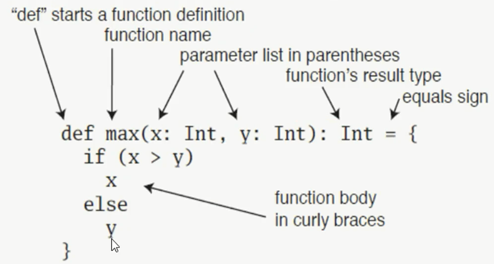

# Scala 中方法与函数

## 方法




```scala
package icu.shaoyayu.scala

/**
 * @author shaoyayu
 * @date 2020/7/23 23:16
 * @E_Mail
 * @Version 1.0.0
 * @readme ：
 */
object Lesson3 {
  def main(args: Array[String]): Unit = {

    /**
     *  创建一个比较大小的函数
     * @param x 比较值1
     * @param y 比较值2
     * @return  返回的最大值
     */
    def max(x : Int,y:Int)= {
      if (x > y) {
         x
      } else
        y

      /**
       * 如果是判断以后后执行的单行代码就直接 使用缩进的方式来省略”{}“
       *  如果在方法体里面使用Return返回值的时候，需要写好方法的返回值，
       *  但是如果没有使用return 的时候，方法会自动的推断返回值类型，使用最后一行计算的结果当做返回值
       *  定义方法的时候，省略的方法体和方法名称之间的“=”的时候。默认的返回是 Unit 空类型，“（）”
       */
    }
    val s = max(5,6);
    println(s)

    /**
     * 简写形式
     */
    def min(x : Int, y:Int) = if (x<y) x else y
    println(min(10,15))

    def add(a:Int,b:Int)={
      if (a+b<100) a+b else 0
    }
    println(add(51,51))

  }
}
```


## 函数

```scala
package icu.shaoyayu.scala

import java.util.Date

/**
 * @author shaoyayu
 * @date 2020/7/25 9:06
 * @E_Mail
 * @Version 1.0.0
 * @readme ：
 *        介绍递归的方法
 */
object Lesson4 {

  def main(args: Array[String]): Unit = {
    var  s = 3
//    println(factorial(s))
  }

  /**
   * 递归的时候需要指定返回的数据类型
   * @param x
   * @return
   */
  def factorial(x: Int): Int={
    if (x==1){
      x
    } else {
      x *factorial(x -1)
    }
  }

  /**
   * 当前的方法在使用的时候，可以没有传递参数或者传递一个或者两个，传递一个的
   * 时候，安装顺序覆盖第一个默认值，传递第二个参数的时候，把两个默认值都会
   * 覆盖。
   * @param a
   * @param b
   * @return
   */
  def passDefaultValue(a: Int=10,b: Int = 10)={
    a+b
  }

  def multipleParameters(str: String*)={
    println(str)
    //增强遍历
    str.foreach(s=>{  //  "=>"代表的是匿名函数的意思
      println(s)
    })

    str.foreach({println(_)}) //在每次都是使用到相同的变量名的时候，我们可以这样的代表传递过来的函数名

    str.foreach(println(_)) //当然也是可以这样的使用方式

  }
  multipleParameters("a","b","c") //WrappedArray(a, b, c)

  /**
   * 必须使用一个函数指向一个匿名函数
   * 多数在方法参数是一个函数的时候传递一个参数
   * @return
   */
  def anonymousFunction = (a: Int,b: Int)=>{
    a+b
  }
  //调用的时候，
  println(anonymousFunction(8,6))


  /**
   * 嵌套函数的写法
   * @param x
   * @return
   */
  def nestedFUn(x: Int): Int={

    def factorialFun(p: Int):Int ={
      if (p==1){
        1
      } else {
          p * factorialFun(p-1)
        }
      }
    factorialFun(x)
  }
  println(nestedFUn(3))

  /**
   * 偏应用函数
   * 打印日志，
   * @param date
   * @param str
   */
  def showLog(date: Date, str: String)={
    println(s"date is $date,$str")
  }
  val  date = new Date()
  //偏应用函数的定义，适用于方法里面有的参数多个不变的情况下传递参数
  def showLogFun = showLog(date, _: String)
  showLogFun("2020-7-25 10:02:15")
  showLogFun("2020-7-25 10:02:27")


  /*===============================================================*/

  def and(a: Int, b: Int): Int ={
    a+b
  }

  /**
   * 高阶函数。
   * 1》传入的值是函数，f：（传递值的类型）=> 返回值的类型
   * @param f
   * @param str
   * @return
   */
  def sumTwoValues(f: (Int,Int)=>Int,str: String): String={
    val s = f(100,200)
    str+":"+s
  }

//  val returnValue = sumTwoValues(and,"hello") //hello:300
  //传递匿名函数
  val returnValue = sumTwoValues((a: Int,b :Int)=>{a*b},"hello")  //hello:20000
  println(returnValue)

  /**
   * 返回值是一个函数
   * @param str1
   * @param str2
   * @return  (String,String)=>String 返回的函数类型
   */
  /*def spliceStr(str1: String,str2: String):(String,String)=>String = {
    def splice(s1: String,s2: String): String ={
      s"$s1 - $s2 - $str1 - $str2"
    }
    splice
  }*/
  //在不声明换回类型的情况下，在返回的函数后面添加 "_" 表示范式
  def spliceStr(str1: String,str2: String) = {
    def splice(s1: String,s2: String): String ={
      s"$s1 - $s2 - $str1 - $str2"
    }
    splice _
  }

  val str = spliceStr("a","b")("c","d")
  println(str)  //c - d - a - b


  def fun(f:(Int,Int)=>Int):(String,String)=>String = {
    val s = f(1,2)
    def pn(str1: String,str2: String):String = {
      s"$str1 ~ $str2 # $s"
    }
    pn
  }

  val ps = fun((a,b)=>{a+b})("--","****")
  println(ps) //-- ~ **** # 3

  /**
   * 柯里化函数
   * 这是函数返回函数的一种写法
   * @param a
   * @param b
   * @param c
   * @param d
   * @return
   */
  def kelihuaFun(a: Int,b: Int)(c: Int,d: Int):Int = {
    a+b+c+d
  }
  println(kelihuaFun(1,2)(3,4))//10
}
```