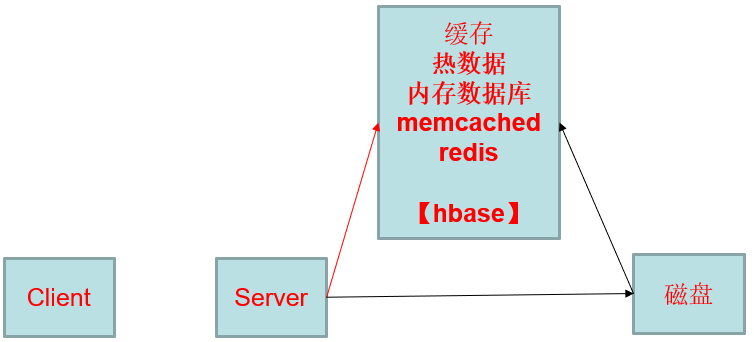
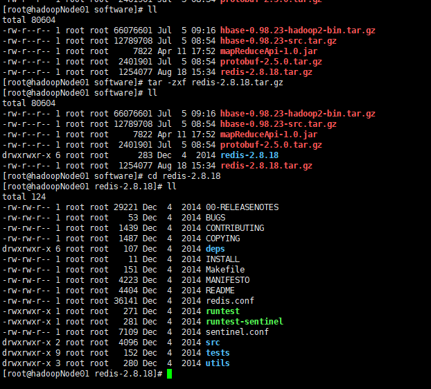

# Redis 数据库

## 简介

Redis是一个开放源代码（BSD许可）的内存中**数据结构存储**，用作数据库，缓存和消息代理。它支持数据结构，例如 [字符串](https://redis.io/topics/data-types-intro#strings)，[哈希](https://redis.io/topics/data-types-intro#hashes)，[列表](https://redis.io/topics/data-types-intro#lists)，[集合](https://redis.io/topics/data-types-intro#sets)，带范围查询的[排序集合](https://redis.io/topics/data-types-intro#sorted-sets)，[位图](https://redis.io/topics/data-types-intro#bitmaps)，[超日志](https://redis.io/topics/data-types-intro#hyperloglogs)，带有半径查询和[流的](https://redis.io/topics/streams-intro)[地理空间索引](https://redis.io/commands/geoadd)。Redis具有内置的[复制](https://redis.io/topics/replication)，[Lua脚本](https://redis.io/commands/eval)，[LRU逐出](https://redis.io/topics/lru-cache)，[事务](https://redis.io/topics/transactions)和不同级别的[磁盘持久性](https://redis.io/topics/persistence)，并通过以下方式提供高可用性[Redis Sentinel](https://redis.io/topics/sentinel)和[Redis Cluster](https://redis.io/topics/cluster-tutorial)自动分区。

您可以 对这些类型运行**原子操作**，例如[追加到字符串](https://redis.io/commands/append)； [在哈希中增加值](https://redis.io/commands/hincrby) ; [将元素推送到列表](https://redis.io/commands/lpush) ; [计算集的交集](https://redis.io/commands/sinter)， [并集](https://redis.io/commands/sunion)和[差](https://redis.io/commands/sdiff) ; 或[获得排序集中排名最高的成员](https://redis.io/commands/zrangebyscore)。

为了获得出色的性能，Redis使用 **内存数据集**。根据您的用例，您可以通过[将数据集](https://redis.io/topics/persistence#snapshotting) 偶尔[转储到磁盘上](https://redis.io/topics/persistence#snapshotting)，或者通过[将每个命令附加到log](https://redis.io/topics/persistence#append-only-file)来持久化它。如果只需要功能丰富的网络内存缓存，则可以选择禁用持久性。

Redis还支持琐碎的设置[主从异步复制](https://redis.io/topics/replication)，具有非常快速的非阻塞式第一次同步，自动重新连接以及网络拆分中的部分重新同步。

Redis数据库是个内存数据库：

内存和磁盘之间的数据交互变得尤为的重要，




数据分为热数据，存放在内存中。其他的数据如冷数据因为生命周期的原因会被会回收带磁盘上。

## 安装



解压好压缩包后，配置编译安装所依赖的环境：

```shell
yum -y install gcc tcl
```

进入Redis的目录下面进行编译安装

```shell
make && make PREFIX=/opt/mgs/redis install
```

配置环境变量：

```shell
export REDIS_HOME=/opt/mgs/redis
PATH=$JAVA_HOME/bin:$JRE_HOME/bin:$HADOOP_HOME/bin:$REDIS_HOME/bin:$HBASE_HOME/bin:$HADOOP_HOME/sbin:$PATH
```

将Redis的启动加载到开机启动的中。

进入解压目录下面，进入Utils目录下面，

执行./install_server.sh文件【执行脚本的时候，需要把环境变量配置好，要不然找不到启动的程序】

```shell
[root@hadoopNode01 utils]# ll
total 48
-rw-rw-r-- 1 root root  593 Dec  4  2014 build-static-symbols.tcl
-rwxrwxr-x 1 root root 2115 Dec  4  2014 generate-command-help.rb
drwxrwxr-x 2 root root   70 Dec  4  2014 hyperloglog
-rwxrwxr-x 1 root root 8545 Dec  4  2014 install_server.sh
-rwxrwxr-x 1 root root  298 Dec  4  2014 mkrelease.sh
-rw-rw-r-- 1 root root 1277 Dec  4  2014 redis-copy.rb
-rwxrwxr-x 1 root root 1098 Dec  4  2014 redis_init_script
-rwxrwxr-x 1 root root 1023 Dec  4  2014 redis_init_script.tpl
-rw-rw-r-- 1 root root 1762 Dec  4  2014 redis-sha1.rb
-rwxrwxr-x 1 root root 3787 Dec  4  2014 speed-regression.tcl
-rwxrwxr-x 1 root root  428 Dec  4  2014 whatisdoing.sh
[root@hadoopNode01 utils]# ./install_server.sh 
Welcome to the redis service installer
This script will help you easily set up a running redis server

Please select the redis port for this instance: [6379] 
Selecting default: 6379
Please select the redis config file name [/etc/redis/6379.conf] 
Selected default - /etc/redis/6379.conf
Please select the redis log file name [/var/log/redis_6379.log] 
Selected default - /var/log/redis_6379.log
Please select the data directory for this instance [/var/lib/redis/6379] 
Selected default - /var/lib/redis/6379
Please select the redis executable path [/opt/mgs/redis/bin/redis-server] 
Selected config:
Port           : 6379
Config file    : /etc/redis/6379.conf
Log file       : /var/log/redis_6379.log
Data dir       : /var/lib/redis/6379
Executable     : /opt/mgs/redis/bin/redis-server
Cli Executable : /opt/mgs/redis/bin/redis-cli
Is this ok? Then press ENTER to go on or Ctrl-C to abort.
Copied /tmp/6379.conf => /etc/init.d/redis_6379
Installing service...
Successfully added to chkconfig!
Successfully added to runlevels 345!
Starting Redis server...
Installation successful!
```


### 客服端帮助文档：

```shell
[root@hadoopNode01 ~]# redis-cli -h
redis-cli 2.8.18

Usage: redis-cli [OPTIONS] [cmd [arg [arg ...]]]
  -h <hostname>      Server hostname (default: 127.0.0.1).
  -p <port>          Server port (default: 6379).
  -s <socket>        Server socket (overrides hostname and port).
  -a <password>      Password to use when connecting to the server.
  -r <repeat>        Execute specified command N times.
  -i <interval>      When -r is used, waits <interval> seconds per command.
                     It is possible to specify sub-second times like -i 0.1.
  -n <db>            Database number.
  -x                 Read last argument from STDIN.
  -d <delimiter>     Multi-bulk delimiter in for raw formatting (default: \n).
  -c                 Enable cluster mode (follow -ASK and -MOVED redirections).
  --raw              Use raw formatting for replies (default when STDOUT is
                     not a tty).
  --no-raw           Force formatted output even when STDOUT is not a tty.
  --csv              Output in CSV format.
  --stat             Print rolling stats about server: mem, clients, ...
  --latency          Enter a special mode continuously sampling latency.
  --latency-history  Like --latency but tracking latency changes over time.
                     Default time interval is 15 sec. Change it using -i.
  --slave            Simulate a slave showing commands received from the master.
  --rdb <filename>   Transfer an RDB dump from remote server to local file.
  --pipe             Transfer raw Redis protocol from stdin to server.
  --pipe-timeout <n> In --pipe mode, abort with error if after sending all data.
                     no reply is received within <n> seconds.
                     Default timeout: 30. Use 0 to wait forever.
  --bigkeys          Sample Redis keys looking for big keys.
  --scan             List all keys using the SCAN command.
  --pattern <pat>    Useful with --scan to specify a SCAN pattern.
  --intrinsic-latency <sec> Run a test to measure intrinsic system latency.
                     The test will run for the specified amount of seconds.
  --eval <file>      Send an EVAL command using the Lua script at <file>.
  --help             Output this help and exit.
  --version          Output version and exit.

Examples:
  cat /etc/passwd | redis-cli -x set mypasswd
  redis-cli get mypasswd
  redis-cli -r 100 lpush mylist x
  redis-cli -r 100 -i 1 info | grep used_memory_human:
  redis-cli --eval myscript.lua key1 key2 , arg1 arg2 arg3
  redis-cli --scan --pattern '*:12345*'

  (Note: when using --eval the comma separates KEYS[] from ARGV[] items)

When no command is given, redis-cli starts in interactive mode.
Type "help" in interactive mode for information on available commands.


[root@hadoopNode01 ~]# redis-cli
127.0.0.1:6379> help
redis-cli 2.8.18
Type: "help @<group>" to get a list of commands in <group>
      "help <command>" for help on <command>
      "help <tab>" to get a list of possible help topics
      "quit" to exit


```

### 服务端帮助文档：

```shell
[root@hadoopNode01 ~]# redis-server -h
Usage: ./redis-server [/path/to/redis.conf] [options]
       ./redis-server - (read config from stdin)
       ./redis-server -v or --version
       ./redis-server -h or --help
       ./redis-server --test-memory <megabytes>

Examples:
       ./redis-server (run the server with default conf)
       ./redis-server /etc/redis/6379.conf
       ./redis-server --port 7777
       ./redis-server --port 7777 --slaveof 127.0.0.1 8888
       ./redis-server /etc/myredis.conf --loglevel verbose

Sentinel mode:
       ./redis-server /etc/sentinel.conf --sentinel
```

